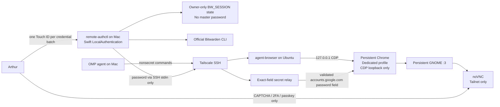

# Desktop browser automation

## Status and authority

This is the canonical architecture for the deployed Ubuntu browser-automation system. Operational commands and current fixed paths live in [`../../skills/fleet/desktop-browser-automation/SKILL.md`](../../skills/fleet/desktop-browser-automation/SKILL.md). Implementation and deployment assets live in [`../../packages/remote-auth-broker`](../../packages/remote-auth-broker).

The system is complete for persistent, nonsecret browser automation and Touch ID-gated Google credential submission. It is not the broader remote-authentication design described in [`remote-authentication-broker.md`](remote-authentication-broker.md): GDM/PAM login, JetKVM control, Bitwarden-extension native messaging, and signed sudo are deferred recovery or future capabilities, not dependencies of this system.

## Goal

Run one persistent Ubuntu GNOME and Chrome automation environment that agents control over Tailscale without exposing Chrome CDP or credentials on the network. VNC exists only for human verification boundaries.

## Architecture

## Runtime boundaries

| Boundary | Responsibility |
|---|---|
| Mac `remote-authctl` | Touch ID gate, saved Bitwarden session reuse, private credential selection, fixed SSH invocation |
| Tailscale SSH | Authenticated transport; Chrome CDP is never published through Tailscale Serve |
| Ubuntu `agent-browser` | Routine nonsecret browser navigation and extraction against the existing Chrome process |
| Ubuntu exact-field relay | Reads one password from stdin, verifies the exact Google origin/account/password field, submits it, emits no credential-bearing output |
| Persistent Chrome | Holds authenticated browser sessions in one dedicated Ubuntu profile; listens only on Ubuntu loopback |
| GNOME/noVNC | Provides a visible desktop and human-only challenge handoff; not used for routine automation |

The saved state is a short-lived `BW_SESSION`, not the Bitwarden master password. It is stored in an owner-only state file and released by package code only after Touch ID. This is a pragmatic software gate, not Bitwarden's official same-machine native-messaging biometric channel.

## Deployment

`packages/remote-auth-broker/ubuntu/scripts/remote-auth-ubuntu` installs and proves the unprivileged Ubuntu user services and exact-field helper. The installed read-only health command is `~/.local/bin/remote-auth-ubuntu status`.

The package owns:

- the real GNOME VNC startup;
- persistent noVNC and Chrome user services;
- the dedicated Chrome profile and loopback CDP contract;
- the exact-field relay;
- Mac Touch ID and Bitwarden-session orchestration.

No maintained implementation or runtime definition belongs under `local/`. That directory is disposable staging/proof space only; reused work is promoted to its owning package, skill, stream, or canonical external repository.

## Deferred layers

These components arose from a different goal: unattended recovery of the physical Ubuntu console after reboot.

- **GDM/PAM verifier:** relevant only if automation must establish a physical GNOME login session. The persistent VNC GNOME session does not depend on it.
- **JetKVM:** out-of-band BIOS/boot/recovery console. It is not a browser automation transport and its Cloud path is irrelevant to the LAN device.
- **Signed sudo:** future fixed privileged maintenance. It is unrelated to browser login.
- **Bitwarden native-messaging relay:** technically possible as a Linux host shim forwarding encrypted Bitwarden frames to Mac Bitwarden.app, but unsupported upstream and unnecessary for the current working path.

Do not reactivate any deferred layer merely because it exists in `packages/remote-auth-broker`. Each requires a new explicit goal and its own jj child change.

## Recovery and change discipline

Before modifying this system:

1. resolve the canonical repository with `jj root`;
2. create one described behavioral change before editing;
3. put experiments in child changes and abandon them if disproven;
4. give concurrent writers isolated workspaces or patches;
5. run the package gate and installed Ubuntu status before landing.

The Tailscale noVNC URL is a review/recovery surface. Normal automation remains SSH plus Ubuntu-local CDP.
