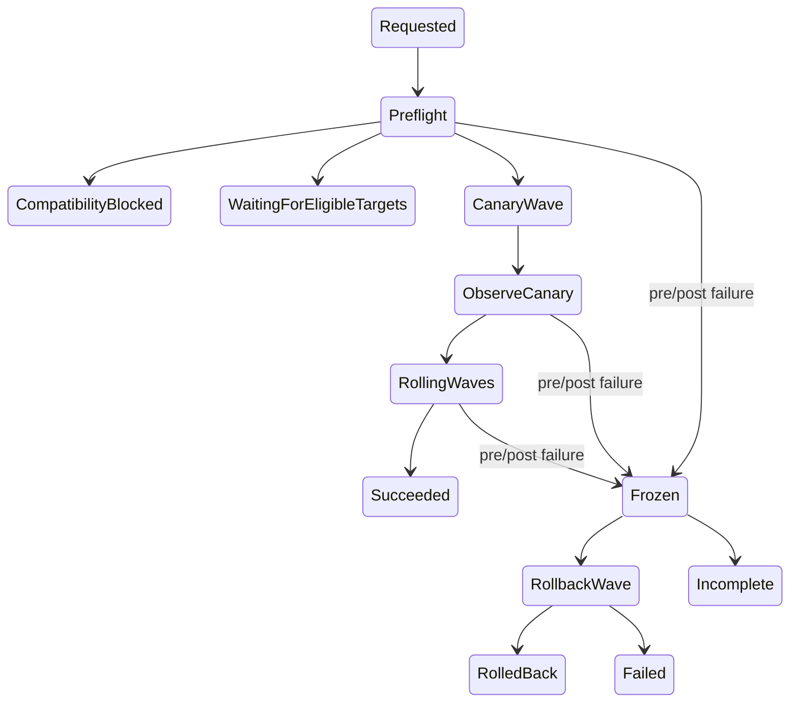
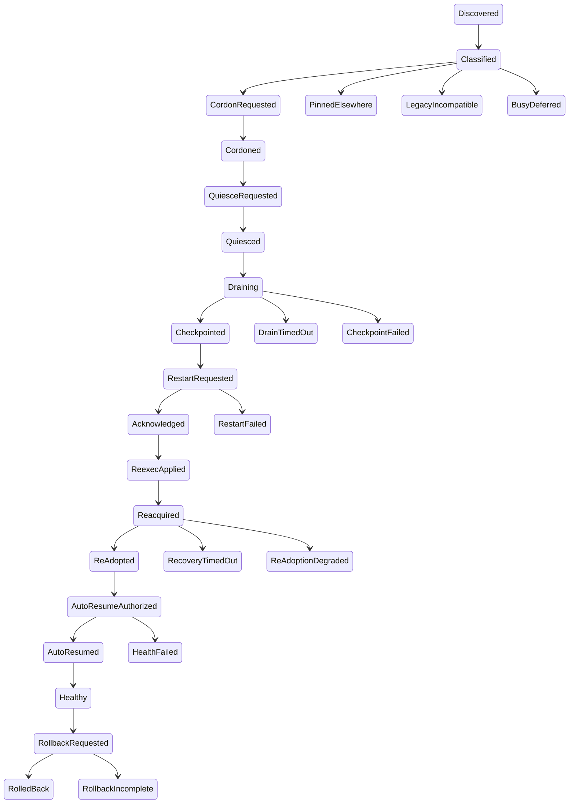

# Fleet rollout design (HR-115)

> **Status:** proposal — commissioned by Arthur 2026-07-15  
> **Author lane:** FleetRolloutDesign  
> **Cross-references:** `harness-request-register.md` HR-115; `2026-07-14-omp-overnight-continuation-results.md`
>
> **Summary:** The design doc should define a local-only, session-runner-owned fleet controller (Arthur’s “mimic orchestrator”) that plans waves and sends epoch-fenced commands; it must not become a daemon, scheduler, second journal writer, or remote-control transport. It extends the already-working immutable promotion/restart substrate with missing semantic quiesce, checkpoint, post-restart health, auto-resume, compatibility advertisement, and journal-backed fleet audit semantics. Promotion and rollout remain deliberately distinct: a BLESSED digest can still have a partially or wholly incomplete fleet rollout.

## Summary and non-goals

State that HR-115 is a design for a native local OMP fleet rollout controller, not implementation. Scope: one user/one machine, existing local SQLite and filesystem substrate, no sudo/launchd/network transport, no scheduler and no direct journal/SQLite mutation by the controller. Keep the journal as authoritative evidence; SQLite tables, IRC peer registry, ErrorInbox, and rollout snapshots are read/projection/receipt substrates. Explicitly say BLESSED is a release-selection result while ROLLOUT is a live-session convergence result, never a synonym.

## Vocabulary

Use a table with the following decisive terms:

| Term | Definition |
|---|---|
| Runner/host | the existing long-lived execution/ownership process for one SessionIdentity. Retain the existing canonical term; do not call it a node. |
| View | the disposable TUI/cmux/web projection. “TUI” means terminal view, not the runner. It may skew from its runner only under the compatibility contract. |
| BuildRevision / release artifact | immutable native executable named by SHA-256 digest; its process reports build digest/version. This is the artifact actually installed/restarted. |
| blessed channel | global registry selection currently called stable: the production default digest for new invocations. N−1 is the registry previous selection. Prefer `blessed` in operator UX but map it explicitly to current registry `stable`; never make a second selector. |
| canary channel | candidate artifact plus readiness evidence; it is not a fleet-wide desired state and does not mutate a live production session merely by existing. |
| pin | a session-journaled declaration that one SessionIdentity targets an explicit digest (including a canary only by explicit operator action). The registry only proves the artifact is available; the session’s journal is authoritative about that session’s pin. |
| peer orchestrator | a top-level orchestrating SessionIdentity/Runner that controls a child tree, discovered through the external IRC peer registry. Children are not fleet members by default. |
| fleet controller (Mimic) | a normal harness-owning orchestrator session temporarily holding the fleet-controller role/lease; it is Arthur’s “mimic orchestrator.” It plans and observes peers via control commands but is never a permanent supervisor and never executes peer work. |
| fleet rollout | one journaled controller operation toward one explicit digest, containing ordered waves and one target receipt timeline per peer. |
| rollout target/unit | one peer orchestrator SessionIdentity plus expected owner epoch, target digest/version/capabilities, channel/pin, and child-tree handoff policy; not a process/PID. |
| wave | a selected ordered group of targets. V1 processes every target serially; a ‘batch’ is an acceptance/observation group, not parallel restarts. Only a later proven controller may raise max-in-flight. |
| cordon/quiesce/drain/checkpoint | cordon rejects new child spawns; quiesce applies the durable pause; drain advances existing work only to durable safe boundaries; checkpoint creates durable session/child handoff evidence. These are not synonyms for killing work. |
| recovery | successful new heartbeat with a different owner epoch and expected digest/version; health is the additional post-recovery gate. |
| rollback | an explicit N−1 (or prior pin) target operation that again cordons/quiesces/handoffs/reacquires; never transcript rewind or fork. |

## Existing substrate versus explicit gaps

A two-column table should make this boundary unambiguous.

| Boundary | Details |
|---|---|
| Already present | Immutable candidate, digest identity, independent canary readiness, atomic bless, previous digest retention, and `BLESSED` separately followed by an `omp rollout --auto` whose failure is reported as `ROLLOUT incomplete` — `scripts/omp-promote.ts` (`promote`, `composePromotionReport`, `writePromotionNote`) and `vendor/oh-my-pi/scripts/link-omp-registry.py`. |
| Already present | Existing `omp rollout` discovers fresh external peers, skips initiator/legacy/current/working/unsafe sessions, restarts eligible idle or waiting-input peers serially, aborts on first failure, maps receipt progress, and requires a replacement heartbeat with changed epoch and matching digest/version — `vendor/oh-my-pi/packages/coding-agent/src/session/rollout.ts` (`createRolloutPlan`, `executeRolloutPlan`, `runRollout`). Its durable SQLite view is latest-per-peer phase, not a controller/command authority — `src/session/rollout-journal.ts` (`RolloutJournal`). |
| Already present | Same-PID `execve` restart rebuilds safe `--resume` args, releases predecessor ownership, carries predecessor epoch, and retries only the narrow restart handoff race — `src/cli/restart-session.ts` (`buildRestartLaunchArgs`, `acquireRestartSessionOwnership`, `handoffRestartProcess`, `replaceRestartProcess`). |
| Already present | Restart captures child restart manifests; re-adoption validates direct non-isolated children, ownership and lifecycle metadata, registers them parked, and resumes only manifest-authorized interrupted running turns through `pending → resuming → resumed` journal records — `src/slash-commands/builtin-registry.ts` (`captureRestartChildrenAfterShutdown`), `src/task/re-adopt.ts` (`reAdoptDirectChildren`), and `test/task/re-adopt.test.ts`. |
| Already present | Session control has same-UID local command admission, target owner epoch fencing, FIFO single-target claims, idempotent same-command replay, and serialized requested/acknowledged/applied\|failed receipts; it already has pause/resume/restart intents — `src/session/session-control.ts` (`SessionControlBus`, schemas) and `src/session/session-control-target.ts` (`startSessionControlTarget`). `applied` on restart means commit at re-exec boundary, not new-owner health. |
| Already present | IRC peer rows expose session identity, state, owner epoch, digest and version and freshness, but are discovery/heartbeat data rather than an authenticated control path — `src/irc/bus-external.ts` (`IrcExternalBus`, `IrcExternalPeer`). |
| Missing and therefore design/implementation work | Current pause durability does not yet specify or prove spawn admission denial, child drain policy, parent safe-boundary determination, checkpoint contents, or a peer-visible quiesce receipt. |
| Missing and therefore design/implementation work | Existing rollout intentionally skips working sessions rather than draining them, has no canary/wave policy, no per-session pin/channel, no fleet-controller lease, no auto-resume policy, and no post-recovery health/error gate. |
| Missing and therefore design/implementation work | Existing peer rows advertise only digest/version/epoch; there is no compatibility-range advertisement or journal/IRC envelope negotiation. |
| Missing and therefore design/implementation work | Existing `RolloutJournal` is a SQLite latest-state projection; the controller needs append-only, correlated fleet-operation records in its own SessionManager journal rather than another authoritative fleet database. |
| Missing and therefore design/implementation work | Existing FleetIncidentStore only models classified network incidents, and current ErrorInbox fields do not carry an explicit runner digest; build-correlated error-rate rollback requires that correlation field/projection. |

## Protocol and state machines

Include two mermaid diagrams and a written procedure.

Fleet run state machine:

`Requested → Preflight → (CompatibilityBlocked | WaitingForEligibleTargets | CanaryWave) → ObserveCanary → RollingWaves → Succeeded`; any pre/post failure goes to `Frozen`, then either `RollbackWave` or `Incomplete`, and only after all selected target terminal receipts exist to `RolledBack`/`Failed`. `BLESSED` is an input in Preflight, not a transition or success state.

Target state machine:

`Discovered → Classified → CordonRequested → Cordoned → QuiesceRequested → Quiesced → Draining → Checkpointed → RestartRequested → Acknowledged → ReexecApplied → Reacquired → ReAdopted → AutoResumeAuthorized → AutoResumed → Healthy`. Terminal alternative states: `PinnedElsewhere`, `LegacyIncompatible`, `BusyDeferred`, `DrainTimedOut`, `CheckpointFailed`, `RestartFailed`, `RecoveryTimedOut`, `ReAdoptionDegraded`, `HealthFailed`, `RollbackRequested`, `RolledBack`, `RollbackIncomplete`. Do not use `applied` as synonym for either recovery or healthy.

Protocol sequence:

1. Controller resolves an explicit target digest from `--digest`, a session pin, or blessed selection; validates immutable artifact/readiness receipt/N−1 availability, then creates an operation ID and appends a `fleet_rollout` intent record to its own session journal. Its SQLite RolloutJournal row is only a query index.
2. Discover peers via `IrcExternalBus.listPeers`; fresh peer metadata supplies SessionIdentity, owner epoch, current build, reported state, and session path. Read peer header/journal projection only. Classify pins, compatibility, stale/legacy, initiator exclusion and safety. Legacy/unknown capability targets are never guessed or restarted: record `LegacyIncompatible`.
3. Order eligible units: idle/waiting-input first. First one (or explicitly configured smallest canary set) is one-at-a-time. After an observation window passes, form subsequent ordered waves. V1 preserves existing serial safety (`maxUnavailable=1`); batch means a group followed by a wave health gate, not concurrent restarts. Working sessions stay `BusyDeferred` until they acknowledge quiesce and meet a safe boundary—there is no forced default rollout.
4. Send a new typed `prepare-rollout`/quiesce intent, rather than treating current generic pause as sufficient. It must be bound to target epoch, expected build/digest and rollout ID; it cordons spawning before draining, reports current parent/child work, executes a declared policy, flushes durable state, captures a restart child manifest, and returns a `RolloutCheckpoint` receipt with journal checkpoint pointer, child summaries, unresumable reason(s), and `autoResumeAllowed`. The target runner alone writes those records. A current `pause` command remains a useful substrate but is not the complete semantic contract.
5. Default drain policy: do not terminate a live provider/tool call. Let existing children reach durable terminal/parked boundaries; checkpoint only children explicitly supported by restart manifest. If the parent cannot reach a durable turn boundary before deadline, leave it cordoned and report `DrainTimedOut`/`BusyDeferred`; an operator may choose a separately explicit force/uncertain-attempt policy later. This preserves the runtime contract’s rule that a runner loss turns a running attempt into `Uncertain`, not silently requeued.
6. Issue the existing epoch-fenced restart only after a valid checkpoint receipt, with a release-store executable whose digest equals the explicit target. Receive `requested/acknowledged/applied|failed`; record each in the controller journal as a correlated projection. `applied` commits at re-exec, exactly as existing target semantics specify.
7. Wait for replacement heartbeat with same session identity/session file, newer heartbeat, changed epoch, exact digest and compatible version; then request/observe a status capability health snapshot. New runner re-adopts only durable validated direct children using existing re-adoption rules; it must record re-adoption diagnostics rather than fabricate successful resume.
8. Auto-resume only the work explicitly authorized by checkpoint/restart manifest, only after new owner/health gates, and never user-cancelled/terminal/isolated/invalid children. Keep cordon until auto-resume decision commits. Restore operator pause state: sessions paused before rollout remain paused; ones paused solely by rollout resume only after auto-resume completion. This extends—not bypasses—the current manifest-authorized re-adoption model.
9. Require target health: replacement heartbeat + owner epoch + digest/version/compatibility, fresh `status` receipt, no unhandled re-adoption/checkpoint failure, ErrorInbox delta below policy, and no correlated fleet incident. On pass append Healthy then proceed. On fail freeze subsequent targets and evaluate rollback.

## Receipt and authority contract

Define correlated IDs: `fleetRolloutId`, `waveId`, `targetId`/`sessionId`, `commandId`, expected and resulting `ownerEpoch`, `targetDigest`, channel/pin source, `checkpointId`, `autoResumeDecisionId`, plus session/child/turn/attempt/workstream identifiers where applicable. Use existing command receipt states exactly (`requested`, `acknowledged`, `applied`, `failed`) and add rollout semantic phases outside it. Each target lifecycle event is appended through the target runner’s SessionManager; controller intent/decision/observations append through its SessionManager. `RolloutJournal`/session-control SQLite index those records and store command receipts, but never become command authority or rewrite journal state. The controller has a local, epoch-fenced fleet-controller lease only to prevent two controllers issuing overlapping waves; it does not confer peer session ownership. Every peer mutation remains a SessionControlBus command verified by that peer’s owner epoch.

## Compatibility and versioning

Specify three independent seams and use SemVer-ish major/minor ranges rather than one product version:

1. **Journal record schema.** Session headers already carry optional `version` and v1 headers are supported (`src/session/session-entries.ts`); projection decoding is intentionally lenient over malformed/unknown records (`src/journal/projection.ts`). Formalize a `journalSchema` read/write range in runner capability. A view/runner N MUST read all released journal schemas ≤ its supported max; runner upgrades only append new records and never rewrite historic journals. Unknown newer records are retained byte-for-byte and surfaced as an incompatible/partial projection, never deleted or interpreted as commands. Additive fields are minor; changed meaning/removal is major.
2. **Session-control protocol.** Current `SESSION_CONTROL_SCHEMA_VERSION = 1` is strict schemas with literal 1 and excess-property rejection (`src/session/session-control.ts`), so it has no forward compatibility by accident. Introduce an advertised `controlProtocol {minMajor, maxMajor, maxMinor}` and only send a command selected from the controller/peer intersection. Same major allows additive minor only when the target advertises it; major mismatch yields `LegacyIncompatible`, not a best-effort command. Keep v1 as an immutable compatibility lane.
3. **IRC fleet envelope.** External IRC rows/messages are local SQLite discovery/comms, not a control plane (`src/irc/bus-external.ts`). Add a versioned fleet notice/capability envelope for fleet informational traffic, separate from ordinary user/agent message body/provenance. Unknown major means preserve/display as opaque informational payload and do not derive control authority. The control command still traverses SessionControlBus.

Advertise all three ranges plus `buildDigest`, product version, `viewProtocol`, supported rollout features and session workstream in fresh peer heartbeat/status. Existing peer metadata already has build/version/epoch but not these ranges. Reject an incompatible target before cordon. View skew rules: a ViewRevision may be updated independently only if it speaks the runner’s supported view protocol and can read that runner’s journal schema; it cannot cause runner restart. Runner package upgrades do not implicitly update a detached view, and a view must fail read-only/with clear compatibility state rather than write or downgrade journal records.

Channels: global registry remains the authoritative inventory/selection for candidate/blessed/N−1 (`scripts/omp-promote.ts`; `vendor/oh-my-pi/scripts/link-omp-registry.py`). `blessed` maps to current stable; `canary` maps to candidate plus readiness receipt; `pinned-per-session` is a journaled target-digest rule. Resolution precedence: explicit rollout `--digest` (validated) > explicit session pin > controller requested channel > blessed. A canary may be selected only with an explicit digest/pin and compatible capability; never automatically by the global rollout. Unpin restores blessed for future operations. Retain N−1 artifact before admitting a non-pinned rollout.

## Health and rollback policy

Make rollback conservative and observable. Every trigger first freezes the current wave and preserves its receipts/errors. Immediate target rollback triggers are failed restart receipt, recovery timeout, replacement heartbeat mismatch, compatibility mismatch, failed status healthcheck, or failed required re-adoption/checkpoint evidence. Crash-loop trigger: two consecutive post-`applied` replacement losses/failures for the same session+target digest within the configured rollout observation window; no third restart attempt. Error-rate trigger: policy evaluates only new, non-user-cancelled, build-correlated ErrorInbox events after checkpoint baseline; add build digest/session/rollout correlation before using this in automation. It must distinguish an underlying provider/network incident from a build regression; the existing `FleetIncidentStore` 3-distinct-agent/120-second network detection is a signal to freeze and investigate, not enough alone to blame any arbitrary new digest. The final policy should require a matching rollout target/build before automatic rollback. A newly opened correlated fleet incident, failed per-target health probe, or threshold-crossing correlated ErrorInbox delta rolls the affected canary/current wave back and halts later waves.

Rollback is explicit target selection to N−1 (or prior pin), with the same cordon/drain/checkpoint/restart/recovery health sequence. It never kills a running process to force a rollback, never reverts a transcript, and reports `RollbackIncomplete` if a session cannot reach a safe boundary. If a wave-level error threshold fires after multiple successful targets, schedule all affected targets in reverse rollout order but leave each cordoned/pending until its individual safe handoff; do not claim global rollback completion until every target receipt is terminal.

## `omp fleet` command surface

Describe intent, no implementation syntax commitments beyond this surface:

- `omp fleet status [--workstream ID] [--all]`: read-only roster with session/name/workstream, freshness/state, owner epoch, runner/view/build versions, compatibility range/result, channel/pin, child drain summary, latest rollout phase/receipt and health. Source: peer registry, status receipts, journal projections.
- `omp fleet errors [--since] [--session] [--workstream] [--rollout]`: read-only aggregation of `ui_error` journal records grouped by session/cause/time/build/rollout, with source journal URI; include FleetIncidentStore incidents as a distinct projection. This is the HR-113 surface, not a copied error database.
- `omp fleet pause|resume <selector>`: issues current/extended epoch-fenced session-control commands and prints receipts. Resume respects pre-rollout/manual pause provenance.
- `omp fleet rollout (--blessed|--digest SHA) [--canary selector] [--wave-size N] [--dry-run]`: builds the journaled plan, displays skip/defer/compatibility statuses, uses the state machine above, and never reports promotion success as rollout success.
- `omp fleet rollback <rolloutId|selector> [--to previous|digest]`: target-specific safe handback; no silent global reversion.
- `omp fleet pin <selector> <digest|blessed|canary>` and `unpin`: typed command that makes the target runner append the pin record; controller only requests/observes it. A pin validates immutable availability/readiness/compatibility.

All selectors should support existing durable workstream metadata where available. That consumes the existing SessionHeader `workstream` (`src/session/session-entries.ts`) and avoids a parallel classification.

## Honest k3s analogy

Use a table:

| k3s concept | OMP fleet equivalent |
|---|---|
| immutable image digest | digest-named OMP native artifact |
| Deployment desired revision | explicit controller target digest/channel/pin |
| rolling update | serial session handoff waves |
| readiness/liveness | canary receipt plus replacement heartbeat/status/ErrorInbox health gate |
| cordon/drain | spawn cordon/quiesce/safe checkpoint |
| rollback | N−1 re-handoff |

Deliberately reject node/pod scheduling, replicas/auto-replacement, multi-host control plane, kubelet, etcd, service/load-balancing, and arbitrary force deletion. Sessions are stateful pets with long-lived journals, PTYs, ownership epochs, child lineage, and possibly running provider calls. Therefore identity stays fixed, disruption is one at a time, work is deferred rather than displaced, and recovery takes durable checkpoints/uncertain-attempt reconciliation rather than replacement replica creation.

## MVP slices and acceptance

Order independently landable work as follows; cite each HR row by requested relationship, avoiding a false claim that a partial slice completes a broad row.

1. **Capability/build provenance advertisement (supports HR-028 and HR-035/HR-040; prerequisite HR-115):** Add peer/status reporting of digest/version, journal/control/IRC/view ranges and features; tests prove fresh compatible peer, strict v1/legacy peer becomes `LegacyIncompatible`, no unknown command sent. Existing source anchors: `src/irc/bus-external.ts`, `src/session/session-control.ts`.
2. **Read-only fleet inspection (direct HR-113; consumes current HR-114 metadata):** `omp fleet status/errors` projects fresh peers, session headers/workstreams, `ui_error` v2 journals, and FleetIncidentStore without writes. Tests fixture multiple journals/incidents, grouping/filtering, stale peer behavior, and prove no journal mutation. Anchors: `src/session/error-inbox-ledger.ts`, `src/task/fleet-incident.ts`, `src/session/session-entries.ts`. This does not claim the commit-trailer/full propagation part of HR-114.
3. **Quiesce/prepare checkpoint receipt (HR-115, builds HR-028):** Extend target control behavior with cordon/no-new-spawn enforcement, persisted pre-existing pause provenance, bounded safe drain, typed checkpoint and diagnostics. Tests prove attempted spawn is rejected after cordon, running provider work is not killed, timeout leaves cordoned/deferred, and stale epoch cannot checkpoint/mutate.
4. **Controller-run journal and canary/wave planner (HR-115):** append controller-side operation/decision observations to journal; mirror only into RolloutJournal; plan idle-first canary then serial waves, honoring pin/compatibility/working defer. Tests deterministic ordering, initiator/legacy/pin exclusion, no SQLite-only authority, first failure freezes later waves. It replaces no existing `omp rollout` safety behavior; adapt/reuse `src/session/rollout.ts` planning.
5. **Exact-digest reexec, re-adoption and auto-resume (HR-115 while retaining HR-104 acceptance):** restart from verified release-store executable after checkpoint; require new epoch/digest/capabilities, re-adopt, then resume only manifest-authorized/cancellation-safe children. Tests same-PID restart, parent/child checkpoint resilience across crash boundaries, existing manual pause remains paused, corrupt/unavailable child becomes diagnostic instead of auto-resume.
6. **Health gates and automatic bounded rollback (HR-115; consumes HR-113):** establish baseline errors, post-recovery status/re-adoption checks, crash-loop and correlated ErrorInbox policy, target rollback to N−1/prior pin and frozen later waves. Tests failed receipt, heartbeat timeout, re-adoption failure, correlated error threshold, incident non-attribution, mixed rollback-incomplete, and no dual-owner behavior.
7. **Pin/channel operator UX and proof suite (HR-115; leverages HR-104/028/113/114):** target-runner journaled pins, status rendering of channel/pin and a documented operator runbook. Tests explicit pin precedence, canary opt-in only, unpin to blessed, dry run, and complete lifecycle receipts/evidence links. This is last because it relies on all behavior, not a shortcut around it.

## Critical files

List these as mandatory reading for implementation: `scripts/omp-promote.ts`; `vendor/oh-my-pi/scripts/link-omp-registry.py`; `vendor/oh-my-pi/packages/coding-agent/src/session/rollout.ts`; `src/session/rollout-journal.ts`; `src/session/session-control.ts`; `src/session/session-control-target.ts`; `src/cli/restart-session.ts`; `src/slash-commands/builtin-registry.ts`; `src/task/re-adopt.ts`; `test/task/re-adopt.test.ts`; `src/irc/bus-external.ts`; `src/task/fleet-incident.ts`; `src/session/error-inbox-ledger.ts`; `src/session/session-entries.ts`; `docs/fable/harness-runtime-contract.md`; `docs/fable/handoffs/2026-07-14-omp-overhaul-continuation-handoff.md`; and `docs/fable/harness-request-register.md`.

### Edge cases to call out

- Peer becomes working, stale, already-current, incompatible, pinned elsewhere, or changes owner epoch between plan and command; re-read and reclassify rather than restart.
- Restart receipt reaches `applied` but no replacement heartbeat appears. This is recovery failure, not success; freeze wave and only rollback through a new safe handoff.
- A peer is manually paused before fleet action. Preserve that origin; do not auto-resume it.
- An active parent/provider call is not checkpointable. Default behavior is cordoned/deferred, not forced kill or hidden requeue; a running attempt requires explicit uncertain-attempt reconciliation.
- Child journal corruption, isolated child, stale parent lineage, duplicate ID, unavailable model, terminal lifecycle, or lost parent ownership produces durable diagnostic and excludes that child from auto-resume.
- Controller process itself restarts: controller journal records and receipt command IDs permit recovery/re-observation; it must not double-send a different command against the same target epoch.
- Two fleet controllers contend: use a fleet-controller lease but still rely on peer epoch fencing; losing controller becomes read-only and reports plan superseded.
- Error spikes caused by a genuine network/provider outage must not automatically blame/roll back a new build without target build/session correlation.
- Canary artifact may disappear or N−1 retention may be absent; preflight blocks before any peer cordon.
- A newer runner/view/journal/control/IRC major version must block safely and display compatibility, never down-migrate/rewrite or attempt a guessed command.

### Evidence basis

- `scripts/omp-promote.ts` proves separate blessing and auto-rollout failure reporting, isolated worktree/readiness and digest identity.
- `vendor/oh-my-pi/packages/coding-agent/src/session/rollout.ts` proves current serial rollout, explicit skip rules, epoch/digest heartbeat recovery, and abort behavior.
- `vendor/oh-my-pi/packages/coding-agent/src/session/session-control.ts` and `session-control-target.ts` prove local same-UID, epoch-fenced serialized control and semantics of restart receipts.
- `vendor/oh-my-pi/packages/coding-agent/src/cli/restart-session.ts`, `src/slash-commands/builtin-registry.ts`, `src/task/re-adopt.ts`, and `test/task/re-adopt.test.ts` prove same-PID restart and guarded child re-adoption.
- `vendor/oh-my-pi/packages/coding-agent/src/irc/bus-external.ts`, `src/task/fleet-incident.ts`, and `src/session/error-inbox-ledger.ts` prove discovery, existing fleet incident projection, and journaled error evidence.
- `docs/fable/harness-runtime-contract.md`, handoff component vocabulary, and register rows HR-028/104/113/114/115 establish the authority, terminology, and requested scope.
