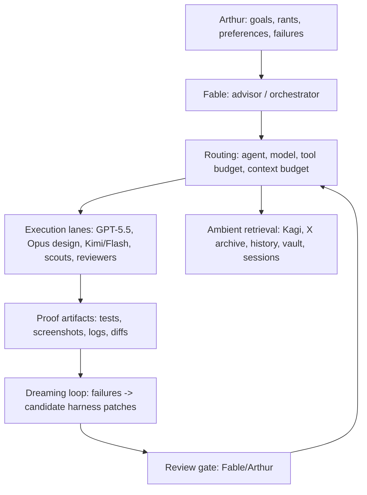

# Harness Meta-Workstream — design brief

Continuous background meta-work on OMP itself: prompts, skill discovery, model routing, tool exposure, subagent contracts, session memory, proof loops. **Polling, not blocking**: friction gets logged as it appears and fixed in background workers; stream work never stalls for harness refactoring. OMP is the current harness, not the optimal one — small bugs and dislikes are expected inputs, not crises.

Symphony Lite is demoted: some backend design ideas are worth keeping, but it is probably the wrong form factor/UX for orchestration, and Elixir is not a settled choice. cmux (with its glitches) is the acceptable status quo for session management. Do not invest there without a new decision.

## The core disease

Every agent gets the same system prompt: all skills, all tools, all lanes, regardless of what it can use. Observed 2026-07-03: sessions load ~64 skills when the intended slim profile is 20, because discovery is multi-source (repo manifest + `~/.omp/agent/skills` + `~/.claude/skills` + `~/.agents/skills` + workspace scan) and only one source was slimmed. The fix direction is **per-agent context routing**: each lane gets the tools/skills it is good with, everything else stays dormant and retrievable.

## Principles

- **Every default earns its prompt tax.** Prefer dormant skills, retrieval, and routing over always-on instructions. Do not auto-grow the harness; the failure mode is dumping every lesson into default context until all agents get slower and dumber.
- **Route capabilities to the agents that can use them.** Codex has native computer-use training; others do better with CuaDriver or CDP or pure edits. A capability good for one family is routed there, not exposed everywhere.
- **Ambient providers, not preloaded text.** Kagi, Twitter/X archive, browser history, vault, session corpus should be easy to invoke, never giant always-on prompt blocks.
- **Track refusal/capability basins** per model family (book retrieval, browser auth, computer use, prompt craft, design) and encode as routing knowledge.
- **Subagents are contract-shaped** (packet: owner paths, exclusions, lane, acceptance, non-goals) so failures are attributable — the prerequisite for the dreaming loop.
- **Friction log over grand redesign.** Keep a running list of OMP bugs/dislikes and harness papercuts; batch them into worker-sized fixes.

## Layered architecture sketch

## Daily "dreaming" loop (future automation)

1. Collect the day's failures: refusals, wasted-token loops, wrong routing, missing context, repeated manual fixes, verification misses.
2. Cluster by cause: missing/bloated skill, wrong model, wrong tool, missing retrieval surface, stale doc, bad subagent contract.
3. Propose small patches: disable a default tool, add a dormant skill, move prompt text into a skill, update routing, add an index.
4. **Review gate before anything lands.** The loop proposes; Fable/Arthur dispose.
5. Keep proof: before/after failure example, changed file, verification.

Hermes is the ontology donor: compact reusable skills, explicit skill-vs-subagent-vs-automation choice, vault-aware source workflows, recurring automations. Port the ontology, not the mechanics.

## Near-term iteration queue

1. Skill-leak consolidation (multi-source discovery → one intentional profile). *In progress 2026-07-03.*
2. Per-agent skill/tool exposure — lanes declare what they carry; default shrinks.
3. Orchestrator UI — watch agent progress live. Substrate confirmed 2026-07-03: `cockpit.sqlite` (sessions/events/heartbeats already published from Pi lifecycle hooks), tail-able typed session JSONL, Bun+SSE dashboard pattern in `packages/jimeng-client/src/artifact-dashboard.ts`, React19+Vite+shadcn shell in `apps/slotok-workbench`.
4. Packet contract as a first-class template for dispatches.
5. Friction log surface (cheap: a `docs/state/harness-friction.md` or SQLite table) feeding…
6. Dreaming loop prototype, gated.
