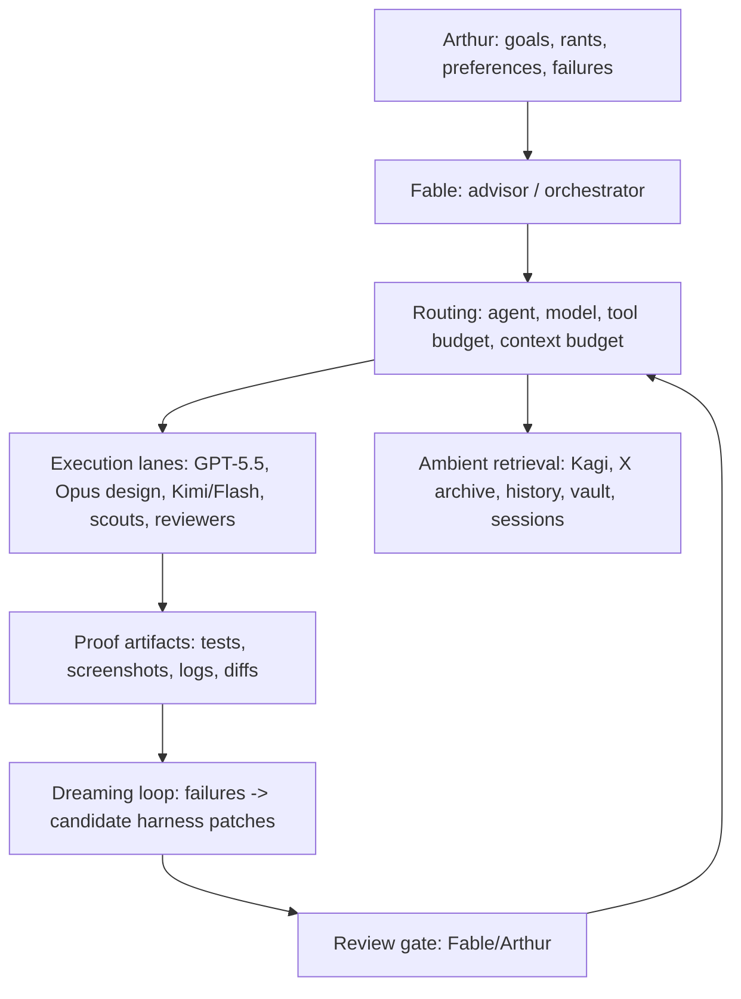

# Harness Meta-Workstream — design brief

Continuous background meta-work on OMP itself: prompts, skill discovery, model routing, tool exposure, subagent contracts, session memory, proof loops. **Polling, not blocking**: friction gets logged as it appears and fixed in background workers; stream work never stalls for harness refactoring. OMP is the current harness, not the optimal one — small bugs and dislikes are expected inputs, not crises.

Symphony Lite is demoted: some backend design ideas are worth keeping, but it is probably the wrong form factor/UX for orchestration, and Elixir is not a settled choice. cmux (with its glitches) is the acceptable status quo for session management. Do not invest there without a new decision.

## The core disease

Every agent gets the same system prompt: all skills, all tools, all lanes, regardless of what it can use. Observed 2026-07-03: sessions load ~64 skills when the intended slim profile is 20, because discovery is multi-source (repo manifest + `~/.omp/agent/skills` + `~/.claude/skills` + `~/.agents/skills` + workspace scan) and only one source was slimmed. The fix direction is **per-agent context routing**: each lane gets the tools/skills it is good with, everything else stays dormant and retrievable.

## Principles

- **Every default earns its prompt tax.** Prefer dormant skills, retrieval, and routing over always-on instructions. Do not auto-grow the harness; the failure mode is dumping every lesson into default context until all agents get slower and dumber.
- **Match the training.** Route work to the harness surface each model was RL'd on: Codex/GPT-5.5 lanes use the Codex computer-use plugin (never CuaDriver); Opus's designer lane uses Claude Code's design-mode workflow; CuaDriver serves lanes without native CU training. GPT-5.5 `:medium` is the Pareto default — `:high` only for genuinely hard work. Generalized: scaffolding is inversely proportional to model strength — weak models get the happy path, frontier models get wiggle room and the right to build their own tools.
- **Ambient providers, not preloaded text.** Kagi, Twitter/X archive, browser history, vault, session corpus should be easy to invoke, never giant always-on prompt blocks.
- **Track refusal/capability basins** per model family (book retrieval, browser auth, computer use, prompt craft, design) and encode as routing knowledge.
- **Subagents are contract-shaped** (packet: owner paths, exclusions, lane, acceptance, non-goals) so failures are attributable — the prerequisite for the dreaming loop.
- **Friction log over grand redesign.** Keep a running list of OMP bugs/dislikes and harness papercuts; batch them into worker-sized fixes.
- **One way per thing.** Never two mechanisms for one job. One messaging channel (the irc bus — agents via the `irc` tool, humans/scripts via `omp irc`), one reload verb (`/restart`), one skill per procedure. When a second mechanism appears, consolidate and delete the loser. Agents may *use* the one way differently per their training; the mechanism stays singular.
- **Fewer, powerful, recombinable skills** (Lopopolo). A skill should be a strong primitive that composes with code — agents recombine skills programmatically, not just MCP-shaped invocation. Prefer deleting three narrow skills for one powerful one.
- **Memory hygiene.** Durable memory/context (charter, state docs, skills, session distillates) must never carry security/reveng/anti-detection payload — it trips provider content filters (observed: Anthropic stream kills) and poisons every future session. Those lanes keep material in their own excluded workspaces; durable docs may only *name* the exclusion.
- **Plan for succession.** The frontier model rotates (Fable → GPT-5.6 expected within a week). Everything durable must be model-agnostic: charters and skills address "the frontier orchestrator", routing is expressed as roles, and per-model affordances live in routing tables so a model swap is a one-table edit.

## Encoding expertise: the guardrail ladder

Skills are only one rung. Preferences and hard-won lessons get encoded at the *cheapest layer that catches them* (Lopopolo's harness-persona writing is the reference here — adapt the ideas, not his token budget):

1. **Static lints** — deterministic, zero-token. AST rules via ast-grep/eslint: no `any`/`unknown` outside typed boundary modules, schema validation at API edges instead of typecasting, banned patterns. `bun run lint:unsafe-types` is the existing seed; grow this ratchet whenever an agent repeats a class of mistake.
2. **First-mistake warnings** — cheap dynamic tripwires: hooks/checks that fire the first time an agent does X in a session (writes a colocated test file, reaches for a formatter, invents token storage), injecting one corrective line instead of preloading the rule for everyone.
3. **Dynamic review rules** — things no static rule can express: taste, architecture drift, silent scope-shrink. Encoded as reviewer-lane prompts (GPT-5.5 adversarial passes) with a named checklist per stream, run at phase gates, not continuously.
4. **Personas/skills** — full procedures for recurring workflows, dormant until routed.

Rule of thumb: push every lesson as far *down* the ladder as it can go. A lint is worth a hundred prompt lines.

## The factory, scaled honestly (1x → 10x)

End state: a recursive production loop — code, assets, distribution (TikTok/ads), revenue — where positive input→output ROI funds scaling the inputs (the hedge-fund logic: a scalable strategy must be scaled fast, before the edge closes; taste is the part of the edge that doesn't close). But "code is cheap" is token-trillionaire talk; the honest **1x version** on one Max plan is: cmux/tmux monitoring, mostly-local runs, a few machines, branch-per-workstream, human at the phase gates. Build the loop so each stage can be *upgraded independently* when revenue allows — never architect for the 10x budget today.

**Human-as-golden-seed.** Remove the human from the loop everywhere except where taste and cost live. Arthur's input is treated like data labeling: a small set of golden judgments (annotations, picks, rankings) that calibrate an automated selection function, which then scales the judgment out — evals for creative work. UI/UX is the one lane where human input is the product spec itself.

## Layered architecture sketch

## Daily "dreaming" loop (future automation)

1. Collect the day's failures: refusals, wasted-token loops, wrong routing, missing context, repeated manual fixes, verification misses.
2. Cluster by cause: missing/bloated skill, wrong model, wrong tool, missing retrieval surface, stale doc, bad subagent contract.
3. Propose small patches: disable a default tool, add a dormant skill, move prompt text into a skill, update routing, add an index.
4. **Review gate before anything lands.** The loop proposes; Fable/Arthur dispose.
5. Keep proof: before/after failure example, changed file, verification.

Hermes is the ontology donor: compact reusable skills, explicit skill-vs-subagent-vs-automation choice, vault-aware source workflows, recurring automations. Port the ontology, not the mechanics.

## Near-term iteration queue

1. Skill-leak consolidation (multi-source discovery → one intentional profile). *In progress 2026-07-03.*
2. Per-agent skill/tool exposure — lanes declare what they carry; default shrinks.
3. Orchestrator UI — watch agent progress live. Substrate confirmed 2026-07-03: `cockpit.sqlite` (sessions/events/heartbeats already published from Pi lifecycle hooks), tail-able typed session JSONL, Bun+SSE dashboard pattern in `packages/jimeng-client/src/artifact-dashboard.ts`, React19+Vite+shadcn shell in `apps/slotok-workbench`.
4. Packet contract as a first-class template for dispatches.
5. Friction log surface (cheap: a `docs/state/harness-friction.md` or SQLite table) feeding…
6. Dreaming loop prototype, gated.
