# Harness runtime contract

Status: canonical stabilization architecture  
Grounded: 2026-07-11  
Doctrine: [Routing doctrine](routing-doctrine.md)

This document is the canonical contract for harness runtime stabilization. It distinguishes observed behavior from decisions; it does not claim that target behavior is implemented.

## Executive diagnosis

OMP has the necessary primitives, but their seams disagree. `AgentSession` executes work, `SessionManager` persists transcript JSONL, queue-v2 journals durable obligations, ownership leases fence writers, collab replicates semantic state, agent-mux keeps a PTY alive, ErrorInbox projects errors, and control-plane SQLite indexes history. The failures come from split authority and incomplete correlation, not from a missing framework.

- **CURRENT** — useful runtime, persistence, lease, replication, and projection mechanisms exist.
- **BROKEN/GAP** — input order can change between capture, delivery, and display; durable work can be invisible; restart races its own lease; route precedence is hard to explain; a view owns too much runtime lifetime; failures lack reproducible evidence.
- **TARGET** — retain those mechanisms, assign one blessed owner per concern, and connect them with stable identities plus one revisioned runner protocol.
- **DEFERRED** — runtime rewrites, autonomous policy, and decorative surfaces until the contract is proven.

The architectural cut is: **one session runner owns live execution; many disposable views observe it; durable domain stores retain their existing bounded authority; one set of IDs joins their evidence.** “One source of truth” does not mean one database.

## Vocabulary and layers

| Term | Meaning |
|---|---|
| Work role / persona | Responsibility, tools, spawn permissions, and judgment profile of a delegated agent. |
| Model lane | User-facing alias describing an execution posture, such as fast or thinking. |
| Concrete route | Provider, model, account, effort, and eligible fallback chain selected for one spawn or session. |
| Session | Durable conversation identity and transcript lineage. |
| Branch | A leaf/path selection within a transcript tree; not a fork. |
| Fork | A new session identity created at an explicit transcript entry. |
| Resume | Reacquisition of the same session identity and its exclusive lease. |
| Queue obligation | Captured user input with stable identity, global sequence, delivery class, state, and attempts. |
| Runner | Long-lived owner of execution, serialized commands/events, queue admission, and explicit stop. |
| View | Disposable terminal, collab, or web projection reconstructed from a runner snapshot and events. |
| Controller / observer | One capability-bearing command issuer / any number of read-only attachments. |
| Diagnostic occurrence | Immutable failure record and causal evidence. |
| ErrorInbox | Acknowledgement projection over diagnostic occurrences. |
| Regression | Durable human index of a recurring invariant violation and its proofs. |

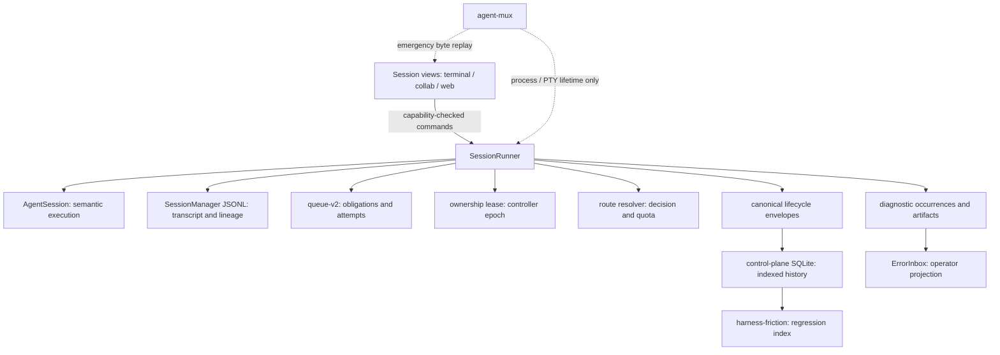

## One blessed owner per concern

| Concern | Blessed owner | Explicit non-owner |
|---|---|---|
| Stable routing doctrine | `docs/fable/routing-doctrine.md` | Runtime defaults and current quota samples |
| Declared model posture | Merged Settings/config and model-lane registry | Historical outcomes |
| Concrete spawn/session route | One route-resolution result around task routing and model resolution | UI inference and quota reconstruction |
| Conversation and branch history | `SessionManager` JSONL | Queue attempts and live topology |
| Queued obligations | durable-input-queue queue-v2 | Render grouping and transient counters |
| Exclusive live control | session-ownership lease and owner epoch | Connection order |
| Live execution | `SessionRunner` wrapping `AgentSession`/`SessionManager` | TUI, collab, web, SQLite |
| Durable query/history | control-plane SQLite projection | Live command authority and config |
| Error acknowledgement | ErrorInbox projection | Immutable occurrence/evidence |
| Human regression memory | `docs/state/harness-friction.md` | Machine event truth |

## Input queue

### Current and target

- **CURRENT** — ordinary sessions have separate in-memory steering and follow-up arrays. Ownership-backed input uses append-only queue-v2 with FIFO replay, adoption, uncertain-attempt reconciliation, writer locks, and epoch fencing.
- **BROKEN/GAP** — grouping steers before follow-ups changes global order; durable records lose delivery class; the UI omits durable and pending-next-turn obligations; compaction can race its first prompt; new input after restart may obscure that older backlog correctly remains first.
- **TARGET** — every capture receives `inputId` and a monotonically increasing sequence before delivery classification. One ordered view covers `captured`, `queued`, `admitted`, `running`, `uncertain`, `failed-rate-limit`, `completed`, and `cancelled`.

Delivery class controls **eligibility**, never ordering among eligible items. Consume the smallest eligible sequence. A steer may become eligible at a tool boundary; a follow-up at terminal yield. Category grouping must not reorder display, dequeue, restore, or delivery.

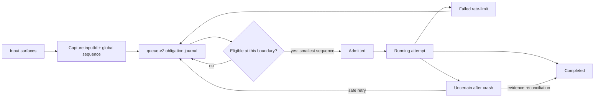

Restart freezes the predecessor boundary, fences the stale epoch, returns admitted-without-request-start to queued, marks running attempts uncertain, reconciles durable provider evidence, then admits FIFO. New input stays behind the frozen backlog. Single-item cancel/dequeue targets `inputId`; explicit transfer on fork creates a new obligation linked by `transferredFromInputId`. Default fork policy leaves obligations with the source.

## Routing and agent taxonomy

### Effective precedence

Hard eligibility constraints always apply. Within them, the current effective runtime order is:

1. per-spawn explicit `model`;
2. explicit parent-session model assignment;
3. temporary/session-only parent selection;
4. configured per-agent override, otherwise agent frontmatter;
5. model-lane expansion, including the special unset `pi/task` inheritance from the active session;
6. active parent/session model;
7. effective global/default lane;
8. registry fallback only when still unresolved, with failure visible;
9. quota admission after concrete resolution.

**Explicit user override rule:** a valid explicit per-spawn or explicit session route wins over automatic policy. Quota may admit or block it with an explanation; it must never silently reroute it. An automatic choice may use only eligible fallback candidates already present in its winning route chain, and the reroute must be recorded.

Settings merge from schema default → global config → project capability settings → ordered CLI overlays → runtime override. Objects deep-merge; arrays and scalars replace. A reload rereads settings; it does not rebuild existing sessions or erase runtime overrides. Shadowing provenance must remain visible.

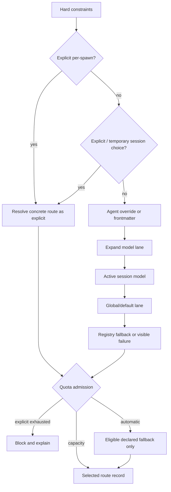

### Three distinct taxonomies

The eight bundled work roles are: `explore`, `plan`, `designer`, `reviewer`, `librarian`, `oracle`, `task`, and `quick_task`. They describe behavior and permissions.

User-facing model lanes describe execution posture: `default`, `fast/smol`, `thinking/slow`, `vision`, `architect/plan`, `designer`, `subtask/task`, and `advisor`. `commit` and `title` remain internal utility selectors; custom lanes belong in an Advanced surface.

A concrete route is the actual provider/model/account plus effort, tools/context, quota decision, and fallback provenance. Historical name overlap does not merge these concepts. UI and evidence must label which taxonomy is shown; personas must not be permanently bound to providers or accounts.

### Default delegated spawn policy

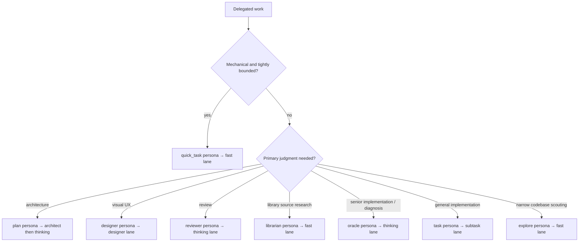

This is a default posture, not a hidden binding: explicit user choice and route eligibility still govern the concrete route.

### Main and subagent rate-limit composition

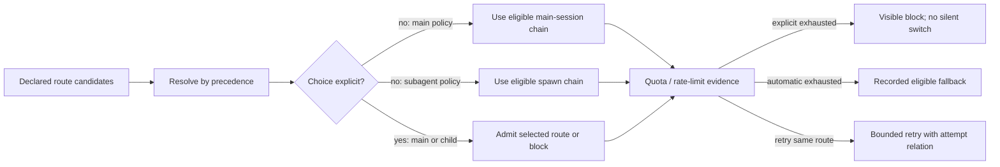

Main-session and subagent policies compose through the same route record: declared candidates first, quota evidence second. Subagents may inherit the active session only where the lane contract explicitly says so (`pi/task` today). Retries and fallback create linked attempts; they do not rewrite the original decision.

## Session identity: branch, fork, resume, restart

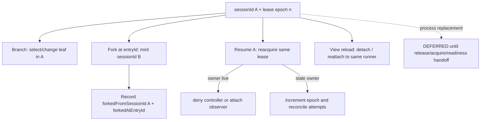

- **CURRENT** — JSONL owns transcript identity and tree entries. File fork mints a UUID and copies transcript/artifacts. Lease arbitration protects same-session resume when bound. In-file branching and pruned-path session creation use inconsistent parent representation.
- **BROKEN/GAP** — fork does not transactionally define queue/topology/error policy; replacement is spawned before the old owner releases its lease; concurrent resume can only be safe when lease acquisition is honored.
- **TARGET** — parent session is always a UUID; file path is only a locator. Fork flushes at an explicit entry, mints a distinct identity and lease, and leaves queued obligations with the source unless explicitly transferred. Resume retains identity. A second resume is observer-only or denied. View reload never means process restart.

## Runner/view boundary

`SessionRunner`, one per session identity, owns execution serialization, the active turn, queue admission, model changes, child lifecycle, persistence flush, revision allocation, and explicit stop. It wraps rather than replaces `AgentSession` and `SessionManager`.

Contract:

- `snapshot(): RunnerSnapshot` — identity/lineage, atomic revision, transcript/leaf references, active turn, ordered queue, current and pending route, topology, lease/capabilities, unresolved diagnostics.
- `subscribe({afterRevision}, listener)` — ordered `RunnerEvent { revision, kind, payload, causalIds }`; a missing/evicted revision yields `resyncRequired` and a fresh snapshot.
- `command({commandId, expectedRevision?, kind, payload})` — correlated, capability-checked, idempotency-aware runtime mutation.
- `attach(ViewDescriptor)` / `detach()` — attachment lifetime only.
- `stop({childPolicy})` — explicit owner-authorized runner shutdown and lease release.

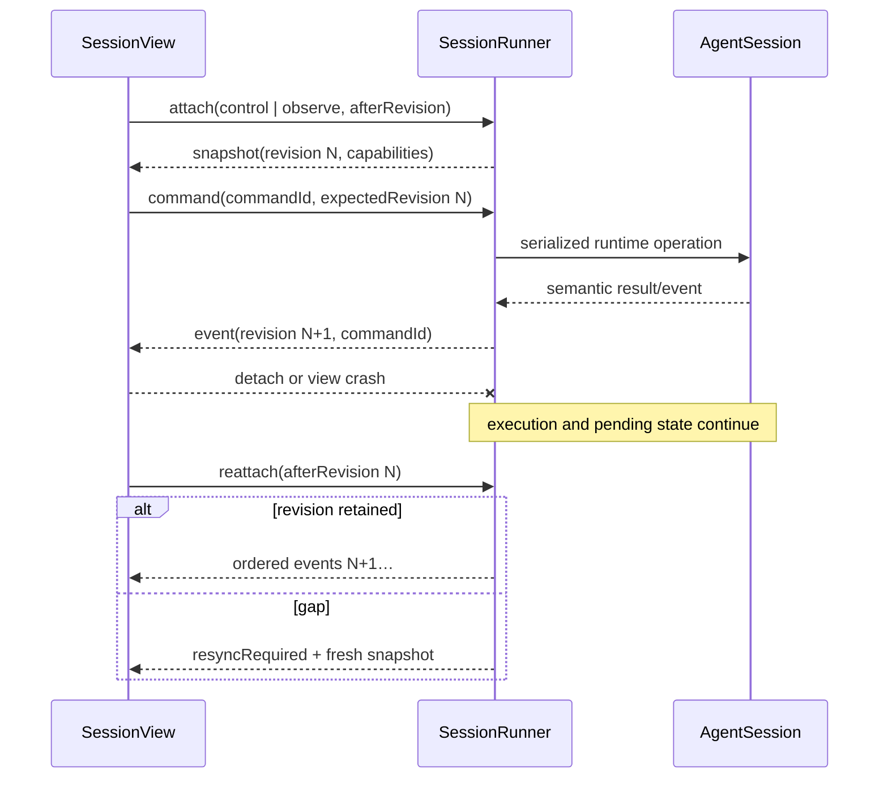

Views own only draft-before-submit, selection, scroll, layout, overlays, render caches, and reconnect UI. Once submitted, input is runner-owned. There is one controller and many observers; authority comes from lease/capability, not connection order. Terminal, collab, and web use the same contract. Collab’s welcome/delta/apply-chain and encryption are retained with version, revision, command, capability, attach/detach, and resync fields. agent-mux remains an outer process/PTY guardian, not the semantic protocol.

## Revisioned runner rollout and N−1 recovery

### Ontology

| Term | Meaning |
|---|---|
| `WorkSlice` | Smallest coherent implementation unit inside a phase: one bounded behavioral contract, its focused proof, and its owned file set. |
| `CodeCheckpoint` | Git commit produced only after a `WorkSlice` proof passes; immutable input to a candidate build, never a mixed-tree autosave. |
| `PhaseGate` | End-to-end acceptance scenario spanning all completed slices in the phase; passing it permits the next phase. |
| `BuildRevision` | Immutable identity of a packaged runner build. A process reports it; no process changes it in place. |
| `RunnerInstance` | One OS process incarnation running one `BuildRevision`, with a unique instance ID and bounded lifetime. |
| `SessionIdentity` | Durable conversation identity and lineage, independent of process, build, view, or lease epoch. |
| `ViewRevision` | Disposable UI asset revision. Views may hot reload and reconstruct from runner snapshots/events. |
| Candidate / canary | Candidate is a build under evaluation; a canary is its runner instance operating only on copied or forked fixtures. |
| Stable / N−1 | Blessed build and the immediately previous immutable build retained as the recovery runner and rollback target. |
| Controller / observer | The single lease/capability holder allowed to issue commands / any read-only attachment. |
| `ReadinessGate` | Evidence-based predicate that a runner can attach, reconstruct, observe, and safely accept control; not mere process liveness. |
| Promotion | Atomically bless a ready candidate revision for new acquisition after its canary evidence passes. |
| Rollback | Select N−1, wait for the candidate to release, then reacquire the session under a new owner epoch. |
| `RecoveryDoctor` | N−1 diagnostic executable that reads N's durable evidence without loading N's binary or sharing its heap. |
| `StateCheckpoint` | Revisioned runtime snapshot published for debugging/reconstruction; evidence, not an alternate command store. |

**Views hot reload; runners roll out.** A `ViewRevision` can be replaced and reattached because it owns no execution lifetime. A runner binary is never patched or dynamically loaded into an existing process. A new immutable `BuildRevision` starts in a new `RunnerInstance`, proves readiness away from the writable session, and crosses a release/acquire handoff.

### Slice checkpoint contract

Git owns code checkpoints; runtime journals own live execution state. Every `WorkSlice` follows one sequence:

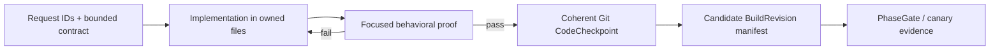

A `CodeCheckpoint` records the request IDs, exact commit SHA, dependency-lock hash, schema/config versions, focused proof commands, and proof artifact IDs. It MUST NOT include unrelated dirty-tree changes, generated secrets, sessions, queues, or runtime databases. A candidate runner is built from a committed checkpoint; a dirty working tree is not a rollback revision. Runtime checkpoints remain separately correlated by `sessionId`, owner epoch, runner/build revision, and journal offsets.

cmux is an external workspace/view host, not isolation or runtime authority. During Phase 1, additional cmux tabs MAY run test clients or candidate processes in an isolated profile/session directory against copied fixtures, but MUST NOT become a second writer for the live session. After the Phase 2 runner/view seam exists, several cmux tabs MAY attach to one runner: exactly one controller capability, any number of read-only observers, and disposable/reloadable views.

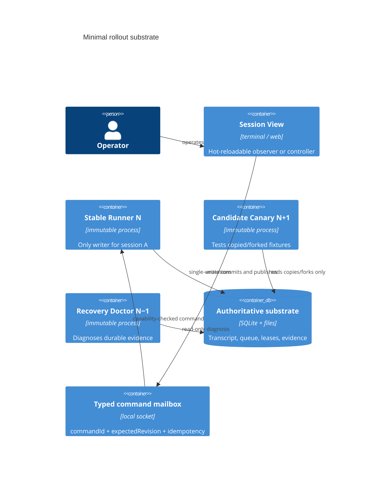

The safe sibling answer is deliberately narrow: stable N−1 **never loads candidate code**. Candidate runners execute sibling/canary sessions created from copied fixtures or explicit forks, never the same writable session. The stable runner remains the only controller for the real session. Observers, the candidate, and the fallback doctor may inspect SQLite, files, snapshots, and immutable artifacts read-only. Fixes are built as another immutable candidate; they are not injected into a live heap.

### Rollout state machine

```mermaid
stateDiagram-v2
  [*] --> StableN
  StableN --> CanaryN1: start candidate on copied/forked fixtures
  CanaryN1 --> Paused: readiness or evidence incomplete
  Paused --> CanaryN1: resume evaluation
  CanaryN1 --> ReadyN1: readiness + fixture evidence pass
  ReadyN1 --> ReleasingN: request controlled handoff
  ReleasingN --> AcquiringN1: N flushes, checkpoints, releases lease
  AcquiringN1 --> StableN1: N+1 reacquires with new owner epoch
  CanaryN1 --> StableN: reject candidate
  Paused --> StableN: reject candidate
  AcquiringN1 --> RollbackN: readiness or acquisition fails
  StableN1 --> RollbackN: post-promotion fault
  RollbackN --> StableN: N+1 releases; immutable N reacquires
```

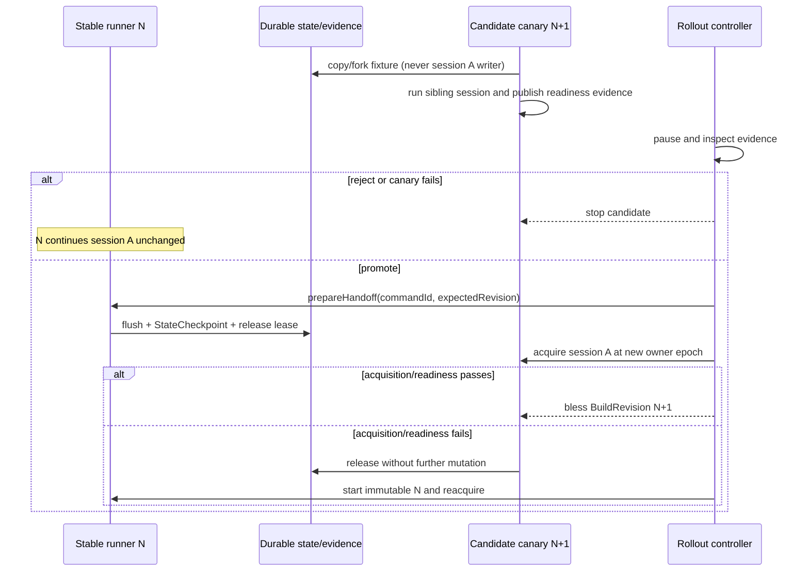

Promotion cannot preserve an in-flight provider call. Handoff waits for a safe boundary or records the running attempt as uncertain for evidence reconciliation. Rollback selects an immutable revision; only after the candidate releases may N−1 reacquire the same `SessionIdentity` under a new epoch.

Conceptual inspiration: [Kubernetes Deployments](https://kubernetes.io/docs/concepts/workloads/controllers/deployment/) for desired revision, immutable revision identity, readiness/status, controlled rollout, pause/resume, promotion, and rollback. This contract borrows those control ideas, not Kubernetes resources, reconciliation machinery, or operational complexity.

### Linux-like substrate and mutation boundary

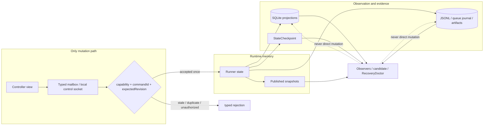

The required substrate is intentionally small: immutable executables, process supervision, Unix-domain socket or equivalent local control channel, file locks/lease epochs, SQLite, append-only files, atomic rename/fsync, and content-addressed artifacts. SQLite and files are authoritative for observation and evidence, but **they are never edited as commands**. Every mutation crosses the typed mailbox with `commandId`, optional `expectedRevision`, controller capability, and idempotency semantics. Runtime memory may publish snapshots/checkpoints; it does not create a second durable authority.

### Fork, resume, and rollback are different operations

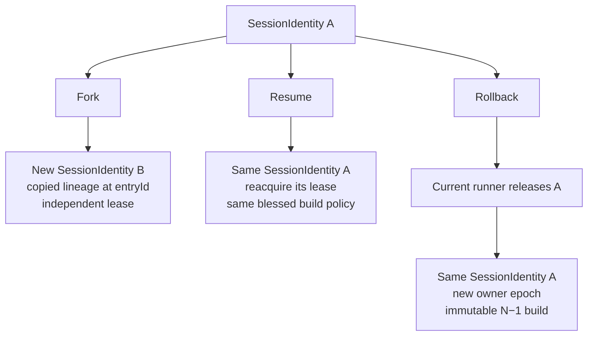

### Observable snapshot and error-evidence flow

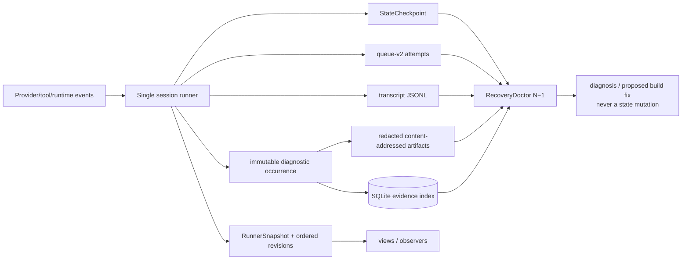

### Queue edit and cancellation state

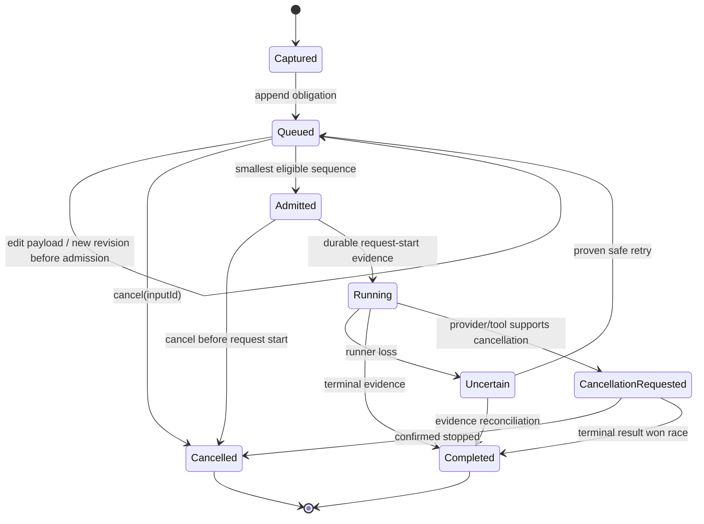

Editing is permitted only while queued and creates a journaled obligation revision without changing its global sequence. Cancellation targets `inputId`; “requested” is not “cancelled” until confirmed. A running attempt without terminal evidence becomes uncertain, never silently requeued.

## Diagram taxonomy

| Diagram | Use it for |
|---|---|
| C4 Context | People, the harness, and external provider/tool systems; the widest trust boundary. |
| C4 Container | Views, runners, stores, mailbox, and process/deployment boundaries. |
| Component | Owners and collaborators inside one runner or viewer container. |
| Data-flow | Where snapshots, commands, evidence, and durable records originate and travel. |
| Sequence | Time-ordered attach, canary, handoff, resync, or recovery interactions. |
| State machine | Legal lifecycle transitions for rollout, queue obligations, leases, or attempts. |
| Deployment | Build revisions, runner instances, hosts, and N−1 placement/replacement. |
| Entity-relationship | Stable IDs and cardinalities across sessions, turns, inputs, attempts, routes, and diagnostics. |
| Decision tree | Eligibility, routing, retry/fallback, readiness, and operator choices. |
| Timeline | Correlating incidents, owner epochs, revisions, provider calls, and interventions. |

Prefer the smallest diagram that answers one question. C4 and deployment diagrams explain static boundaries; sequence and timeline explain order; state machines constrain legality; data-flow and ER diagrams explain evidence and identity. Do not use a topology picture to imply runtime control authority.

## Failure evidence and postmortems

A diagnostic occurrence is immutable. Acknowledgement and resolution append projection state and never delete evidence.

Required identity and correlation:

- `diagnosticId`, occurrence time, typed failure class, and phase;
- build version/SHA, runtime/OS identity, config hash, and context/extension/skill/MCP manifest hash;
- run, session, branch, turn, entry, agent, route-decision, queue-input, attempt, and owner-epoch IDs;
- selected provider/model/account/effort and explicit/automatic decision;
- request fingerprint; immutable request, response, tool, log-range, and other artifact pointers;
- cause chain; retry, fallback, and intervention relations; final outcome and projection state;
- deterministic redaction policy recorded at artifact creation.

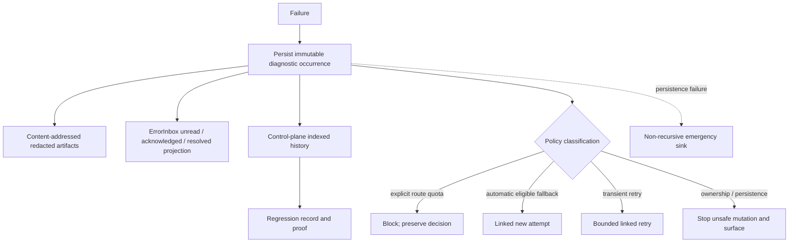

Failure classes include provider, quota/rate-limit, auth, refusal/content-filter, timeout, invalid output, failed acceptance, persistence/ownership, protocol/resync, and human/reviewer rejection. SQLite indexes occurrences and links but is not the live transaction boundary. ErrorInbox is only the operator-state projection. Evidence persistence failure must surface through a non-recursive emergency sink rather than being swallowed.

## Effect v4: Effect-native runner target

**DECIDED.** Arthur accepts Effect v4 beta and wants the new stabilized `SessionRunner` to be Effect-native, not merely Effect-wrapped at boundaries. Pin the exact beta version. Migrate behavior slice-by-slice behind the runner seam; do not mechanically rewrite the current tangled runtime in one change.

**Version mismatch to resolve before implementation:** `bun.lock` currently resolves `effect@4.0.0-beta.92`, while `vendor/effect-smol` is commit `8441836e6dde70e8ae2126be9cefe9b45798b134` at `4.0.0-beta.84`. The vendored `ai-docs`, `LLMS.md`, migrations, and source are authoritative only for beta.84. Synchronize the vendor checkout and generated AI guidance to the exact package-owned pinned runner version before writing Effect-native runner code; do not infer beta.92 APIs from beta.84 or remembered v3/v4 behavior.

Effect can participate deeply in a runner design:

- Schema validates command, event, config, provider, and persisted boundaries.
- `Context.Service` and Layer define runner capabilities and composition roots.
- Scope and `acquireRelease` own sockets, processes, subscriptions, watchers, terminal resources, and lease-bound services.
- Queue, PubSub, and Stream model bounded in-process dispatch and projections.
- structured child fibers, FiberMap/FiberSet, and interruption model runner-owned concurrency.
- Schedule applies classified retry policy; TestClock drives deterministic recovery tests.
- Ref/SubscriptionRef may own coherent ephemeral and observable state.
- typed error channels make failure policy explicit instead of throwing through callbacks.

Effect still does **not** choose ordering policy, establish single-writer authority, make arbitrary side effects exactly-once, or separate views from runtime by itself. Its public in-memory queues, streams, refs, STM transactions, and fibers are not crash-durable; durability comes from the explicitly unstable persistence/eventlog/SQL implementations or our durable adapters.

The vendored beta does include real but explicitly unstable durability modules:

- `effect/unstable/persistence/PersistedQueue` with memory, Redis, and SQL stores; schema encoding, caller IDs, leases, attempts, and at-least-once redelivery.
- `effect/unstable/persistence/Persistence` for persisted schema-encoded results/checkpoints.
- `effect/unstable/eventlog` with `SqlEventJournal`.
- `effect/unstable/workflow` with Workflow/Activity/DurableDeferred/DurableClock/DurableQueue, but only an in-memory `WorkflowEngine.layerMemory` is shipped.
- `effect/unstable/sql` plus `@effect/sql-sqlite-bun`, which uses `bun:sqlite`, serializes access, and enables SQLite WAL by default.

These APIs materially inform the runner design, but the vendored SQL `PersistedQueue` has a load-bearing caveat: its lease refresher's `elementIds` set is deleted from but never populated in this snapshot, so a handler longer than the default two-minute lease may be redelivered. It also exposes no complete dead-letter/requeue administration surface. Until fixed and proven upstream or locally, use an explicit SQL obligation/state-machine adapter behind an Effect service for load-bearing session work. Treat all persisted delivery as at-least-once; external effects still require idempotency or prepared/running/uncertain reconciliation.

Begin with one representative vertical slice: command decode → route decision → scoped provider resource → typed outcome/event → deterministic test. Use it to establish runner conventions and measure allocations/overhead before migration expands. Each later cutover preserves behavior, passes its acceptance proof, creates a coherent Git checkpoint, and removes the superseded semantic path. Broad runner-core adoption is intended; a big-bang conversion is not.

### Effect-native runner guardrails

1. **Do not block the serialized command loop on provider/tool I/O.** Commit admission/preparation, launch the scoped attempt, and return its outcome as a later command; otherwise one slow call causes session-wide head-of-line blocking.
2. **Do not maintain two authoritative queues.** The durable store owns obligations; an Effect Queue contains only wakeups/IDs and is always reconstructible.
3. **Do not event-source everything.** Keep explicit current-state tables plus an append-only committed event/outbox ledger. Reducer replay is a proof/debug tool, not the only way to answer ordinary state.
4. **Do not promise exactly-once external effects.** Use idempotency where providers/tools support it; otherwise persist prepared/running/uncertain and reconcile.
5. **Order by committed session sequence, not wall-clock timestamps.** Carry `causationId` and `correlationId` across sessions without inventing a global total order.
6. **Bound backpressure explicitly.** Command inbox, wakeups, event subscribers, diagnostics, and view replay each need capacity/overflow policy; no unbounded PubSub history.
7. **Keep cancellation typed.** Distinguish cancel-before-admission, interrupt-running, detach-view, shutdown-runner, and owner-epoch loss.
8. **Version every durable boundary.** Commands, state tables, events, checkpoints, and outbox payloads need migrations and old-build readability for N−1 rollback.
9. **Keep pure transitions separate from Effect plumbing.** Domain state machines are deterministic functions; Effect owns services, concurrency, transactions, interruption, and resources.
10. **Pin and isolate Effect beta churn.** One package-owned version and local conventions; upgrade only as its own proven `WorkSlice`.
11. **Make projections disposable.** Terminal/web/error indexes rebuild from committed state/events and never become command authority.
12. **Crash-test commit boundaries.** Inject failure before commit, after commit/before publish, during external effect, during terminalization, and during ownership handoff.

## Recursive context delegation: bounded RLM adaptation

**DECIDED DIRECTION, DEFERRED IMPLEMENTATION.** The RLM paper treats an oversized prompt as an external environment: the root model inspects and slices it programmatically, launches plain or recursive LM calls over selected fragments, then synthesizes a final answer. OMP should adapt that inference pattern rather than copy the paper's Python REPL or add another agent persona.

The default remains an explicit work packet. When the source context is too large or the task is historical synthesis, the parent instead creates an immutable `ContextManifest` at a known session revision. A read-only context worker may list metadata, search, read bounded ranges, batch-map a structured summarizer over selected spans, and recursively query a bounded subproblem. Every returned claim carries source IDs/ranges and the manifest/build revision.

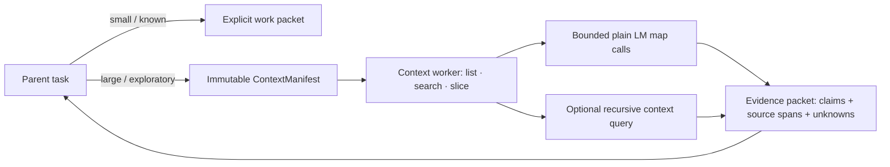

This is not a conversation fork. The worker receives references and read capabilities, not the parent's mutable heap, queue, tools, or controller authority. Session content is data, never executable instruction. Recursion has explicit depth, subcall, concurrency, token, and wall-clock budgets; children receive remaining budget. Trajectories record query, route, source spans, cache keys, cost, and result so omission and recursive-summary drift can be analyzed.

Three context modes remain distinct:

1. **Explicit packet** for implementation and bounded delegated work.
2. **Retrieval-first context query** for oversized history, archaeology, comparison, and synthesis.
3. **Full session fork** only for a genuine alternate conversational branch with a new `sessionId`.

Existing `history://`, artifact/file references, `read`/`search`, structured completion calls, and agent handles are sufficient primitives for a later prototype. A dedicated generic “summarize everything” tool is insufficient: the model needs selective inspection plus structured, cited map/reduce. Model choice for leaf summarization is policy data, not hard-wired to DeepSeek or any provider.

Sources: [Recursive Language Models paper](https://arxiv.org/abs/2512.24601), [official repository](https://github.com/alexzhang13/rlm), and [official architecture](https://github.com/alexzhang13/rlm/blob/main/docs/architecture.md).

## Three sequential stabilization phases

### Phase 1 — Canonical decisions, obligations, identity, and evidence

Preserve current behavior while establishing one route decision record; one globally ordered queue view retaining delivery class; explicit fork/resume/lease semantics; and immutable correlated diagnostics. Align vocabulary across terminal surfaces and the friction ledger.

**Acceptance gate:** after fresh start and restart, the harness can explain the winning route and quota action, display every obligation in stable order/state, distinguish branch/fork/resume, fence a second controller, and produce one diagnostic linking build/config/session/route/input/attempt/artifacts. Mixed steer/follow-up/compaction and uncertain-attempt recovery are demonstrated without duplicate delivery.

### Phase 2 — Runner/view seam

Introduce the transport-neutral snapshot/event/command contract and additive transcript subscriptions. Move runtime disposal, revision serialization, queue/model events, and explicit stop authority into `SessionRunner`. Convert terminal first and collab second; preserve collab security and resync behavior. Within this seam, add immutable build identity, canary fixtures, readiness, pause/promote/rollback, and the release/acquire handoff; rollout is not a fourth stabilization phase.

**Acceptance gate:** one controller and two observers attach; observer commands and stale controllers are denied; detaching or crashing any view during work does not stop execution; a replacement reconstructs from snapshot/revisions; revision gaps resync; pending model switches and queue state survive detachment; explicit stop flushes and releases exactly once. A candidate proves readiness on copied/forked fixtures without loading into N−1 or writing the stable session; promotion and rollback each preserve the single-writer lease boundary.

### Phase 3 — Operational viewer and regression loop

Project canonical runner events and immutable evidence into control-plane queries without moving live command authority. Expose the same vocabulary and IDs in the compact terminal Hub and one drill-down web view. Bind friction entries to occurrences and proof artifacts.

**Acceptance gate:** an operator can navigate fleet → session → route/diagnostic → evidence/regression, explain route and queue state, reconstruct a failure without ad hoc logs, and reopen the same regression ID on recurrence. Ledger rebuild/reingest is idempotent and does not become configuration or command authority.

Each phase is sequential; its full acceptance gate precedes the next. Build, typecheck, or a narrow unit test alone does not prove ordering, ownership, detach, resync, or postmortem behavior.

## Deferred

- Big-bang conversion of the existing runtime before the Effect-native runner seam and representative slice are proven. Elixir/OTP migration remains deferred.
- Cross-host orchestration, multi-region placement, or a general deployment platform beyond the local release/acquire contract.
- Continuation of an in-flight provider turn across process replacement.
- One OS process per child agent.
- A universal event-sourcing rewrite replacing transcript JSONL, queue-v2, and all domain stores.
- Replacement of collab encryption/topology or a second semantic protocol.
- Automatic routing-policy mutation, autonomous lane promotion, or hidden account balancing from telemetry.
- Game/world views, avatars, decorative topology, or multiple dashboard products.
- New personas or compatibility aliases that perpetuate ambiguous “role” terminology.

## Documentation index

- **Canonical runtime stabilization contract:** this document.
- **Canonical request and decision intake:** [Harness request register](harness-request-register.md); request status and proof links, not runtime behavior.
- **Routing policy and evidence doctrine:** [Routing doctrine](routing-doctrine.md).
- **Current-system historical map:** [Agent system overview](agent-system-overview.md), subordinate where it discusses target architecture.
- **Current restart operator note:** [Harness hot reload](../state/harness-hot-reload.md), subordinate to this lifecycle contract.
- **Regression memory:** [Harness friction log](../state/harness-friction.md); evidence index, not runtime truth.
- **Control-plane plans:** planning/history only; they do not override this contract or the routing doctrine.
