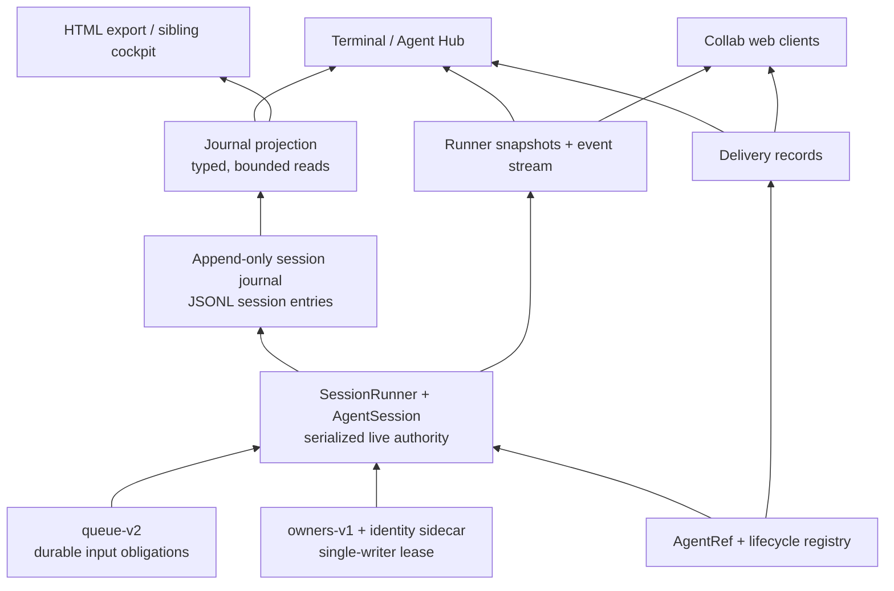
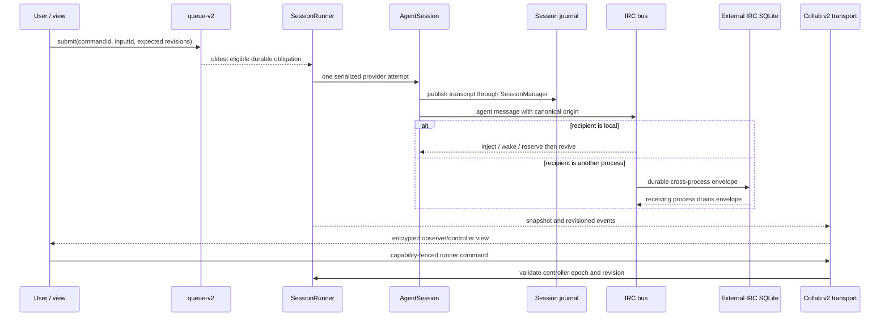
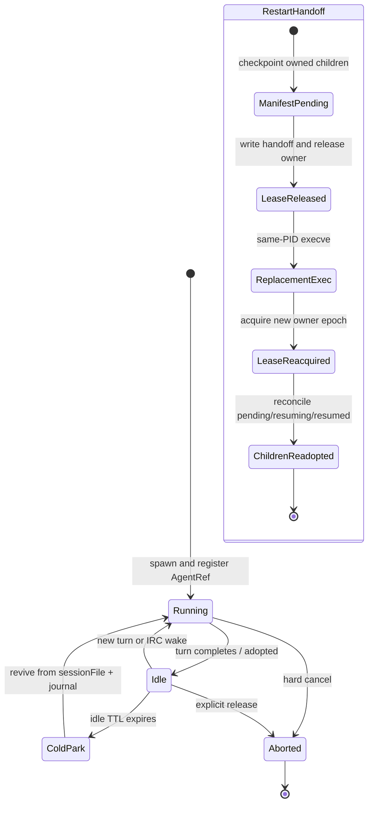
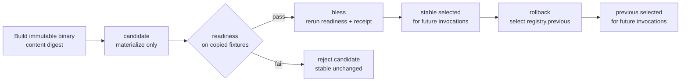

# OMP primitives map

> A ten-minute map of the current fork. Code is authoritative for behavior; the request register is authoritative for work status. Doctrine: **the append-only session journal is the API; everything else is an authority with one narrow write concern, or a bounded projection/cache** ([D-014](harness-request-register.md#decision-ledger)).

## 1. The system in four layers

The arrows upward are reads/projections. The only downward-looking responsibilities are narrow authorities: queue-v2 owns accepted input, the ownership lease fences writers, SessionRunner serializes live commands, AgentSession owns provider attempts, and SessionManager publishes the transcript.

## 2. Core primitives

| Primitive | One-line responsibility | Authority file(s) | Main consumers | Invariants |
|---|---|---|---|---|
| Session journal | Durable append-only record of session identity and transcript entries. | [`src/session/session-manager.ts`](../../vendor/oh-my-pi/packages/coding-agent/src/session/session-manager.ts), [`src/session/session-entries.ts`](../../vendor/oh-my-pi/packages/coding-agent/src/session/session-entries.ts) | Journal projection, restart/resume, exports, sibling views | Append rather than mutate history; a view never becomes a second writer. |
| Journal projection | Decode/migrate JSONL once and expose typed complete or bounded-tail reads. | [`src/journal/projection.ts`](../../vendor/oh-my-pi/packages/coding-agent/src/journal/projection.ts) | [`src/irc/sibling-session.ts`](../../vendor/oh-my-pi/packages/coding-agent/src/irc/sibling-session.ts), Agent Hub, HTML export | Malformed/unknown rows do not hide valid rows; bounded consumers do not invent parser copies ([HR-106](harness-request-register.md#architecture--docs)). |
| queue-v2 | Persist input capture, eligibility, attempts, state transitions, revisions, and idempotent command receipts. | [`src/session/durable-input-queue.ts`](../../vendor/oh-my-pi/packages/coding-agent/src/session/durable-input-queue.ts) | [`src/session/agent-session.ts`](../../vendor/oh-my-pi/packages/coding-agent/src/session/agent-session.ts), [`src/runner/session-runner.ts`](../../vendor/oh-my-pi/packages/coding-agent/src/runner/session-runner.ts), queue UI | One global capture order; delivery class affects eligibility, not order; ownership/revision/CAS fences reject stale mutation; accepted input survives restart. |
| SessionRunner | Serialize commands around one injected queue, AgentSession, SessionManager, and ownership lease; publish snapshots/events to disposable views. | [`src/runner/session-runner.ts`](../../vendor/oh-my-pi/packages/coding-agent/src/runner/session-runner.ts), [`src/runner/protocol.ts`](../../vendor/oh-my-pi/packages/coding-agent/src/runner/protocol.ts) | [`src/runner/terminal-session-view.ts`](../../vendor/oh-my-pi/packages/coding-agent/src/runner/terminal-session-view.ts), collab host, SDK | One live session authority; expected revision and controller epoch fence commands; views observe/control by capability, never own persistence. |
| Session ownership | Acquire/release the exclusive owners-v1 lease and attach epoch-fenced build/runner/view metadata. | [`src/session/session-ownership.ts`](../../vendor/oh-my-pi/packages/coding-agent/src/session/session-ownership.ts) | SessionRunner, queue-v2, restart, resume/canary | Exactly one writer; sidecars describe but never override the lease; stale epochs cannot mutate. |
| AgentRef | Canonical process-local identity with id, job, session, file, external-peer, parent, display, and status facets. | [`src/registry/agent-ref.ts`](../../vendor/oh-my-pi/packages/coding-agent/src/registry/agent-ref.ts), [`src/registry/agent-registry.ts`](../../vendor/oh-my-pi/packages/coding-agent/src/registry/agent-registry.ts) | Job manager, IRC, hot-swap, Agent Hub | Resolve exact identity, then registered lineage, then job ownership; authorization follows registry ancestry ([HR-107](harness-request-register.md#architecture--docs)). |
| Agent lifecycle | Adopt completed workers, cold-park their live sessions after TTL, and revive them from session files on demand. | [`src/registry/agent-lifecycle.ts`](../../vendor/oh-my-pi/packages/coding-agent/src/registry/agent-lifecycle.ts) | IRC bus, task executor, registry | Only lifecycle manager flips idle/parked; parked means ref + journal retained and live session disposed; hard-aborted is terminal. |
| Restart handoff | Release predecessor ownership, persist child manifest, same-PID exec the replacement, reacquire, and reconcile child adoption. | [`src/cli/restart-session.ts`](../../vendor/oh-my-pi/packages/coding-agent/src/cli/restart-session.ts), [`src/session/session-ownership.ts`](../../vendor/oh-my-pi/packages/coding-agent/src/session/session-ownership.ts) | Interactive restart, task child re-adoption | Predecessor releases before replacement acquires; owner epoch fences handoff; pending → resuming(attempt) → resumed is idempotent ([HR-104](harness-request-register.md#lifecycle--runner)). |
| IRC delivery | Address agents through one in-process mailbox and a cross-process SQLite transport using one provenance/delivery schema. | [`src/irc/bus.ts`](../../vendor/oh-my-pi/packages/coding-agent/src/irc/bus.ts), [`src/irc/bus-external.ts`](../../vendor/oh-my-pi/packages/coding-agent/src/irc/bus-external.ts) | [`src/tools/irc.ts`](../../vendor/oh-my-pi/packages/coding-agent/src/tools/irc.ts), sibling cockpit, Agent Hub delivery projection | `origin` is user/agent/system independent of transport; delivery states are queued/delivered/read/failed; reserve-before-revive prevents loss. |
| Collab v2 | Encrypt and transport runner snapshots/events and capability-fenced commands; it is not a message or session store. | [`src/collab/protocol.ts`](../../vendor/oh-my-pi/packages/coding-agent/src/collab/protocol.ts), [`src/collab/crypto.ts`](../../vendor/oh-my-pi/packages/coding-agent/src/collab/crypto.ts), [`src/collab/host.ts`](../../vendor/oh-my-pi/packages/coding-agent/src/collab/host.ts) | [`src/collab/guest.ts`](../../vendor/oh-my-pi/packages/coding-agent/src/collab/guest.ts), relay client, collab web | Authenticated attach; encrypted sequence/replay checks; one controller epoch; observers cannot command; durable truth remains runner/journal. |
| Immutable release registry | Materialize candidate binaries, rerun readiness, atomically bless future invocations, and retain previous for rollback. | [`scripts/link-omp.sh`](../../vendor/oh-my-pi/scripts/link-omp.sh), [`scripts/link-omp-registry.py`](../../vendor/oh-my-pi/scripts/link-omp-registry.py), [`src/runner/canary-readiness-worker.ts`](../../vendor/oh-my-pi/packages/coding-agent/src/runner/canary-readiness-worker.ts) | Promotion runbook, future `omp` launches | Candidate cannot change stable; readiness uses copied fixtures; bless revalidates rather than trusting a supplied receipt; rollback selects previous and never rewinds a live session. |

## 3. Message and delivery flow

Three deliberately different concerns coexist: **queue-v2 is the sole durable input authority**, IRC is agent-to-agent delivery with observable records, and collab v2 is an encrypted runner transport. Folding them into one store would blur eligibility, addressing, and view capability; duplicating their state would create drift.

## 4. Agent lifecycle and restart

“Cold-park” is not deletion: the live AgentSession, subscriptions, and timers go away; AgentRef and session file remain. Restart is not fork/resume shorthand: it preserves session identity and transfers ownership at a journal boundary.

## 5. Release pipeline

Candidate/readiness/bless changes the binary chosen by future launches. It does not hand off, kill, or mutate a live session; `/restart` is the separate ownership-transfer primitive.

## 6. Known-open: small bugs and remaining work

Status comes from the canonical request register; symptoms are cross-checked against the friction/taxonomy ledgers. Items marked “small” are bounded papercuts, not claims that the fix is trivial.

| Ledger ID | Status | What remains | Evidence / current symptom |
|---|---|---|---|
| [HR-001](harness-request-register.md#input--queue) | REQUESTED | Choose and implement the remaining queue shortcuts/conflict policy. | Binding choice remains open as OQ-001; durable edit/cancel mechanics already exist. |
| [HR-002](harness-request-register.md#input--queue) | IMPLEMENTED-PARTIAL | Project generic pending-next-turn internal messages into the always-legible queue indicator. | Friction ledger says durable and legacy obligations are visible, but this class is incomplete. |
| [HR-073](harness-request-register.md#input--queue) / [HR-074](harness-request-register.md#input--queue) | NEEDS-DECISION | Decide queue journal versus transactional SQLite adapter, then prove one serialized causal command order with atomic state/event publication. | OQ-007 is still open; SQLite must not become an accidental second live authority. |
| [HR-025](harness-request-register.md#lifecycle--runner) / [HR-026](harness-request-register.md#lifecycle--runner) | REQUESTED / BROKEN | Finish replaceable view detach/reload semantics across the default terminal. | Open friction: terminal shutdown still disposes AgentSession and collab remains coupled to broad TUI context. |
| [HR-028](harness-request-register.md#lifecycle--runner) | REQUESTED | Complete authenticated remote runner commands with controller/observer authorization. | Collab controller fencing exists; the canonical remote-command contract and transport decision remain OQ-005. |
| [HR-033](harness-request-register.md#rollout--recovery) / [HR-035](harness-request-register.md#rollout--recovery) | REQUESTED | Ship an operator doctor that reports installed build, owner, state, and safe recovery action. | Taxonomy still records CLI/build and ownership incidents whose installed-runtime identity was hard to establish. |
| [HR-036](harness-request-register.md#persistence--diagnostics) / [HR-037](harness-request-register.md#persistence--diagnostics) | BROKEN | Persist immutable error occurrences and correlate build/config/runtime → route → session/turn/agent → input/attempt → artifacts. | Open friction explicitly calls current error evidence incomplete. |
| [HR-044](harness-request-register.md#persistence--diagnostics) | IMPLEMENTED-PARTIAL | Bind repeated occurrences and proof to stable canonical regression IDs rather than prose-only rows. | Human friction ledger exists; canonical-ID recurrence is not proven. |
| [HR-048](harness-request-register.md#orchestration--workflow) / [HR-063](harness-request-register.md#orchestration--workflow) | IMPLEMENTED-PARTIAL / REQUESTED | Add compaction manifest/timeline and explain threshold, trigger, retained/dropped context. | Taxonomy cluster 7 remains open for 5m39s/24m52s recovery latency/visibility. |
| [HR-061](harness-request-register.md#routing--policy) | REQUESTED | Prove automatic child continuation on an explicitly equivalent eligible model after quota exhaustion. | Taxonomy cluster 5 remains partly fixed; explicit user-pinned routes must never silently reroute. |
| [HR-080](harness-request-register.md#tools--learning--communication) | IMPLEMENTED-PARTIAL | Integrate DST/fault injection and history checking with runner, queue, ownership, and rollout. | Prototype/rules exist; runner integration and model checker remain. |
| [HR-089](harness-request-register.md#architecture--docs) / [HR-090](harness-request-register.md#architecture--docs) | PAUSED | Resume rich/default terminal cutover to the runner/view authority when Arthur unpauses it. | Phase-two gate still has `default-terminal-selection` and `interactive-view-authority` residuals. |
| [HR-091](harness-request-register.md#architecture--docs) | REQUESTED | Resolve ownership and commit the verified Phase3A projection cleanly. | Open friction records verified-but-uncommitted interleaved hunks and unanswered ownership pings. |

Two additional live papercuts should be attached to an HR row before work starts: job handles lost after a coordinator model swap, and idle-agent IRC wake loops. They are currently open only in [`harness-friction.md`](../state/harness-friction.md#open); creating a new shadow list here would worsen the sync problem.

## 7. Sync discipline: one owner per fact class

“Single source of truth” is concern-scoped, not “put everything in one database” ([HR-051](harness-request-register.md#architecture--docs)). Use this ownership table when a fact changes:

| Fact class | Single owner | Other documents/surfaces do | Update cadence |
|---|---|---|---|
| Runtime behavior, schemas, invariants | The implementing file under `vendor/oh-my-pi/packages/coding-agent/src/` (or release scripts for promotion) | Link to the exact file/symbol; never restate a competing schema | Same code slice, before proof/commit |
| Accepted work intent and status | [`harness-request-register.md`](harness-request-register.md) HR row | Quote the HR ID and current status only | Intake before implementation; transition in place immediately after linked behavioral proof |
| Architecture decisions/doctrine | Decision ledger in [`harness-request-register.md`](harness-request-register.md#decision-ledger); detailed rationale in the linked fable | Diagrams summarize and link the decision | At decision time, before dependent implementation |
| Open papercut occurrence | [`harness-friction.md`](../state/harness-friction.md#open) | Register links the occurrence when it becomes planned work | Append on observation; move/update when fixed and proven |
| Cross-session frequency and ranking | [`harness-issue-taxonomy.md`](../state/harness-issue-taxonomy.md) | Use it for prioritization, not status | Refresh after a collection window or meaningful recurrence cluster; never per anecdote |
| Behavioral proof | Test/runbook/artifact named by the HR row | Ledgers link immutable evidence; summaries do not duplicate outputs | Produce with the change; link before setting `IMPLEMENTED` |
| Installed release selection | Immutable release registry and bless/rollback receipts managed by `scripts/link-omp*` | Friction may note the promoted digest; repo HEAD is never substituted for installed identity | Every candidate, bless, or rollback operation |
| Explanatory maps | This file and the interactive viewer, subordinate to code/register | Explain the same owners; no new implementation status | Refresh only when a primitive boundary changes or a diagram becomes false |

### The update transaction

1. **Observe:** append one occurrence to the friction ledger; reuse an existing symptom rather than cloning it.
2. **Intake:** create or update exactly one HR row before implementation; link the occurrence.
3. **Implement:** change the authority file and its directly affected consumers—no compatibility twin or parallel store.
4. **Prove:** produce behavioral evidence, then update the same HR row’s status and proof link.
5. **Consolidate:** move/annotate the friction occurrence; refresh taxonomy only if frequency/rank changed; update this map only if a primitive boundary changed.
6. **Release:** candidate → readiness → bless records the installed digest independently of source HEAD; rollback selects `previous` without rewriting runtime history.

The anti-drift test is simple: for any sentence of the form “X is implemented/open/currently selected,” there must be exactly one owner file to edit. Every other appearance must be a link or projection.
