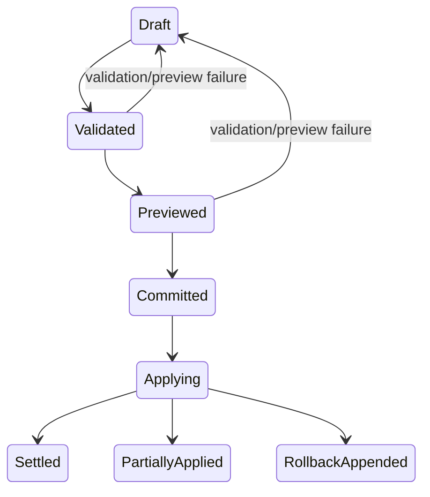
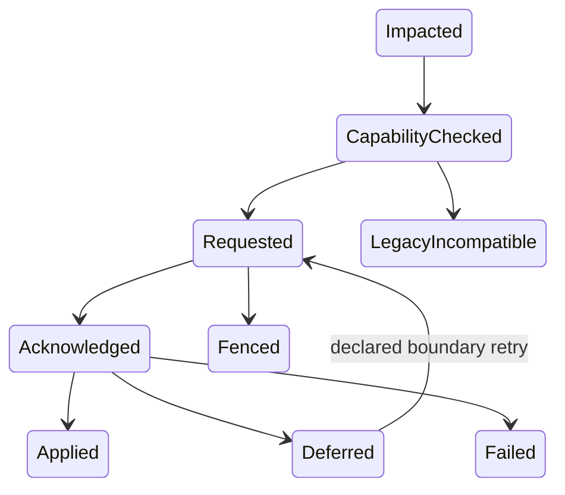

# Runtime policy plane design (HR-129)

## Status, scope, and non-goals

**Status:** HR-129 proposal/design only.

**Scope:** One user on one machine (same UID), using the existing filesystem, SQLite, and session-control substrate. V1 supports one user on one machine. Distributed apply is observable but not atomically all-or-nothing. The policy plane is foreground-operated through the existing epoch-fenced fleet substrate: it is never a daemon, scheduler, remote service, or second command bus.

This design replaces YAML as live authority with one typed, append-only global policy journal. Target session journals retain session-local overrides and apply evidence, and the existing fleet-controller session journal retains propagation orchestration. SQLite remains rebuildable projection/receipt storage.

**Non-goals:**

- A daemon.
- A scheduler.
- A remote policy service.
- A general deployment system.
- Autonomous telemetry-driven policy mutation.
- A secret store.
- A replacement fleet bus.

**Invariant:** Journals are authority. SQLite, Control Plane views, fleet status, and command receipts are projections or transport evidence only. Policy must not be silently mutated by telemetry, file watching, or a read/projection surface.

Hard eligibility and safety constraints compose before preference precedence. Active sessions change only at declared safe boundaries after a target-owned acknowledgement. Expiry is evaluated at runtime boundaries, so an idle session needs no wake-up to “revert.”

## Vocabulary and precedence

The policy plane has five named inputs:

| Input | Definition |
|---|---|
| `BootConfig` | Paths, credential-store selection, provider endpoints, and extension roots. It is startup-only and is not live routing policy. |
| `DurablePolicy` | Journaled routing, fallback, budgets, and UI preferences. |
| `TemporaryPosture` | A journaled effective interval, such as provider deny for one hour. |
| `SessionPolicy` | A session-journaled pin, override, or clear. |
| `InvocationOverride` | A one-command/spawn-only choice, recorded in its route/action receipt but not persisted as policy. |

### Eligibility and preference precedence

First evaluate non-bypassable hard constraints. These are not preference layers:

1. Credential availability.
2. Provider/model capability.
3. Security/tool restrictions.
4. Active provider-deny posture.
5. Quota.
6. Registry eligibility.

Among the remaining eligible values, precedence is:

| Precedence | Layer |
|---:|---|
| 1 | `InvocationOverride` |
| 2 | `SessionPolicy` |
| 3 | `TemporaryPosture` preference |
| 4 | Workstream-scoped `DurablePolicy` |
| 5 | Global `DurablePolicy` |
| 6 | Built-in default |

`BootConfig` supplies connectivity and capability facts and does not compete in this preference chain.

An explicit model pin blocked by `no Anthropic` fails visibly rather than silently rerouting. Explicit user choices still win among eligible routes, preserving HR-019/current resolver semantics.

Agent-frontmatter route directives and `--config` overlays are eliminated as live authorities. Agent definitions may declare responsibility, capabilities, and requested lane; concrete route policy moves into `DurablePolicy`. Preserve HR-122 responsibility-role → lane → concrete-route provenance and do not revive catch-all `task` as a policy ontology.

Within one policy layer and scope, the later committed sequence wins for the same typed key. Scope specificity is fixed, not configurable. There are no arbitrary numeric priorities. `explain` always lists the winner and shadowed candidates.

## Authority and storage

Use a dedicated append-only journal, e.g. `~/.omp/agent/policy/policy-v1.jsonl`, as the global/workstream `DurablePolicy` and `TemporaryPosture` authority. Do not put global policy truth in an arbitrary controller session journal: controller sessions are temporary, while policy must outlive and reconstruct independently.

A short-lived foreground policy-controller lease, carrying the same-UID owner and epoch, is the sole append path. A complete validated transaction is one bounded JSONL record. Append under lock, `fsync`, then advance the projection. Add `sequence` plus `previous-record hash`/`current hash` so truncation, forked heads, and stale writers fail closed.

Use the fleet controller’s own `SessionManager` journal only for policy propagation operation and target observations, mirroring HR-115 `fleet_rollout`. Use each target session journal for `policy_apply` results and `SessionPolicy` records. The existing session-control SQLite mailbox transports commands and receipts. A policy SQLite database indexes transactions, effective values, and target drift, but is fully rebuildable.

“Transactional” means atomic validation plus append of one policy transaction and idempotent correlated propagation. It does not promise impossible fleet-wide atomic commit. `--require-all` may block commit during preview if any target is incompatible; races after commit become visible deferred or failed drift.

Rollback never rewrites or deletes history: append a new inverse transaction with `rollbackOf`. Expiry also never deletes history; an expired record simply ceases to participate in effective resolution.

## Typed record schemas

### `PolicyTransactionV1`

`PolicyTransactionV1` has the following fields:

- `recordType: 'policy-transaction'`
- `schemaVersion: 1`
- `transactionId`
- Monotonically committed `sequence`
- `previousHash`
- `recordHash`
- `createdAt`
- `effectiveFrom`
- Optional `expiresAt`
- `author { kind:'cli'|'control-plane'|'import', uid, pid, sessionId? }`
- `source { kind, uri?, importDigest? }`
- Mandatory `reason`
- Optional `rollbackOf`
- `registry { version, digest }`
- Non-empty typed `mutations`

Validate `expiresAt > effectiveFrom`, UUID/ISO time/hash formats, same UID, current lease epoch, unique transaction ID, current head, and the complete mutation set before append.

### `PolicyMutationV1`

`PolicyMutationV1` is a generated discriminated union, never `{value:any}` or `{value:unknown}`:

```ts
{op:'set', key:<registered literal>, scope:Global|Workstream, fragmentVersion, value:<key-specific type>}
```

or:

```ts
{op:'clear', key, scope, fragmentVersion}
```

Built-in model-routing keys should include responsibility-role lane mappings, concrete eligible fallback chains, provider allow/deny constraints, account/effort constraints, and budget/admission rules.

### `SessionPolicyRecordV1`

`SessionPolicyRecordV1` is written in the target session journal for an explicit session pin, override, or clear. It includes:

- `sessionPolicyId`
- `transactionId`
- Typed key/value
- `effectiveFrom`
- Optional `expiresAt`
- Author/source/reason
- Command ID
- Session ID
- Owner epoch

### `PolicyApplyCommandV1`

`PolicyApplyCommandV1` is a new session-control command selected only through capability intersection. It includes:

- `commandId`
- Target session/owner epoch
- `policyTransactionId`
- `policySequence`
- `policyHeadHash`
- `expectedAppliedSequence`
- Impacted policy classes

The target re-reads and verifies the authoritative record/hash rather than trusting untyped values in SQLite.

### `PolicyApplyRecordV1`

`PolicyApplyRecordV1` is typed semantic target evidence. It includes:

- Transaction/sequence/head
- Previous sequence
- Session/owner epoch
- Command ID
- Classification (`hot|next-operation|next-turn|restart-required`)
- Result (`applied|deferred|failed`)
- Boundary/effective time
- Typed reason

The generic transport receipt remains `requested`/`acknowledged`/`applied`/`failed`, but policy command results use a strict result union rather than leaking the current `Schema.Unknown` receipt result into runtime APIs.

### Projections

Projection rows are conceptual only:

- Transaction index.
- Current effective key plus scope.
- Target applied sequence/status.
- Provenance edges.

Every row carries source journal URI, sequence, and hash and can be rebuilt.

## Fragment registry and schema evolution

Use namespaced fragments: `core.routing`, `core.fallback`, `core.budgets`, `ui`, and `extension.<id>`. Fragments are registered at composition startup. Each fragment contributes:

- Key literals.
- Effect Schema codecs.
- Current version.
- Read/write version range.
- Default.
- Merge class (`scalar`, `set constraint`, or key-specific deterministic reducer).
- Apply class.
- Redaction policy.
- UI metadata.

The core registry compiles these into the closed mutation/result unions and a registry digest. Do not extend the giant `SETTINGS_SCHEMA`.

Registration is namespaced and collision-failing. An extension cannot replace core keys or another extension’s namespace. Enabling or disabling extension code is `BootConfig`/restart-required; extension policy values are `DurablePolicy`.

Additive optional fields are minor versions. Changed meaning, removal, or incompatible representation is a new major/key with an explicit pure migration. Writers emit only current versions. Readers retain original journal bytes and project through registered migrations without rewriting history.

Unknown-field behavior is strict:

- Known major/version records reject excess fields with source journal URI, transaction ID, mutation index, key, and schema path.
- A newer unsupported record/fragment is retained byte-for-byte and surfaced as `UnsupportedPolicyRecord`/partial projection.
- An unsupported record never becomes a runtime `unknown` value and never controls behavior.
- A missing plugin decoder makes its namespace inactive with a clear compatibility diagnostic.
- Unknown CLI keys are hard errors with suggestions, never tolerated as experimentation.

Validation failures include source provenance and redact according to fragment policy. Secrets and secret-like values are rejected before append.

## Propagation protocol and state machines

### Transaction state machine



The transaction states are `Draft → Validated → Previewed → Committed → Applying → Settled`; `Applying` may end `PartiallyApplied` or `RollbackAppended`. Validation or preview failure returns to `Draft` and performs no write. `Committed` is durable policy truth for new sessions. Each active session retains its prior applied sequence until its target acknowledgement.

### Target state machine



The target states are `Impacted → CapabilityChecked → Requested → Acknowledged → (Applied | Deferred | Failed | Fenced | LegacyIncompatible)`. `Deferred` can be retried at its declared boundary with the same transaction/command identity. An owner-epoch change causes re-observation and a newly fenced command, never guessed success.

### Written procedure

1. Validate all typed mutations and registry versions.
2. Compute effective-before/effective-after and impacted fresh peers without mutation.
3. Show the diff, provenance, safe-boundary class, legacy/stale targets, and expiry.
4. On confirmed set, append one transaction.
5. Create a policy propagation operation in the controller session journal.
6. Dispatch serial/local epoch-fenced policy-apply commands through `SessionControlBus`.
7. Each target verifies the same UID, current ownership, journal head/hash, and expected prior sequence.
8. The target applies only at its class boundary and appends semantic evidence.
9. The controller records receipts and drift.
10. The projection updates from journals.

New sessions resolve the current effective policy journal head. Existing sessions never watch YAML or silently mutate from file changes. A failed or deferred session remains explicitly on `appliedSequence=N` while the global head is `N+1`.

For `expiresAt`, effective resolution excludes the posture at every operation/turn boundary. Active runners may update UI timers, but no background scheduler owns expiry. On the first post-expiry boundary, the previous policy becomes effective and the target appends an apply record. Idle sessions require no wake-up.

Reuse existing fleet capability negotiation by adding an advertised `policy-apply-v1` feature and independent policy journal schema read/write range. Reuse command IDs, same-UID admission, target owner epoch, FIFO claim, idempotent replay, and `requested`/`acknowledged`/`applied`/`failed` receipts. Do not overload rollout phases or invent a second control bus.

## Apply-boundary matrix

| Apply class | Examples | Semantics |
|---|---|---|
| `hot` | Presentation-only UI preferences/status rendering | Apply immediately after ownership recheck; no semantic work changes. |
| `next-operation` | Provider allow/deny, budget ceilings, spawn/concurrency/admission controls | Never kill an admitted provider/tool call or running child; block the next admission. |
| `next-turn` | Responsibility-role routing, model/fallback/account/effort policy, compaction/default behavioral preferences | Snapshot once at turn/spawn admission so a turn never mixes policy revisions. |
| `restart-required` | `BootConfig` paths, credential backend, provider endpoints, extension set/schema registry, process topology | Journal and preview may stage them, but the session receipt is deferred until a verified restart/reacquisition. |

A transaction spanning classes is atomic in the policy journal, but each target reports each class separately. The effective target sequence advances only when all non-restart parts it uses are applied; restart-required drift remains explicitly staged. Prefer rejecting mixed live/restart transactions in v1 unless the CLI explicitly stages them, to keep operator intent legible.

## CLI and Control Plane

### CLI

- `omp policy get [key] [--scope ...] [--session ...] [--at ...]`: effective value, applied/global sequence, and source record.
- `omp policy explain <key>`: ordered provenance stack, hard constraints, winner, shadowed/rejected candidates, expiry, schema fragment/version, route consequences, and target drift.
- `omp policy diff [<from>..<to>|--file import.yml]`: typed semantic diff plus affected sessions/apply classes; no mutation.
- `omp policy set <typed assignments> --scope ... --reason ... [--effective-from ...] [--expires-in 1h|--expires-at ...] [--dry-run] [--require-all]`: dry-run performs validation and impact preview and writes nothing. Include the canonical temporary posture example `no Anthropic for one hour`.
- `omp policy rollback <transactionId> --reason ... [--dry-run]`: append inverse transaction, preview, and propagate normally.
- `omp policy history [key] [--author ...] [--since ...]`: immutable transactions, rollback/expiry links, controller operation, and target receipts.

### Control Plane

The Control Plane calls the same typed service and command path. It displays:

- Current global head versus selected-session applied head.
- Provenance stack.
- Impacted sessions.
- Expiry countdown.
- Deferred/failed reasons.
- Rollback action.

It never writes SQLite or journal files directly.

## Migration and staggered compatibility

Implement migration conceptually as explicit `omp policy import <yaml...> --dry-run`, followed by a confirmed bootstrap transaction, and a redacted `omp policy export` only. YAML is never watched or used by policy-capable runners after cutover.

The importer reads:

- Global `~/.omp/agent/config.yml`.
- Project/stream `.omp/fable-config.yml`/capability settings.
- Ordered CLI overlays if explicitly supplied.
- `models.yml` classifications.
- Routing directives in agent frontmatter.

It produces a conflict report for every imported key containing:

- Source path/location.
- Normalized typed key.
- Candidates in old precedence order.
- Winning value.
- Shadowed values.
- Secret/boot/policy classification.
- Unsupported key.
- Required manual resolution.

No live behavior changes during dry-run.

Bootstrap appends one import transaction with source file digests. Secrets move to the credential store, and only credential references/provider IDs may appear in policy. Provider endpoints, paths, model catalog definitions, and extension roots remain `BootConfig`; routing, fallback, budgets, and UI become policy. Frontmatter retains responsibility metadata but loses routing authority after full cutover.

For staggered fleets, old peers without policy capability are `LegacyIncompatible`, shown in preview, and never receive guessed commands. Existing old live sessions keep their startup YAML snapshot until restart. The default `--require-all` prevents claiming fleet completion. A bounded one-way generated compatibility YAML export may be produced from the journal for old binaries only, stamped with policy sequence/hash and never manually edited. Policy-capable binaries ignore policy keys in that file. Remove the bridge once the minimum fleet capability advances.

Never dual-write journal and editable YAML. Never silently reload an old session. A rollback to an old binary must disclose that it can only honor the last generated compatibility snapshot and may therefore be policy-deferred until regenerated or restarted.

## Security and audit

Secrets, API keys, OAuth material, credential payloads, signed URLs, and environment values never enter policy transactions, diffs, projections, controller journals, or exports. Policy may reference an opaque credential/provider identifier only. Schema redaction is defense in depth, not permission to persist secrets.

Journal, lease, and projection files are owner-only; reject symlink, ownership, and mode violations. Mutation requires the same UID plus the current policy-controller lease epoch. Target apply additionally requires the current session owner epoch. Control Plane observers remain read-only.

Audit every attempted mutation outcome (`validated`/`rejected`/`committed`), author/source/reason, source import digest, transaction/hash chain, rollback relation, command IDs, controller and target owner epochs, applied/deferred/failed evidence, and redaction policy version. Clock timestamps are evidence; committed sequence/hash defines order.

A stale controller may read but cannot append or apply. Conflicting transaction or command ID reuse fails. SQLite corruption or deletion triggers rebuild, never policy loss or authority transfer.

## MVP slices and acceptance tests

1. **Slice 1 — required first vertical slice, model routing end-to-end:** Implement the dedicated journal, typed core routing fragment, and projection; `get`/`explain`/`diff`/`set`/`rollback`; policy apply capability/command; and feed the applied policy snapshot into existing `resolveSpawnRoute`. Run a real multi-process proof where one runtime edit changes the next safe spawn/turn in multiple active sessions with provenance, an in-flight call is not killed, and rollback restores the prior route. The operator edits no YAML. Preserve explicit-choice block semantics and route receipts.
2. **Slice 2 — temporary posture and boundaries:** Add provider deny/fallback/budget fragments, `effectiveFrom`/`expiresAt`, next-operation/next-turn behavior, and partial/deferred drift. Deterministic clock tests prove pre-boundary, exact expiry, post-expiry auto-reversion, explicit pin visibly blocked, and idle-session correctness without a scheduler.
3. **Slice 3 — inspection and Control Plane:** Add projection rebuild, provenance stack, history/diff, global-versus-applied drift, and dry-run impact preview. Tests delete/rebuild SQLite from journals and prove identical query output and no journal mutation from read surfaces.
4. **Slice 4 — YAML migration/cutover:** Add importer/conflict report, secret classification, generated legacy compatibility export, policy-capable ignore path, and old-peer capability block. Fixture/process tests cover global-plus-stream conflicts, arrays/scalars versus prior deep merge, malformed/unknown keys, frontmatter routing, redacted export, and no silent live change.
5. **Slice 5 — fragment registry/general policy:** Add extension namespace registration, collision rejection, additive versions, pure migration, absent/newer plugin behavior, strict excess-property errors with provenance, and no `unknown` reaching runtime consumers.

Security/authority tests across slices cover wrong UID, stale policy lease epoch, stale target owner epoch, conflicting transaction/command replay, torn final JSONL line/hash mismatch, file permissions/symlink attack, attempted secret persistence, rollback chain, and projection corruption/rebuild.

Compatibility/process tests cover policy-capable and legacy peers in one fleet; dry-run reporting of exact impacted/apply class; default `require-all` blocking; explicit deferred mode never claiming applied; owner changes between preview and request; target applying once after re-fencing; and newer policy/control major safely blocking.

Use existing focused test patterns rather than mocks: extend routing process proof, session-control target proof, fleet capability/plan proof, and fleet CLI proof. The final Slice 1 gate must demonstrate edit → provenance → active-session safe update → rollback end-to-end, not merely schema/unit tests.

## Alternatives and rationale

- **Reject controller-session journal as global policy authority:** A temporary controller identity and scattered sessions make global history discovery/compaction ambiguous. Keep it for propagation operations only.
- **Reject SQLite authority:** It violates the runtime contract, makes rebuild/rollback provenance weaker, and turns query state into commands.
- **Reject YAML watch/reload:** Parsing and file watch do not solve typed transactions, expiry, acknowledgements, owner fencing, or provenance.
- **Reject a single rigid mega-schema:** It recreates the experimentation bottleneck. Namespaced closed fragments keep runtime values typed while permitting additive registration.
- **Reject last-write-wins by timestamp and arbitrary priorities:** Use committed sequence, fixed layers/scopes, and explicit provenance.
- **Reject force-applying routing during a turn or killing provider calls:** Snapshot at safe boundaries and report deferred state.

## Critical files

The following are mandatory reading for implementation:

- `docs/fable/harness-runtime-contract.md`
- `docs/fable/fleet-rollout-design.md`
- `docs/fable/harness-request-register.md`
- `vendor/oh-my-pi/packages/coding-agent/src/config/settings.ts`
- `vendor/oh-my-pi/packages/coding-agent/src/config/settings-schema.ts`
- `vendor/oh-my-pi/packages/coding-agent/src/capability/settings.ts`
- `vendor/oh-my-pi/packages/coding-agent/src/task/route-resolution.ts`
- `vendor/oh-my-pi/packages/coding-agent/src/task/spawn-route.ts`
- `vendor/oh-my-pi/packages/coding-agent/src/config/role-resolution.ts`
- `vendor/oh-my-pi/packages/coding-agent/src/session/session-control.ts`
- `vendor/oh-my-pi/packages/coding-agent/src/session/session-control-target.ts`
- `vendor/oh-my-pi/packages/coding-agent/src/session/fleet-capability.ts`
- `vendor/oh-my-pi/packages/coding-agent/src/session/fleet-rollout-plan.ts`
- `vendor/oh-my-pi/packages/coding-agent/src/cli/fleet-operations.ts`
- `vendor/oh-my-pi/packages/coding-agent/test/process/routing-precedence-process.test.ts`
- `vendor/oh-my-pi/packages/coding-agent/test/session/session-control-target.test.ts`
- `vendor/oh-my-pi/packages/coding-agent/test/session/fleet-capability.test.ts`
- `vendor/oh-my-pi/packages/coding-agent/test/session/fleet-rollout-plan.test.ts`
- `vendor/oh-my-pi/packages/coding-agent/test/fleet-cli.test.ts`

## Source citations

- `docs/fable/harness-runtime-contract.md:56-69` — blessed owner table: SQLite is query/history, not live commands/config; route decision is explicit evidence.
- `docs/fable/harness-runtime-contract.md:105-117` — current routing/settings precedence and reload limitation: reload does not rebuild sessions and runtime overrides survive.
- `docs/fable/harness-runtime-contract.md:217-234` — controller/observer authority.
- `docs/fable/harness-runtime-contract.md:346-379` — typed mutation boundary; SQLite/files are not command paths.
- `docs/fable/harness-runtime-contract.md:519-530` — committed sequence over timestamps, version every durable boundary, disposable projections.
- `docs/fable/harness-runtime-contract.md:568-595` — local scope and no automatic telemetry-driven policy mutation.
- `docs/fable/fleet-rollout-design.md:40-50` and `:115-145` — controller session journal authority for controller operations, epoch-fenced protocol, compatibility, rollback.
- `docs/fable/harness-request-register.md:58` — HR-129 exact requirement; `:77` — HR-122 responsibility ontology; `:111` — HR-115 fleet substrate.
- `vendor/oh-my-pi/packages/coding-agent/src/config/settings.ts:220-251,318-444,678-715,742-800,1184-1220` — current cached global/project/overlay/runtime layers, reload, provenance, and deep-merge precedence.
- `vendor/oh-my-pi/packages/coding-agent/src/config/settings-schema.ts:43-65,463-469,3895-3898` — current giant settings metadata/schema and unstructured `modelRoles`/agent override records.
- `vendor/oh-my-pi/packages/coding-agent/src/capability/settings.ts:8-31` — current generic `Record<string, unknown>` capability boundary that the typed fragment registry must not copy.
- `vendor/oh-my-pi/packages/coding-agent/src/task/route-resolution.ts:10-108,157-243,245-344` — existing pure route-decision seam, precedence/provenance, explicit terminal behavior, and fallback receipts.
- `vendor/oh-my-pi/packages/coding-agent/src/task/spawn-route.ts:64-83,101-214` — concrete task-spawn wiring and quota/auth fallback path for Slice 1.
- `vendor/oh-my-pi/packages/coding-agent/src/config/role-resolution.ts:6-72,75-150,152-195` — role grammar, layer labels, fallback expansion, and legacy precedence.
- `vendor/oh-my-pi/packages/coding-agent/test/process/routing-precedence-process.test.ts:1-319` — real process proof pattern for reload, explicit session selection, journaled model change, and provider receipt.
- `vendor/oh-my-pi/packages/coding-agent/src/session/session-control.ts:9-216,278-285,397-545` — strict command schemas, protocol lanes, same-UID check, epoch-bound FIFO/idempotency, and receipt lifecycle. Call out current `SessionControlReceipt.result: Schema.Unknown` as a boundary to tighten for policy results.
- `vendor/oh-my-pi/packages/coding-agent/src/session/session-control-target.ts:15-55,61-85,87-216` — target action seam, ownership checks, serialized apply, and post-action fencing pattern.
- `vendor/oh-my-pi/packages/coding-agent/src/session/fleet-capability.ts:3-48,91-137,148-213` — independent protocol ranges, strict compatibility classification, unknown feature filtering, and explicit feature intersection.
- `vendor/oh-my-pi/packages/coding-agent/src/session/fleet-rollout-plan.ts:14-94,299-357,364-410,495-575` — typed controller journal records, controller lease, plan/target lifecycle, and SQLite projection separation.
- `vendor/oh-my-pi/packages/coding-agent/src/cli/fleet-operations.ts:463-490,514-555,607-708,709-850` — foreground fleet-controller `SessionManager`, journal append, command/health sequence, and durable reconstruction.
- `vendor/oh-my-pi/packages/coding-agent/test/session/session-control-target.test.ts:1-280` — existing real receipt, checkpoint, digest, pause provenance, and stale-owner proof patterns.
- `vendor/oh-my-pi/packages/coding-agent/test/session/fleet-capability.test.ts`, `test/session/fleet-rollout-plan.test.ts`, and `test/fleet-cli.test.ts` — compatibility, journal/controller planning, and CLI test anchors.
