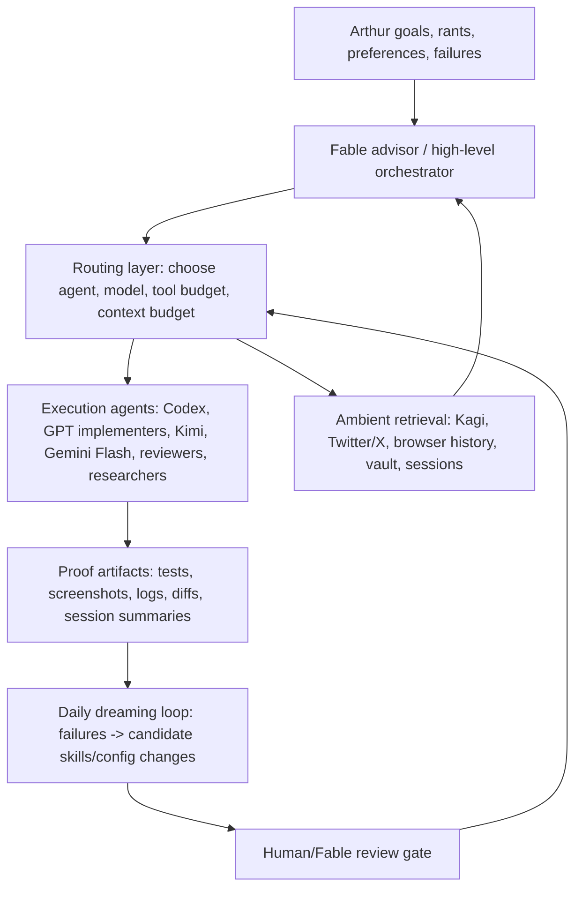

# Fable Workstream / Repo Map

Use this as a locator map. It names goals, inspirations, and folders; it intentionally avoids prescribing exact implementations. Fable should diagnose the X/Y problem before choosing methods.

## Main streams

| Stream | Goal | Inspiration / reason | Primary folders and records |
|---|---|---|---|
| AI companion / realtime avatar | Build an emotionally compelling realtime companion product with voice, avatar, memory, and low-latency interaction. | Grok/Annie realtime chat, *Love and Deep Space*, spatial ASMR, VRM/Live2D/WebGL intimacy. | `apps/ai-companion-rtc/`; `docs/plans/asmr-companion-overnight-goals.md`; `docs/plans/asmr-companion-seedance-chinese-text-frontier.md`; `data/fable-prep/session-corpus-summary.md` label `chatbot_rtc`; older context may be in Pi/Codex sessions, not only OMP. |
| UGC / media creative playground | Create a flexible human+agent creative workbench for distribution assets and weird media exploration. | ArCAD/Higgsfield/Midjourney-style creation interfaces as rough references, ComfyUI/canvas freedom as interaction inspiration, Pleometric/brainrot/Torment-Nexus energy as aesthetic fuel — not a fixed implementation plan. | `apps/slotok-workbench/`; `packages/hyperframes-renderer/`; `packages/jimeng-client/`; `workflows/tiktok-recreate/`; `docs/state/video-creative-direction.md`; `docs/plans/ugc-studio-workstreams.md`; `docs/plans/layered-video-graph.md`; session label `ugc_video`. |
| Personal second brain / shared context | Combine Twitter/X inspiration, browser history, transcripts, SRS, annotation, and personal library into a queryable shared memory for Arthur and agents. | Andy Matuschak, Fernando Borretti, Hashcards, practitioner podcasts, tacit-knowledge extraction, Golden Nuggets-style flashcard generation. | `packages/twitter-archive/`; `browser-extensions/extensions/twitter-archive-firefox/`; `packages/borges-library/`; `~/apps/mochi-lite`; `~/apps/hsk-deck`; `~/apps/japanese-vocab`; `~/vault`; `~/github/hashcards`; labels `twitter_archive` + `learning_memory`; `docs/twitter-archive-plan.md`; `docs/plans/twitter-archive-goal.md`. |
| Agent harness / cyborgism | Improve OMP/Pi orchestration, repo state, memory handoffs, subagent control, and proof so stronger models waste less time. | Fable as scarce advisor/orchestrator; cheap agents as execution; distinct model-creatures with their own preference basins rather than extensions of Arthur. | `oh-my-pi/`; `packages/web-access/`; `.omp/`; `docs/plans/symphony-lite-goal.md`; `docs/state/symphony-lite-direction.md`; label `agent_harness`. |

Trading / market research remains opportunistic. Cybersecurity, vphone, proxy, anti-detection, and reverse-engineering implementation lanes are routed away from Fable unless Arthur explicitly starts a separate non-Fable session.

## Agent harness / OMP workstream — canonical framing

This stream is not "the Symphony project." Symphony Lite is one possible layer. The actual target is the whole OMP harness: prompts, skill discovery, model routing, tool access, subagent contracts, daily self-improvement, and retrieval surfaces.

Fable should treat this as a continuous meta-workstream that improves while the other streams run. Do not implement all of this immediately; use it as the design brief for future harness iterations.

### Layered architecture inspiration

Hermes inspiration: compact reusable skills, explicit skill/subagent/automation choice, vault-aware source workflows, and recurring automations. Do not copy Hermes mechanically; port the useful ontology into OMP.

### Routing matrix sketch

| Need | Preferred lane | Why |
|---|---|---|
| High-level synthesis, prompt taste, project ontology | Fable main session | Scarce advisor role; best used for goals, taste, cross-workstream routing. |
| Implementation-heavy code changes | Codex/GPT-5.5 or `gpt-implementer` | Strong logic and code execution; not the final prompt/taste author. |
| Native computer use / GUI action where Codex has advantage | Codex lane first, CuaDriver/Computer Use where appropriate | Codex has built-in computer-use affordances and is likely trained around that interaction style. |
| Browser protocol / network / auth extraction | CDP/browser tools or authenticated web worker | More precise than generic computer use; preserves sessions. |
| Cheap bounded implementation or review | Kimi / Gemini Flash workers | Good for scoped work when the main model should stay scarce. |
| Search / outside web context | Kagi by default | Use Kagi as the default search provider, not generic Google fallback. |
| Twitter/X inspiration and social graph | Twitter/X archive and browser-context retrieval | Should become ambient shared context; not necessarily a heavy always-on tool. |
| Vault / sources / notes | Direct filesystem/vault-aware retrieval | Use as memory substrate without dumping it all into default context. |
| Book/library retrieval that some models refuse | Borges/library-specific lane or Kimi researcher | Route around model-specific refusal basins instead of arguing with the wrong agent. |

### Daily "dreaming" self-improvement loop

Desired future automation, not immediate implementation:

1. Collect the day's agent failures: refusals, bad prompt-writing, wrong tool routing, wasted context, broken assumptions, repeated manual corrections, missing state, and verification misses.
2. Cluster them by cause: missing skill, bloated skill, wrong model, wrong tool, missing retrieval surface, stale doc, bad default prompt, bad subagent contract.
3. Propose small harness patches: disable a default tool, add a dormant skill, move instructions from default prompt into a skill, update model routing, add an index, or create a scheduled maintenance task.
4. Require a review gate before changes land. The loop proposes; Fable/Arthur decides.
5. Keep proof: before/after failure example, changed file, and how to verify the fix.

### Context-budget discipline

- Default context should stay small. The harness should retrieve context when needed instead of loading every skill, plan, and source.
- Prefer dormant skills and explicit routing over always-on instructions.
- Every default tool/skill must earn its prompt tax.
- Search providers such as Kagi and shared memory providers such as Twitter/X or browser history should be easy to invoke, but not necessarily preloaded as text.
- If a capability is only good for one agent family, route it there rather than exposing it everywhere.

## Session and auth locations

| Thing | Location / command | Notes |
|---|---|---|
| OMP sessions | `~/.omp/agent/sessions/` | Main source for recent OMP work. Use `docs/fable/session-index.md` first; do not scan all JSONL blindly. |
| Pi sessions | `~/.pi/agent/sessions/` | Older work may live here. Included in `data/fable-prep/session-records.json`. |
| Codex sessions | `~/.codex/sessions/` and `~/.codex/archived_sessions/` | Important pre-OMP context, especially AI companion and Mochi/SRS work. |
| OMP auth/session mechanism | `omp auth-broker`, `omp token <provider>`, `omp usage`, `OMP_PROFILE`, `PI_CODING_AGENT_DIR` | Fable should reuse OMP's existing auth/session machinery and subscription quotas instead of inventing new token storage. Do not print secrets. |
| Frontend LLM sessions | `llm_frontend_browser` tool/session store | Use subscriptions/quotas when possible before paid APIs, especially for expensive deep research. |
| Generated Fable corpus | `data/fable-prep/session-corpus-summary.md`, `data/fable-prep/session-records.json` | Ignored/generated local files; useful for filtering by label, cwd, score, and transcript path. |

## Transcription caveats

Arthur often dictates via VoiceInk / speech-to-text. Uncommon words are frequently mistranscribed. Do not overfit spelling.

Known likely aliases:

- "Heisuke" → likely `HSK` / Chinese deck work, not a separate Heisuke project.
- "Matsuchak", "Matuschak" → Andy Matuschak.
- "brainrod", "brenrod" → brainrot / UGC media stream.
- "Gming" → Jimeng / Dreamina.

For the fuller transcription table, see [`docs/fable/transcription-notes.md`](transcription-notes.md).

## Small tasks to leave for Fable orchestration

Do not execute these now; keep them visible so Fable can choose the best route:

- Map who Arthur follows on Twitter/X and which personalities are highest-signal for each workstream.
- Unify Twitter/X archive, browser history, transcripts, SRS, and personal-library data into one second-brain monorepo or workspace structure.
- Inspect Grok/Annie on Arthur's iPhone Max for AI-companion inspiration, using approved local device-control tooling and avoiding proprietary copying.
- Evaluate transcript/diarization lanes for practitioner podcasts and tacit-knowledge extraction.
- Investigate subscription-backed speech/meeting transcription lanes and rate limits through OMP's existing auth/session system.
