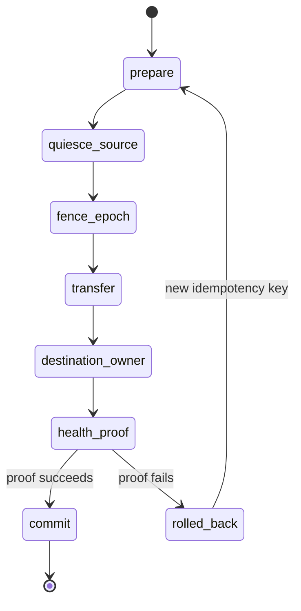

# Majordomo fleet-control and migration API

Majordomo exposes the typed migration core from `@oh-my-pi/pi-coding-agent`: `inspectFleetSession`, `checkpointFleetSession`, `correctFleetSession`, `exportFleetSession`, `importFleetSession`, `migrateFleetSession`, and `attachFleetSession`. The adjacent directory core exposes `querySessionDirectory`, `inspectSessionDirectory`, and `resolveSessionDirectorySelector`. `omp fleet` is a stable-JSON projection over these shared APIs; migration mutation verbs take `--request <json-file>`.

## Safety contract

Every mutation request carries a caller-stable `idempotencyKey`, an epoch-bound `FleetOwnerProof`, explicit `FleetMutationCapability` values, and a timeout from 1–300000 ms. Receipts have schema version 1, a SHA-256 payload digest, and an HMAC-SHA-256 signature. A proof for another host/session/epoch, a missing capability, a second migration, or a source reacquisition after commit is refused.

The source journal and durable queue boundary are immutable. `correctFleetSession` appends a `FleetCorrection` addressed to a record ID. `decodeFleetJournal` applies this overlay for presentation; transcript “edit” UX must call this operation and must never rewrite historical JSONL bytes.

`exportFleetSession` checkpoints journal and closed queue byte lengths/digests, requires a typed continuation snapshot, maps the cwd to `workspace://agents/<relative-path>`, and writes a digest manifest. The snapshot names every running, idle, parked, or failed child by `journal://<session>/<child>`, status, resumability, and continuation handle, plus current todos and deferred changes. Import refuses missing or malformed continuation state. Historical tool arguments remain unchanged presentation data. `importFleetSession(..., { dryRun: true })` validates and copies immutable bytes into a destination staging directory without creating an owner. Migration alone promotes the staging bundle and creates a fresh destination epoch, queue root, socket path, and build record.

## Migration state machine



Transfer is resumable only with the same idempotency key and source owner proof. Rollback removes the uncommitted destination owner and reopens the same source epoch. No rollback transition exists after `commit`; the committed fence permanently prevents source reacquisition.

Zero task loss is a commit condition: the destination owner records all child continuations, todos, and deferred changes, and its health proof must explicitly enumerate every continuation handle. Missing handles trigger pre-commit rollback. A real H11 destination must re-adopt those handles or expose them for explicit continuation; it may not silently omit children.

## Session directory

`SessionDirectoryRow` is searchable by session ID, workstream, exact host, state, model, category tag, claim, attention category, freshness, and free text. Rows carry owner/build/model, cwd, active jj change, tags, summary, and attention state. `resolveSessionDirectorySelector` accepts a session ID or workstream plus optional exact host and refuses zero or multiple matches. Orchestrator mutations resolve through this directory, then still require the selected owner proof and capabilities; random IRC handles are not a control identity.

## CLI request envelope

The verbs `checkpoint`, `correct`, `export`, `import`, `migrate`, and `attach` require a JSON request file; import additionally requires the explicit CLI gate `--dry-run`. `inspect <session-id> --request inspect.json` selects bounded migration-state inspection; without `--request`, it retains fleet directory inspection. Responses are one JSON line with keys `schemaVersion`, `action`, `selector`, and `result`.

Example:

```sh
omp fleet migrate 019f... --request migrate.json
```

A migrate request includes `host`, `destination`, `files`, `context`, `cwd`, and a destination `healthProof`. Production callers should obtain the health proof from the destination owner/controller path; static proof values exist only as the JSON projection seam for already-verified orchestrators.

`attachFleetSession` delegates exclusively to the existing public `connectAttachedTerminalController` observer/controller wire. It does not duplicate remote-view mode internals.

## Path portability

Only typed decode overlays translate persisted paths: `workspace://agents/<relative-path>` and `journal://<sessionId>[/child-id]`. There is no `/Users` compatibility symlink and no historical journal rewrite. The destination must resolve the workspace URI beneath its configured workspace root.

## Operational status

The automated suite uses isolated temporary host-A/host-B roots. It does not mutate the recovered Companion, Primer, or Playground session predecessors and does not constitute a real H11 migration. A real H11 claim requires the H11 environment, destination owner/controller health proof, and lane-specific workspaces to be green.
