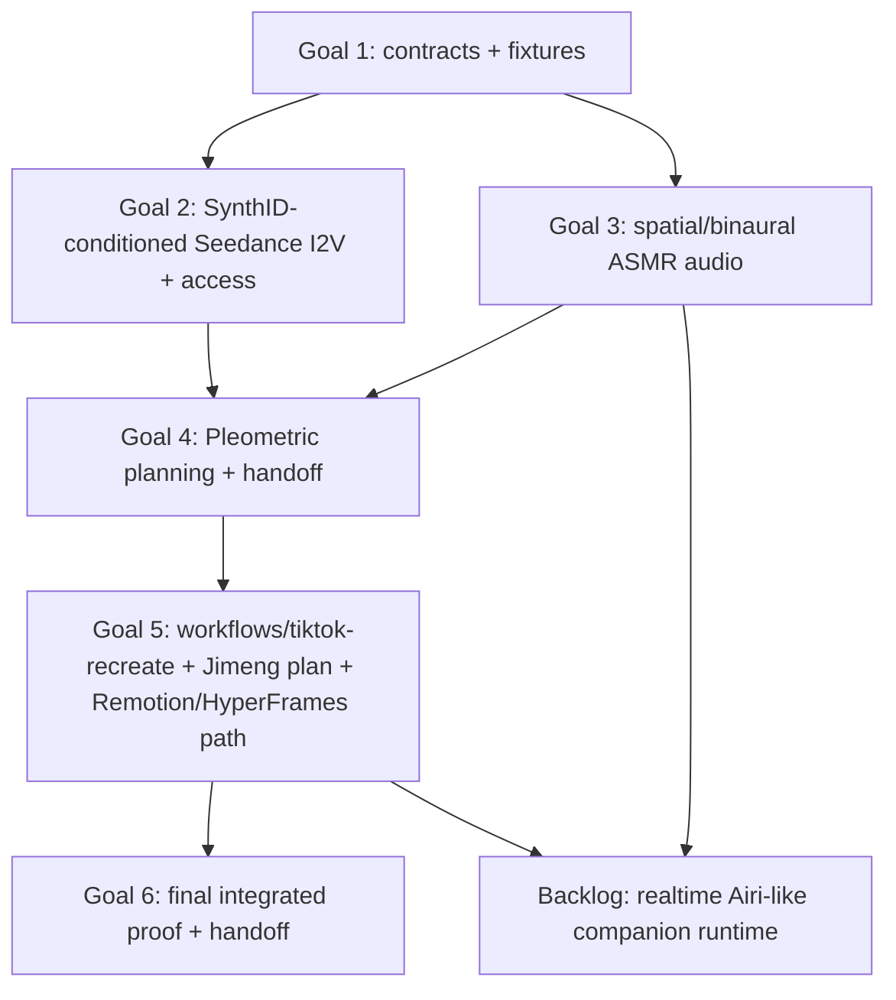

# ASMR Companion + SynthID-Conditioned Seedance Overnight Goals

Generated: 2026-06-24

Use this as the orchestration brief for a `/goal`-driven overnight implementation pass. Use only GPT-5.5-capable implementation agents for the main work. The main overnight scope is the staged offline media pipeline: contracts, SynthID-conditioned Jimeng/Seedance image-to-video, spatial/binaural ASMR audio, Pleometric planning, existing video/render integration, and final proof. The realtime Airi-like companion runtime is backlog, gated on a successful ASMR audio + media pipeline proof.

The unit of work is a **workstream**, not a task checklist. Each main goal gets one orchestrator agent with exclusive ownership of its stream. Shared dependencies are blockers and handoffs, not duplicate ownership.

## Shared context every orchestrator should receive

Canonical plan:

- `docs/plans/asmr-companion-seedance-pipeline.md`

Reference ASMR archive:

- `data/youtube-liked-asmr-refs/20260624/review-links.md`
- `data/youtube-liked-asmr-refs/20260624/archive-summary.json`
- `data/youtube-liked-asmr-refs/20260624/media/`

Existing repo insertion points:

- `workflows/tiktok-recreate/workflow.js`
- `workflows/tiktok-recreate/README.md`
- `packages/jimeng-client/src/video-plan.ts`
- `packages/jimeng-client/src/browser-proxy-cli.ts`
- `packages/jimeng-client/src/mix-audio.ts`
- `packages/remotion-renderer/src/render.ts`
- `packages/remotion-renderer/src/Root.tsx`
- `packages/remotion-renderer/src/compositions/TiktokRecreate.tsx`
- `docs/state/video-creative-direction.md`

## Operating model

Recommended topology:

- Same repo checkout, no worktrees by default.
- One outer-loop meta-orchestrator agent owns the whole overnight run and has its own explicit `/goal`.
- The meta-orchestrator dispatches workstreams by the dependency graph below, not by a flat checklist. Goals 1–6 are DAG nodes: run dependencies first, then overlap only ready nodes with disjoint ownership.
- Default to two active senior workstreams when the DAG permits it. Raise to three only when the third workstream has no blocker, no shared owner paths, and no shared proof artifact with the others. Otherwise sequence to avoid merge/proof conflicts.
- Senior workstream agents own one goal end-to-end: design inside scope, helper delegation if available, checkpoint proof, scoped commits, and final handoff to the meta-orchestrator.
- Do not depend on disabling subagent-depth limits. If nested subagents work, senior agents may use them; if not, senior agents ask the meta-orchestrator to spawn helpers or continue directly.
- cmux mb is optional; visible terminal tabs are optional. Prefer OMP subagents for the first overnight run because they already notify the parent on completion. Use cmux mb only when Arthur wants visible long-running terminals, manual inspection, or an out-of-band message bus.
- Worktrees are a fallback only if same-repo coordination becomes slower than merging.

Outer-loop meta-orchestrator goal:

```txt
/goal asmr-seedance-meta-orchestrator

Own the staged overnight manager loop for the ASMR companion + SynthID-conditioned Seedance media pipeline. Dispatch one senior workstream at a time by blocker order unless a later prep task has no file or dependency overlap. Preserve the dependency checklist in this markdown file, collect proof artifacts, require each workstream’s own E2E proof before acceptance, run the smallest integration smoke after each accepted boundary, and launch the next dependent workstream only after its blockers are accepted. Keep realtime Airi-like runtime work in backlog until the ASMR audio + media pipeline proof succeeds.
```

Manager/subagent message contract:

- Senior agent completion notice must include: workstream name, commit hash(es), proof command(s), artifact path(s), changed files, blocked items if any, and recommended next workstream.
- Meta-orchestrator records accepted proof in the checklist below before launching the next dependent workstream.
- If a senior agent needs help and nested subagents are unavailable, it asks the meta-orchestrator for a helper with a short request: target, files, acceptance.
- If using cmux mb, prefix messages: `[goal-2-seedance-access -> meta] ...`. If using OMP subagents, use their normal completion output/IRC.

Checkpoint contract for senior agents:

1. Implement one coherent checkpoint inside the workstream.
2. Run the smallest relevant test/proof for that checkpoint.
3. Inspect scoped file impact before staging.
4. Commit only the files owned/touched by that checkpoint.
5. Report checkpoint proof to the meta-orchestrator with commit hash, proof command, artifact path, and next checkpoint.
6. Finish the workstream with a reviewer-rerunnable E2E proof for that workstream’s owned path.
7. Continue to the next checkpoint only after the commit/proof is recorded, unless blocked or the meta-orchestrator set a checkpoint stop.

Commit rules:

- Senior commit messages use: `goal-N: <checkpoint summary>`.
- Meta-orchestrator integration commits use: `meta: <integration/proof summary>`.
- Do not stage unrelated user or sibling-agent changes.
- Do not rewrite another workstream’s committed work without manager coordination.
- If two workstreams need the same shared file, the first committer announces the export/shape; the second adapts or asks before editing.

Inter-workstream gates:

- Before launching the next senior workstream, the meta-orchestrator records the completed upstream workstream commit(s), proof command(s), and artifacts in the checklist.
- After each accepted workstream, run the smallest integration/E2E smoke that exercises the newly available handoff path. If it passes, make a `meta: accept goal-N <summary>` commit or record the accepted senior commit hash if no integration files changed.
- If the integration/E2E smoke fails, do not launch the dependent workstream. Ask the owning senior agent for a fix or make a narrow meta integration fix, then commit that fix before continuing.
- Between major phases, prefer a clean committed state over a large uncommitted queue. Preserve unrelated user/sibling changes.

## Goal 2 live-access reference

This section is a reference owned by **goal 2**. Other goals may consume its resulting manifests and proof artifacts, but they do not own provider access, access preflight, Jimeng/Seedance provenance gates, or live provider stop conditions.

Goal: make paid/subscription access explicit, auditable, and optional for the Jimeng/Seedance I2V lane. Arthur can approve **one standing live-access approval** for this pass. Inside that approval, GPT-5.5-capable senior agents may run live E2E provider tests unattended without further approval; outside it, they fall back to dry-run/local fixtures or stop. Every live command, request/response manifest, provider job id, cost/credit observation, and media artifact must be recorded after the fact under the approved ignored `data/**` output root.

Access lanes:

| Lane | What it unlocks | Preferred access shape | Standing approval rule |
|---|---|---|---|
| Jimeng/Seedance | Live image2video / frames2video / multimodal2video, Seedance 2.0 variants | Arthur confirmed Jimeng is already logged in on Firefox and Chrome. Prefer those existing browser profiles or an ignored refreshed session bundle, then local direct CLI/API client using `data/jimeng-lab/raw/session-bundle.json` style capture. Helium is only a fallback session holder. Dreamina is excluded for this run because Arthur said it does not work. | Allowed inside the approval; concurrency 1; stop at provider cap, risk control, or auth challenge |
| KIE / MiniMax / adjacent video APIs | Comparative I2V/T2V plans or fallback providers | API key or existing account config in ignored local config/env | Allowed inside the approval if keys work, with its own cap and output subroot |
| OMP / LLM subscriptions | GPT-5.5 implementation agents; Antigravity/Gemini, Kimi, ChatGPT/OpenAI Pro/Codex, and AI Studio/Gemini artifact generation or review where already authenticated | Use OMP/tool-managed OAuth/session resolution; do not extract, print, or copy raw OAuth/security tokens. OMP `task` agents remain the main implementation lane; Oracle-style prompt+file bundling/manual or recoverable browser sessions are acceptable for external review. Current `llm_frontend_browser` is best-effort only and must not be an overnight dependency. | Use GPT-5.5/Codex primarily for orchestration; prefer Antigravity/Gemini then Kimi for image/artifact generation; use Codex/OpenAI image generation only as fallback so orchestration quota stays available |
| Voice/TTS | Synthetic whisper variants and ASMR delivery for goal 3 | Local/WebAudio/FFmpeg/Kokoro/OpenAI-compatible prototype first; provider APIs later for quality | Local/no-spend is allowed; live provider TTS is allowed inside the approval and recorded in `voice-assets.v1` |
| YouTube/reference research | Metadata/transcripts/audio references | Local browser cookies and `yt-dlp`/transcript tooling already proved enough | Analysis/reference only; do not redistribute source media |

Standing live-access approval Arthur can approve for this pass:

```txt
Run id: asmr-seedance-overnight-20260624
Allowed live providers: Jimeng/Seedance; KIE/MiniMax if keys work; TTS/voice. Dreamina excluded.
Provider caps:
  Jimeng/Seedance: use available VIP credits conservatively; max 6 live video jobs; concurrency 1.
  KIE: max USD 2.00 or provider-equivalent credit spend; prefer cheap image routes before video routes.
  MiniMax/TTS/voice: max 10 short samples or USD 2.00 equivalent.
  OpenAI/Codex: reserve for orchestration; artifact/image generation only after Antigravity/Gemini and Kimi are unavailable or fail.
Subscription priority:
  Image/artifact generation: Antigravity/Gemini or AI Studio/Gemini first, Kimi second, Codex/OpenAI fallback.
  Implementation/orchestration: GPT-5.5/Codex/OMP first until rate-limited; save sessions and resume after rollover.
Output root: data/asmr-companion/overnight-live/20260624/
Live artifact roots:
  Jimeng/Seedance: data/asmr-companion/overnight-live/20260624/jimeng-seedance/
  KIE/MiniMax/adjacent: data/asmr-companion/overnight-live/20260624/<provider>/
  TTS/voice: data/asmr-companion/overnight-live/20260624/voice/
Max live jobs: caps above; generation concurrency 1 unless Arthur writes otherwise
Allowed outputs: provider-neutral manifests, raw/normalized JSON, provider job metadata, downloaded media, logs, and replay commands
```

Arthur confirmed standing live-access approval in-session for this run: use the approval block above, checkpoint commits are approved, use existing codebase/provider caps where they are already safer or more specific, and stop on 429 exhaustion, 401/403/auth/CAPTCHA, 1019, shark-not-pass, cap/cost surprises, secret exposure, sudo/project-wide command need, or any request to hide/omit provenance records.

Rate-limit and provider-error handling:

- Live generation concurrency is `1` per provider/account unless Arthur explicitly raises it in the approval.
- On HTTP 429/rate-limit responses, back off and retry only inside the approved job count and time window; after repeated throttling, stop that provider lane and record the last response.
- On 401/403, expired session, CAPTCHA/verification, new terms/compliance prompts, Jimeng/Dreamina `1019`, `shark-not-pass`, or equivalent risk-control errors, stop that provider lane. Do not bypass, automate around, or brute-force risk controls.
- If a provider reports an unexpected charge, unavailable balance, changed pricing, or a cost estimate that would exceed the cap, stop before submitting more jobs.

OpenAI/ChatGPT/Codex subscription handling:

- Use OMP GPT-5.5 workers for load-bearing implementation. Use lower effort/settings only for artifact generation experiments when the client supports an explicit effort/quality parameter and the manifest records it.
- If ChatGPT/OpenAI Pro/Codex hits a five-hour or weekly rate limit, record the exact provider banner/API message, session id, conversation URL, local Codex session id if available, and next retry time. Continue non-OpenAI/local work, then resume after rollover instead of starting duplicate jobs.
- The current `llm_frontend_browser`/Helium implementation is a second-tier cleanup target, not a trusted overnight dependency. Prefer existing OMP workers and Oracle-style prompt+file bundling/session recovery for now.
- Backlog design: replace ad hoc frontend LLM browser state with a SQLite-backed queue/session ledger; support cmux mb/browser-control/CuaDriver/browser backends; persist prompts, file attachments, model/effort, submitted-at, retry-after, conversation URL, output file, and proof artifacts; consolidate or hide redundant Oracle/frontend-browser skills if the workflows merge.
- OMP/Codex/provider tools already manage OAuth/security tokens. Agents should run health/preflight commands and provider tools that consume configured auth; they must not read raw token files, paste tokens into prompts, or print credentials.

Subscription policy:

- Prefer subscription-backed browser/session lanes where we already pay, but keep the implementation contract provider-neutral.
- Every live provider lane must have a dry-run command that produces the same manifest shape without spend.
- Store credentials/session captures only in ignored local paths or OS/browser profiles; manifests may record provider/account class but never secrets.
- Senior agents may execute live provider tests only inside the standing live-access approval. They must record exact commands and artifacts after the fact; they must not ask command-by-command while staying inside the approval.
- For Jimeng, prefer the already logged-in Firefox/Chrome profiles Arthur confirmed. Use CuaDriver/browser-control only to operate the normal logged-in browser surface if a session refresh needs human-like navigation; do not scrape or print cookies/tokens.

Bare-minimum access preflight commands before live E2E:

```bash
# Read-only/no-generation Jimeng/Seedance preflight; do not paste or print cookies/session values.
bun packages/jimeng-client/src/browser-proxy-cli.ts account-credit \
  --session <ignored-session-bundle.json> \
  --outDir data/asmr-companion/overnight-live/20260624/preflight/jimeng-account-credit

bun packages/jimeng-client/src/browser-proxy-cli.ts account-config \
  --session <ignored-session-bundle.json> \
  --outDir data/asmr-companion/overnight-live/20260624/preflight/jimeng-account-config

bun packages/jimeng-client/src/browser-proxy-cli.ts commerce-pricing \
  --session <ignored-session-bundle.json> \
  --outDir data/asmr-companion/overnight-live/20260624/preflight/jimeng-pricing
```

Access checklist for Arthur before live E2E:

1. Confirm the standing live-access approval above: allowed providers, per-provider budget/credit caps, max job counts, and exact `data/**` output root.
2. Jimeng login source is available: Arthur confirmed Firefox and Chrome are already logged in. Use those profiles or an ignored refreshed session bundle; Dreamina is out of scope for this run.
3. Confirm KIE/MiniMax/OpenRouter/OpenAI/ElevenLabs/Qwen/Kokoro keys/accounts only by successful preflight; agents should not read or print raw secret values.
4. Confirm which subscription lanes are usable through OMP/tool-managed auth: GPT-5.5/Codex, Antigravity/Gemini, AI Studio/Gemini, Kimi, direct API keys. Current frontend browser automation is best-effort; do not make the run depend on it unless login/session preflight succeeds.
5. Confirm whether live proof may generate one canonical Seedance clip, one voice sample, both, or dry-run only.

## Hard constraints

- Do not call live paid generation providers outside the standing live-access approval Arthur approved for this run.
- Do not run any project-wide commands during the overnight run, including build/test/lint/format; use only scoped checkpoint commands for touched packages/files and record them.
- Do not use sudo, write secrets, or commit/session-print credentials.
- Integrate reverse-SynthID/Synthid-Bypass-informed image conditioning inside goal 2 as a quality step between image generation and Jimeng/Seedance I2V. Do not frame it as a blocker; the problem is video conditioning artifacts.
- Keep AI-origin/provenance disclosure in manifests and final records. Removing or reducing a first-frame image watermark/noise pattern for I2V quality does not remove the requirement to disclose the image source, conditioning steps, and generated-video provenance.
- Gemini or other vision models may analyze disposable copies only; analysis output must be sidecar JSON. If Gemini-generated or Gemini-edited pixels are used as a first-frame candidate, goal 2 owns the conditioning/removal step plus A/B proof before I2V.
- Keep generated media, audio stems, provenance, provider jobs, and render outputs manifest-backed and reproducible.
- Tests should be close to the relevant package test directories. Each orchestrator runs scoped checkpoint tests and a workstream E2E proof; the coordinator runs scoped integrated verification at every handoff and final full E2E at the end.
- Preserve user work in the repo. Touch only the owner paths named in the assigned goal unless a callsite requires a narrow documented change.

Definition of done for the overnight pass:

- Dry-run end-to-end path exists from a recipe/context object to: analysis manifest, Pleometric-style prompt/recipe card, voice/stem manifest, spatial-audio manifest/render proof, Jimeng/Seedance dry-run plan, generated-clip manifest shape, existing TikTok recreation workflow handoff, Remotion/HyperFrames composition input, and final proof bundle.
- Each workstream has its own reviewer-rerunnable E2E proof artifact before it is accepted.
- Final proof runs the whole dry-run path through goals 1–5 outputs. Live E2E proof is allowed only inside the standing live-access approval. A fixture/demo path using local media remains acceptable if live access hits a stop condition.
- The proof artifact explains exactly what ran, where outputs are, which commands rerun it, and which live-provider calls were skipped or stopped.

## Dependency graph and workstream order

Do not collapse the project into only the 3D audio lane, and do not split shared dependencies into overlapping parallel lanes. The overnight work is a staged graph:



Main sequence:

1. **Goal 1 — Contract spine**: shared manifest contracts and reusable fixtures only. It does not own provider code, audio renderers, prompt planners, or composition internals.
2. **Goal 2 — SynthID-conditioned Jimeng/Seedance I2V + access**: canonical first-frame provenance, reverse-SynthID/Synthid-Bypass-informed conditioning/removal, Jimeng/Seedance dry-run/live command split, and access/preflight. This blocks downstream video generation/composition.
3. **Goal 3 — Spatial/binaural ASMR audio**: local/WebAudio/FFmpeg or provider TTS as needed, producing stems, manifests, stereo/binaural proof, and a renderer-consumable master.
4. **Goal 4 — Pleometric referential planning**: rights-safe prompt/recipe planning that consumes goals 1–3 outputs/contracts and hands off to the existing video pipeline. It does not own provider access or renderer internals.
5. **Goal 5 — Existing video generation/render pipeline integration**: make `workflows/tiktok-recreate`, Jimeng video plan artifacts, Remotion, and HyperFrames handoff work end-to-end from goal 4 plans plus goals 2–3 media outputs.
6. **Goal 6 — Final integrated proof/handoff**: collect accepted outputs, run final full E2E proof, and write operator handoff only. It does not take ownership of upstream internals unless the owning workstream is unavailable and the fix is narrow/coordinator-owned.

Coordinator rule: launch the next workstream only when its blockers in this graph have accepted proof. Temporary local fixtures are allowed only inside the owning workstream’s E2E proof when an upstream blocker explicitly exported them for that purpose.

## Backlog after overnight proof

### Realtime Airi-like companion runtime

This is not a main overnight goal. Start it only after goal 3 produces a usable spatial/binaural ASMR audio proof and goal 5/6 prove the media pipeline can consume the audio + video handoffs.

Backlog ownership when unblocked:

- Persona, memory, STT/TTS boundaries, realtime response planning, spatial-audio intents, and VRM/Live2D stage controls.
- Project AIRI may be used as architecture reference only; do not clone branding, character assets, or identity.
- Reuse `voice-assets.v1`, `asmr-stems.v1`, and `spatial-audio-manifest.v1` from goal 1 and rendered/intended spatial behaviors from goal 3.
- Keep realtime UI/runtime work separate from offline video generation and render pipeline ownership.

## Manager checklist and proof ledger

The meta-orchestrator owns this checklist during the overnight run. Fill `Owner`, `Status`, `Commit(s)`, `Workstream E2E proof`, `Integration gate`, and `Artifacts` as each senior agent reports completion.

| Goal | Workstream | Owner tab/agent | Status | Blocked by | Commit(s) | Workstream E2E proof | Integration gate / Artifact(s) |
|---|---|---|---|---|---|---|---|
| meta | Meta-orchestrator loop | `Main` / `coord-asmr-seedance` | active | none |  | `agent://preflightblockers` | Root orchestrator active; Codex-style OMP compaction configured globally; preflight completed; Goal 1 accepted, so Goals 2 and 3 are parallel-ready |
| 1 | Contract spine and fixture bundle | `goal1contracts` | accepted | none |  | `cd packages/media-contracts && bun run typecheck`; `cd packages/media-contracts && bun test test/fixture-validation.test.ts` | Exports `@wirebabel/media-contracts`; valid/invalid fixtures under `packages/media-contracts/fixtures/`; root fixed tsconfig/test typing and accepted proof |
| 2 | SynthID-conditioned Seedance I2V + access/preflight | `goal-2-seedance-access` | pending | none |  |  | generated clip plan + access proof; consume Goal 1 `analysis-tags.v1` and `generated-video-clips.v1` |
| 3 | Spatial/binaural ASMR audio | `goal-3-spatial-audio` | pending | none |  |  | stereo/binaural proof master; consume Goal 1 `voice-assets.v1`, `asmr-stems.v1`, and `spatial-audio-manifest.v1` |
| 4 | Pleometric planning and pipeline handoff | `goal-4-prompt-system` | pending | goals 1, 2, 3 |  |  | prompt bundle consumes upstream outputs |
| 5 | TikTok/Jimeng/Remotion/HyperFrames integration | `goal-5-video-pipeline` | pending | goals 1, 2, 3, 4 |  |  | render pipeline E2E proof |
| 6 | Final integrated proof/handoff | `goal-6-proof` | pending | goals 1–5 accepted |  |  | final full E2E proof bundle |
| backlog | Realtime Airi-like companion runtime | `backlog-airi-runtime` | parked | goals 3, 5, 6 |  |  | not overnight scope |

Status values: `pending`, `active`, `blocked`, `proof-ready`, `accepted`, `parked`.

Recommended sequence:

1. Start `goal-1-contracts` first because it sets the only shared shapes/fixtures.
2. Start `goal-2-seedance-access` after goal 1 exports enough `analysis-tags.v1` / `generated-video-clips.v1` shape to validate provenance and generated clip plans.
3. Start `goal-3-spatial-audio` after goal 1 exports enough `voice-assets.v1`, `asmr-stems.v1`, and `spatial-audio-manifest.v1` shape.
4. Start `goal-4-prompt-system` after goals 2 and 3 have accepted E2E proof artifacts to consume.
5. Start `goal-5-video-pipeline` after goal 4 hands off a concrete prompt/recipe bundle and goals 2–3 have media/manifest artifacts.
6. Start `goal-6-proof` only after goals 1–5 are accepted.

Permitted overlap:

- Goal 2 and goal 3 may run concurrently only after goal 1 exports stable fixture shapes and only if their file ownership stays disjoint.
- Goal 4 may draft docs or fixture ideas earlier, but it cannot land pipeline handoff code or claim proof until goals 2–3 outputs exist.
- Goal 5 may inspect existing pipeline insertion points earlier, but it cannot own provider plans, audio rendering, or Pleometric prompt generation.

## /goal 1 — Contract spine workstream

```txt
/goal asmr-contract-spine-workstream

You are the orchestrator for the contract spine. Own only the manifest schemas, validation, shared exports, and fixture manifests that downstream workstreams consume. Do not own provider code, prompt planning, audio rendering, or composition internals.

Context:
- Read `docs/plans/asmr-companion-seedance-pipeline.md` first.
- The missing contracts are listed in that plan: `analysis-tags.v1`, `voice-assets.v1`, `asmr-stems.v1`, `spatial-audio-manifest.v1`, `generated-video-clips.v1`.
- Existing workflow entry for later consumers: `workflows/tiktok-recreate/workflow.js`.
- Coordinate through OMP/IRC or cmux mb using sender prefixes, especially with goals 2, 3, 4, and 5.

Ownership paths:
- Contract/schema modules and tests you create or extend.
- Fixture manifests used by multiple streams.
- README or inline docs that explain the contract shapes.

Explicit non-ownership:
- No Jimeng/Seedance access or CLI behavior.
- No audio renderer implementation.
- No Pleometric prompt planner implementation.
- No Remotion/HyperFrames composition behavior.

Workstream checkpoints:
1. Schema foundation: choose contract location, implement decoders/types, add valid/invalid fixture tests, commit `goal-1: contract schema foundation`.
2. Cross-stream fixtures: add representative valid fixtures for analysis tags, prompt card placeholder, voice/stems, spatial audio, and generated clips, commit `goal-1: shared fixture bundle`.
3. Invalid fixture coverage: prove malformed critical fields fail: missing source hash/provenance, unsafe derivative input path, invalid timestamps, invalid spatial coordinates, generated clip without provider/model/job provenance, commit `goal-1: contract validation coverage`.
4. Export announcement: report exported names and fixture paths to the meta-orchestrator, commit `goal-1: contract handoff notes` if docs changed.

Workstream E2E proof:
- Run a single focused contract proof that validates the full fixture bundle and rejects the invalid fixture bundle.
- Save or report the exact command/log and fixture paths.

Acceptance:
- Other workstreams can import or read the contract fixtures without guessing shape.
- Goal 2 can validate first-frame provenance, SynthID conditioning records, and generated clip manifests.
- Goal 3 can validate voice/stem/spatial manifests.
```

## /goal 2 — SynthID-conditioned Jimeng/Seedance I2V and access workstream

```txt
/goal synthid-conditioned-seedance-access-workstream

You are the orchestrator for the provider-quality lane: canonical first-frame provenance, reverse-SynthID/Synthid-Bypass-informed image conditioning/removal before Jimeng/Seedance I2V, Jimeng/Seedance dry-run planning, live-access preflight, and generated-clip plan artifacts. This is a blocker for downstream video generation and composition because SynthID-like image artifacts meaningfully affect image-to-video conditioning. Dreamina is out of scope for this overnight run unless Arthur later confirms it works.

Context:
- Read `docs/plans/asmr-companion-seedance-pipeline.md`, especially SynthID conditioning/removal and repo insertion points.
- Existing planning code: `packages/jimeng-client/src/video-plan.ts`.
- Existing CLI: `packages/jimeng-client/src/browser-proxy-cli.ts`.
- Existing endpoint/session doc: `docs/provider/jimeng-direct-client-endpoints.md`.
- Consume goal 1 `analysis-tags.v1` and `generated-video-clips.v1` shapes. Do not invent parallel manifest shapes.

Ownership paths:
- Jimeng/Seedance planning code and CLI aliases.
- Provider dry-run/live command split and no-spend proof artifacts.
- Access checklist docs or proof notes for this lane.

Explicit non-ownership:
- No Pleometric prompt mechanics beyond accepting a prompt string/recipe pointer.
- No audio rendering.
- No Remotion/HyperFrames composition internals.
- No final integrated proof beyond this lane’s E2E proof.

Workstream checkpoints:
1. Dry-run CLI alias: add a clear command such as `seedance-image2video-plan` over the existing first-frame video plan path, commit `goal-2: seedance dry-run alias`.
2. SynthID conditioning stage: accept canonical first-frame URI/path/hash plus sidecar provenance; integrate a reverse-SynthID/Synthid-Bypass-informed preprocessing step for Gemini/SynthID-marked image candidates; record pre/post hashes and conditioning parameters, commit `goal-2: first-frame synthid conditioning`.
3. Generated clip plan artifact: emit `generated-video-clips.v1` compatible dry-run output with provider/model/duration/ratio/first-frame/hash/params, commit `goal-2: generated clip plan artifact`.
4. Access readiness: document exact session/API/subscription prerequisites, dry-run/live command split, standing live-access command templates, output roots, budget caps, rate-limit handling, and stop conditions, commit `goal-2: provider access runbook`.

Workstream E2E proof:
- Good direct first-frame fixture passes through the no-spend Jimeng/Seedance I2V plan command and emits a `generated-video-clips.v1` artifact.
- Gemini/SynthID-marked first-frame fixture passes through the conditioning/removal stage, records pre/post provenance, and then emits a generated-clip plan rather than being blocked.
- A/B proof compares unconditioned vs conditioned first-frame inputs for downstream I2V readiness; live provider calls run only inside the approved standing live-access approval.

Acceptance:
- The lane can produce deterministic no-spend Jimeng/Seedance plan artifacts.
- The lane records exactly what access/subscriptions, caps, stop conditions, commands, and artifact roots are needed for live E2E.
- Goals 4 and 5 can consume the generated clip plan without owning provider internals.
```

## /goal 3 — Spatial/binaural ASMR audio workstream

```txt
/goal spatial-asmr-audio-workstream

You are the orchestrator for object-based ASMR audio first: dry stems or generated/provided voice assets, spatial automation, and a stereo/binaural proof master usable by the existing video render pipeline. Use local/WebAudio/FFmpeg or provider TTS as needed, but keep the manifest and proof reproducible.

Context:
- Read `data/youtube-liked-asmr-refs/20260624/review-links.md`.
- Existing renderer already accepts audio inputs: `packages/remotion-renderer/src/render.ts`.
- Do not confuse provider-side Jimeng mix-audio with local binaural rendering: `packages/jimeng-client/src/mix-audio.ts` is provider-side reference only.
- Consume goal 1 `voice-assets.v1`, `asmr-stems.v1`, and `spatial-audio-manifest.v1` shapes.

Ownership paths:
- Local audio renderer scripts/modules and tests.
- Audio fixture stems or generated test tones/noise/voice samples.
- Audio proof artifacts and manifests.

Explicit non-ownership:
- No Jimeng/Seedance I2V provider access.
- No Pleometric prompt planner.
- No Remotion/HyperFrames composition internals beyond providing renderer-consumable audio paths/manifests.
- No realtime Airi runtime.

Workstream checkpoints:
1. Manifest reader + fixture scene: consume `spatial-audio-manifest.v1` with local generated stems/test tones or provider TTS output, commit `goal-3: spatial audio fixture scene`.
2. Renderer MVP: render a short stereo WAV/M4A proof supporting start/end, gain, fade, azimuth, elevation, distance, loop, bus, and provenance, commit `goal-3: spatial renderer mvp`.
3. ASMR reference mapping: include close-left whisper, close-right whisper, behind/near/far movement, soft brush/tap loop, and room tone or heartbeat bed, commit `goal-3: asmr scene mapping`.
4. Audio proof tests: validate duration, stereo channel count, non-silent output, timing constraints, artifact paths, and manifest round-trip, commit `goal-3: spatial audio proof tests`.

Workstream E2E proof:
- Run one command from manifest + stems/voice inputs to a rendered stereo/binaural proof file and output manifest.
- Save the proof artifact where the coordinator can listen with headphones and pass the file path to goal 5.

Acceptance:
- Remotion/video integration can use a rendered spatial audio master from this lane.
- The editable manifest remains source of truth; stereo/binaural master is output artifact.
- Later realtime companion runtime can reuse the spatial manifest after the overnight proof, but does not block this goal.
```

## /goal 4 — Pleometric referential planning and handoff workstream

```txt
/goal pleometric-referential-planning-workstream

You are the orchestrator for creative planning only: convert the Pleometric explanation into original, rights-safe recipe cards and prompt bundles that consume goals 1–3 outputs and hand off into the existing video generation/render pipeline. Do not own provider access, audio rendering, or renderer internals.

Context:
- Read the Pleometric section in `docs/plans/asmr-companion-seedance-pipeline.md`.
- Source tweet/post is a mechanics reference only; do not clone Tom Tucker, Tom and Jerry, iShowSpeed, Family Guy, exact music, or trademarked character/media assets.
- Consume goal 1 recipe/manifest shapes, goal 2 generated clip plan constraints, and goal 3 audio manifest/proof paths.
- Handoff target is the existing `workflows/tiktok-recreate` pipeline plus Jimeng plan and Remotion/HyperFrames inputs owned by goal 5.

Ownership paths:
- Prompt/recipe helpers or docs you create.
- Fixture cards and deterministic prompt snapshots.
- Workflow-local planner outputs that turn cards into provider/audio/render intents for goal 5 to consume.

Explicit non-ownership:
- No Jimeng/Seedance access or CLI implementation.
- No spatial audio renderer internals.
- No Remotion/HyperFrames renderer internals.
- No final integrated proof beyond this planning handoff E2E.

Workstream checkpoints:
1. Recipe card shape: implement or document `brainrot_referential_mirror_card` with nodes, recognition chain, source lineage, handoffs, avoid-list, layers, provider prompts, and provenance, commit `goal-4: referential mirror card schema`.
2. Fixture cards: add at least one ASMR companion concept and one high-aura short-video concept, both original and rights-safe, commit `goal-4: original prompt fixtures`.
3. Prompt planner: generate image prompt, Seedance motion prompt, audio/music intent reference, caption/overlay plan, and safety/provenance notes from a card, commit `goal-4: prompt planner`.
4. Handoff bundle: emit a deterministic bundle that references goal 2 generated-clip plan constraints and goal 3 audio proof path/manifest without copying their internals, commit `goal-4: pipeline handoff bundle`.
5. Determinism/safety tests: snapshot prompt output and enforce avoid-list/protected-reference exclusion, commit `goal-4: prompt safety tests`.

Workstream E2E proof:
- Run a clean-room prompt bundle generation from fixture card to pipeline handoff JSON.
- Prove avoid-list enforcement catches protected source names or exact asset references.
- Show the handoff includes references to upstream clip/audio manifests rather than duplicating provider or renderer logic.

Acceptance:
- Goal 5 can consume prompt-card outputs without copying protected references.
- Provider, audio, and renderer ownership remains with goals 2, 3, and 5.
```

## /goal 5 — Existing video generation/render pipeline integration workstream

```txt
/goal asmr-video-pipeline-integration-workstream

You are the orchestrator for making the existing video generation/render path work end-to-end: `workflows/tiktok-recreate`, Jimeng video plan artifacts, Remotion composition, and HyperFrames handoff. Consume goals 1–4 outputs/contracts. Do not own provider access, first-frame provenance rules, audio rendering internals, or Pleometric prompt mechanics.

Context:
- Workflow files: `workflows/tiktok-recreate/workflow.js`, `workflows/tiktok-recreate/README.md`.
- Jimeng plan artifacts come from goal 2 and `packages/jimeng-client/src/video-plan.ts` / `packages/jimeng-client/src/browser-proxy-cli.ts`.
- Renderer files: `packages/remotion-renderer/src/render.ts`, `packages/remotion-renderer/src/Root.tsx`, `packages/remotion-renderer/src/compositions/TiktokRecreate.tsx`.
- HyperFrames future path must be represented through a concrete handoff/animation-map or documented compatibility output, even if brittle.
- Consume goal 3 spatial audio master and goal 4 prompt/planning handoff bundle.

Ownership paths:
- `workflows/tiktok-recreate` integration glue and docs.
- Renderer schema/composition/render CLI changes needed to consume generated clip manifests and spatial audio.
- HyperFrames handoff manifest or animation-map compatibility output.
- Pipeline E2E proof outputs.

Explicit non-ownership:
- No provider access/preflight or SynthID conditioning/removal changes; request fixes from goal 2.
- No ASMR audio renderer implementation; request fixes from goal 3.
- No Pleometric card semantics; request fixes from goal 4.
- No final operator handoff; goal 6 owns that.

Workstream checkpoints:
1. Workflow ingestion: teach `workflows/tiktok-recreate` to consume goal 4 handoff plus goal 2 generated clip plan and goal 3 spatial audio manifest/master, commit `goal-5: tiktok workflow ingestion`.
2. Clip layer path: add local/generated MP4 layer support using fixtures/placeholders and safe path resolution, commit `goal-5: generated clip layer support`.
3. Spatial audio input: accept spatial audio master via existing audio path or a clear manifest field, commit `goal-5: spatial audio render input`.
4. Remotion proof: render or dry-run a short composition from fixtures: clip/plate, captions/overlay if already supported, spatial ASMR master, commit `goal-5: remotion pipeline proof`.
5. HyperFrames handoff: add equivalent manifest/animation-map stub or documented mapping if full parity is too broad, commit `goal-5: hyperframes handoff map`.

Workstream E2E proof:
- Run one workflow command from goal 4 handoff bundle to renderer input/output using goal 2 clip artifact shape and goal 3 audio proof path.
- Output references the spatial audio proof, generated-clip manifest, Remotion result/dry-run output, and HyperFrames handoff artifact.

Acceptance:
- Existing `workflows/tiktok-recreate` can drive the ASMR/Seedance media path without duplicating upstream logic.
- Final proof stream can compose provider clip fixtures and spatial audio without live generation.
- HyperFrames has a concrete handoff artifact or intentionally minimal mapping, not an unowned future note.
```

## /goal 6 — Final integrated proof and operator handoff workstream

```txt
/goal overnight-e2e-proof-workstream

You are the coordinator/integration proof orchestrator. Start only after goals 1–5 are accepted. Your job is final full E2E proof and operator handoff, not owning the internals of every lane.

Context:
- Collect outputs from goals 1–5.
- The canonical task tracker row is `T-2026-06-24-001` in `TASKS.md`.
- The main plan is `docs/plans/asmr-companion-seedance-pipeline.md`.
- Use OMP/IRC or cmux mb messages to request fixes from owning orchestrators before editing their paths yourself.

Ownership paths:
- Integrated proof directory under `docs/qa/` or `data/.../proof-YYYYMMDD-asmr-seedance-dry-run/`.
- Final plan/task tracker status links.
- Coordinator-owned integration glue only when no specific workstream owns it.

Explicit non-ownership:
- No new provider access scope or live-provider policy.
- No provider, audio, prompt, or renderer internals unless a narrow coordinator fix is necessary after owner handoff.
- No realtime Airi runtime implementation.

Workstream checkpoints:
1. Artifact inventory: collect checkpoint commits, commands, manifests, and output paths from goals 1–5, commit `goal-6: proof artifact inventory`.
2. Final full E2E dry-run: run the smallest complete dry-run path from prompt/recipe to manifests to Seedance plan to spatial audio to workflow/render output, commit `goal-6: final e2e dry-run proof`.
3. Final verification: run scoped integrated verification across only the changed files/packages and save exact output/log paths, commit `goal-6: integrated verification`.
4. Operator docs: update the main plan and `TASKS.md` only with durable status/proof links, live-access outcomes, stop-condition caveats, and remaining approvals, commit `goal-6: operator handoff`.

Final E2E proof:
- A reviewer can rerun proof without guessing cwd, env, command order, subscription state, or approval limits.
- Final handoff distinguishes verified dry-run behavior, live calls actually executed inside the approval, and untested/skipped live-provider behavior.
- If one upstream goal is incomplete, do not claim full completion; document the exact missing contract and verify only completed branches.

Acceptance:
- The overnight pass ends with one proof bundle and a clear list of live-access results, stop conditions hit, and approvals still needed for any further true E2E.
```

## Suggested overnight launch

Default: start the meta-orchestrator and goal 1 only.

```txt
meta: /goal asmr-seedance-meta-orchestrator
goal-1-contracts: /goal asmr-contract-spine-workstream
```

After goal 1 exports stable fixtures, the meta-orchestrator may start goal 2 and goal 3 together if file ownership is disjoint. Otherwise run them sequentially:

```txt
goal-2-seedance-access: /goal synthid-conditioned-seedance-access-workstream
goal-3-spatial-audio: /goal spatial-asmr-audio-workstream
```

After goals 2 and 3 are accepted:

```txt
goal-4-prompt-system: /goal pleometric-referential-planning-workstream
```

After goal 4 is accepted:

```txt
goal-5-video-pipeline: /goal asmr-video-pipeline-integration-workstream
```

After goals 1–5 are accepted:

```txt
goal-6-proof: /goal overnight-e2e-proof-workstream
```

Do not launch the backlog realtime Airi-like runtime during this overnight run unless Arthur explicitly changes scope after final ASMR audio + media pipeline proof.

## Collision rules

- Goal 1 owns shared schemas/contracts/fixtures and announces exact exported names early.
- Goal 2 owns Jimeng/Seedance access, preflight, provenance gates, generated clip plan artifacts, and live provider stop conditions.
- Goal 3 owns audio stems, spatial/binaural rendering, and audio proof artifacts.
- Goal 4 owns creative planning and handoff bundles only; it consumes goals 1–3 outputs.
- Goal 5 owns `workflows/tiktok-recreate`, Remotion/HyperFrames integration, and final media pipeline mechanics; it consumes goals 1–4 outputs.
- Goal 6 requests fixes from owners before directly editing their paths.
- Only the coordinator should make broad `TASKS.md` status edits.
- If a downstream workstream needs a field absent from an upstream contract/artifact, it files a fix request to the owning goal instead of adding a second contract shape.

## Recommended final verification commands

Do not run any project-wide commands, including build/test/lint/format. Use the exact scoped commands emitted by the workstreams for touched files/packages. Each workstream must report a rerunnable E2E proof command for its owned path, and goal 6 must report the final full E2E command.

```bash
# Examples only; replace with the package-local command each workstream reports.
bun test packages/<touched-package>/<focused-test>.test.ts
bun packages/jimeng-client/src/browser-proxy-cli.ts <dry-run-command> --outDir data/asmr-companion/overnight-live/20260624/proof/<lane>
```

Verification order:

1. Goal 1: run the contract fixture validation proof.
2. Goal 2: run the direct first-frame dry-run, Gemini/SynthID-marked conditioning proof, pre/post provenance proof, and generated-clip plan proof; run live commands only inside the approved standing live-access approval.
3. Goal 3: run the audio render proof and inspect/listen to the rendered stereo/binaural file.
4. Goal 4: run the prompt/planning handoff proof and protected-reference rejection proof.
5. Goal 5: run the workflow/render pipeline proof using goal 4 handoff, goal 2 generated clip manifest, and goal 3 audio master.
6. Goal 6: run final full E2E dry-run from recipe/context through final render/proof bundle and record exact artifacts.
