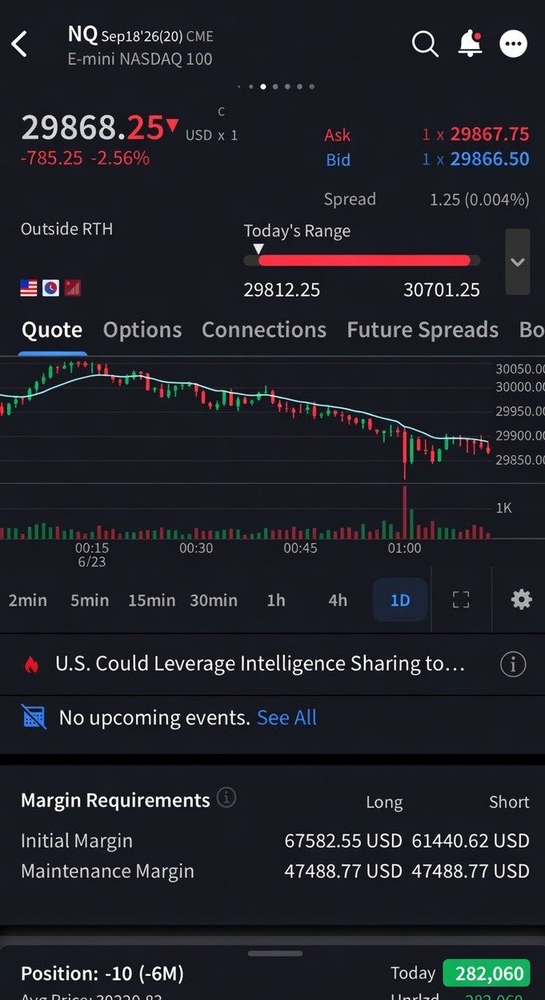
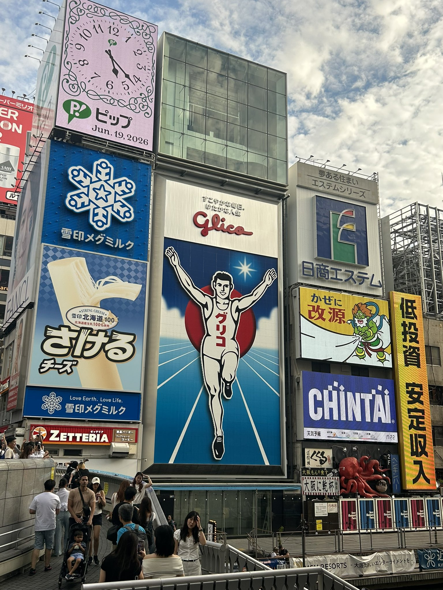
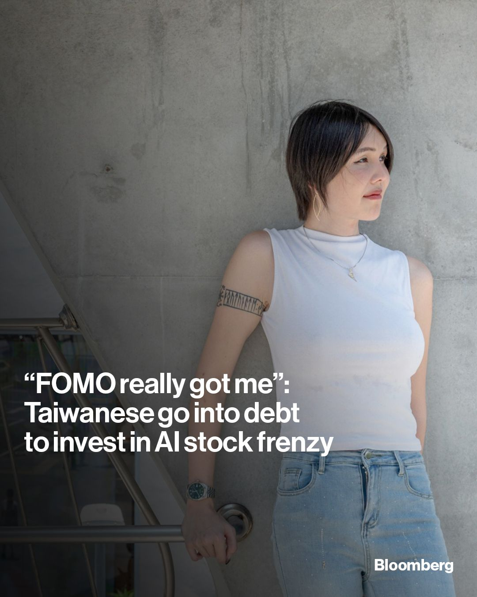
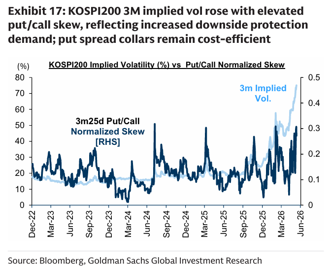
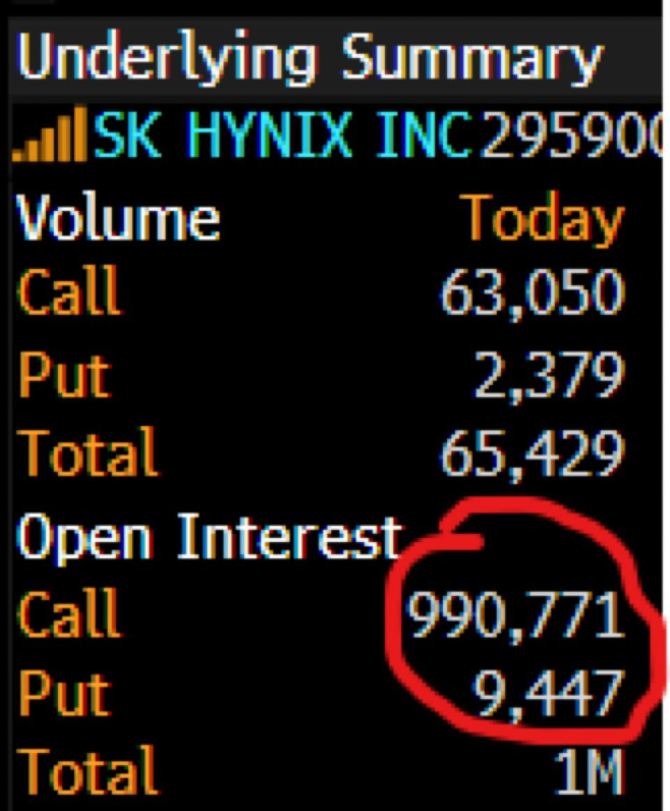
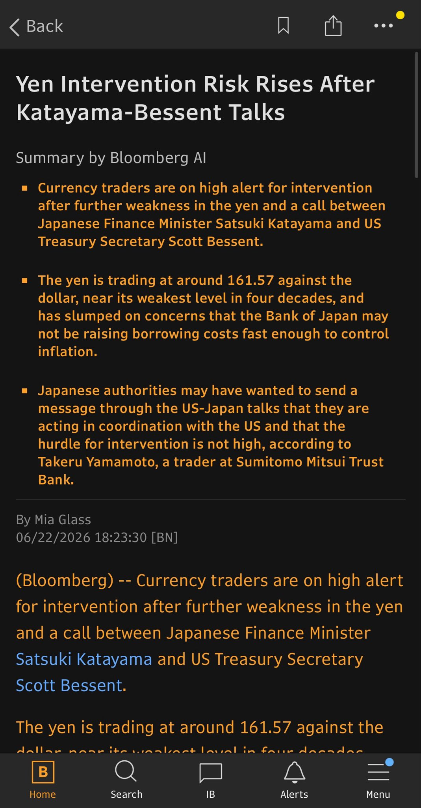
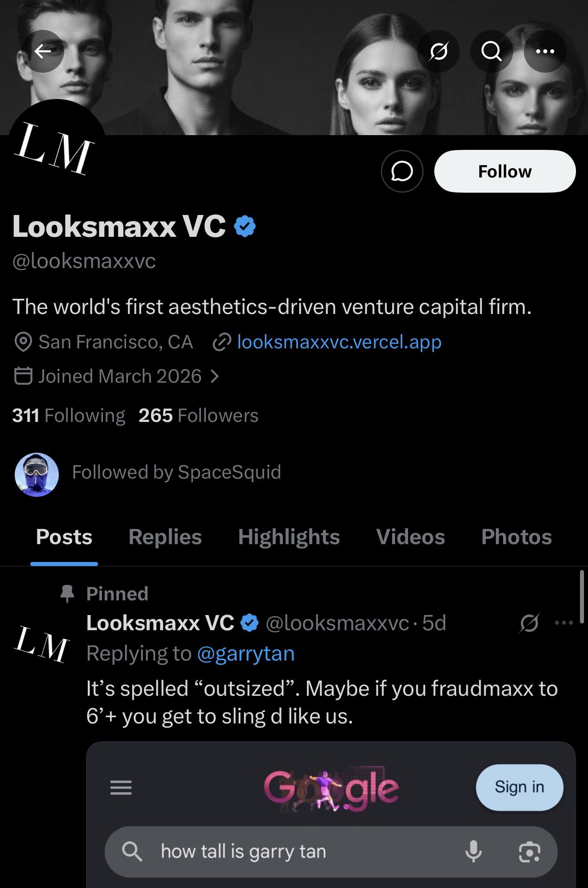
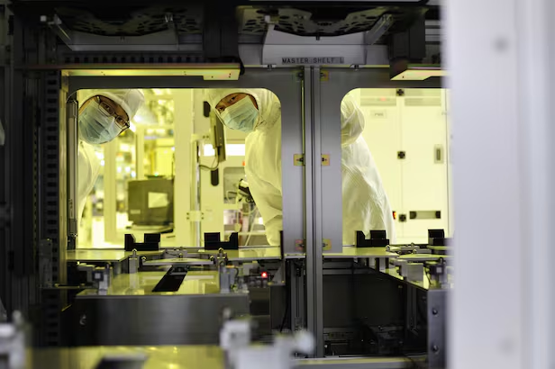

# bubbleboi tweets since 2026-06-23 — market commentary

- **Profile**: https://x.com/bubbleboi
- **Search used**: `from:bubbleboi since:2026-06-23` (no `until`)
- **Fetched at**: 2026-06-23T09:41:12.791Z
- **Tweets captured**: 32
- **Images saved**: 16

## Quick market read

- Focus: KOSPI crash/downside vol, yen/BOJ/rates, semis/DRAM/SK Hynix/Micron, Nasdaq drawdown and reversal call.
- Tone: early panic/bearish commentary around Korea/Japan/semi stocks, then a later call that Nasdaq had bottomed and should reverse in the morning.

## Tweets

### 1. 2026-06-23T08:59:16.000Z
- **Source**: https://x.com/bubbleboi/status/2069344529271116126
- **Replying to**: @kryptomokus
- **Engagement**: 1 reply, 1 like, 366 views

I’m market neutral
### 2. 2026-06-23T08:45:03.000Z
- **Source**: https://x.com/bubbleboi/status/2069340948128211205
- **Replying to**: @kryptomokus
- **Engagement**: 1 reply, 11 likes, 2032 views

I need to monitor the global stock markets.
### 3. 2026-06-23T08:41:48.000Z
- **Source**: https://x.com/bubbleboi/status/2069340130004066367
- **Replying to**: @Cedric_appren
- **Engagement**: 2 likes, 282 views

LMAOOOOOOOO
### 4. 2026-06-23T08:32:52.000Z
- **Source**: https://x.com/bubbleboi/status/2069337884692472254
- **Engagement**: 19 replies, 191 likes, 12 bookmarks, 18787 views

Ok Nasdaq has bottom expect market to reverse in the morning. You are welcome. 🤗
### 5. 2026-06-23T08:32:10.000Z
- **Source**: https://x.com/bubbleboi/status/2069337708066173412
- **Engagement**: 11 replies, 8 reposts, 81 likes, Liked, 5 bookmarks, 5150 views

At every market bottom I post an inspirational quote. This one will be no different.

**Images**
- Image 1: [source](https://pbs.twimg.com/media/HLfDrftbsAA-gUo?format=jpg&name=orig)
  
### 6. 2026-06-23T08:22:57.000Z
- **Source**: https://x.com/bubbleboi/status/2069335388230152274
- **Engagement**: 11 replies, 3 reposts, 146 likes, 7 bookmarks, 8733 views

Nasdaqistan in turmoil.
### 7. 2026-06-23T08:19:37.000Z
- **Source**: https://x.com/bubbleboi/status/2069334550199808413
- **Engagement**: 11 replies, 3 reposts, 115 likes, 11 bookmarks, 11526 views

NASDAQ 100 DOWN 820 POINTS GOD HELP US !!!
### 8. 2026-06-23T08:18:23.000Z
- **Source**: https://x.com/bubbleboi/status/2069334238302982184
- **Engagement**: 16 replies, 1 repost, 78 likes, 6 bookmarks, 12270 views

This is getting scary.

**Images**
- Image 1: [source](https://pbs.twimg.com/media/HLfAhgfbsAAS4Lr?format=jpg&name=orig)
  
### 9. 2026-06-23T07:18:09.000Z
- **Source**: https://x.com/bubbleboi/status/2069319080184881309
- **Engagement**: 7 replies, 1 repost, 111 likes, 8 bookmarks, 17128 views

😭😭😭😵‍💫😵‍💫😵‍💫😵‍💫🤣🤣🤣

> **Quote tweet** — First Squawk @FirstSquawk · 3h
> South Korea’s benchmark KOSPI finished the session down 9.99%, the steepest daily loss since March 4.
### 10. 2026-06-23T07:15:15.000Z
- **Source**: https://x.com/bubbleboi/status/2069318350359134611
- **Engagement**: 5 replies, 75 likes, 5 bookmarks, 15701 views

Holy shit Greenspan died?

> **Quote tweet** — 𝐄𝐟𝐟𝐢𝐜𝐢𝐞𝐧𝐭 𝐌𝐚𝐫𝐤𝐞𝐭 𝐇𝐲𝐩𝐞 @EffMktHype · 3h
> DONT TELL ME GREENSPAN DYING MARKED THE TOP FOR IRRATIONAL EXUBERANCE CMON
### 11. 2026-06-23T06:47:56.000Z
- **Source**: https://x.com/bubbleboi/status/2069311475685158954
- **Replying to**: @yuren477
- **Engagement**: 5 likes, 1042 views

I love this saying.
### 12. 2026-06-23T06:43:06.000Z
- **Source**: https://x.com/bubbleboi/status/2069310258498154618
- **Engagement**: 16 replies, 4 reposts, 258 likes, 26 bookmarks, 15188 views

My top analyst is in Japan right now and instead of warning me about the impending collapse of the currency and the confidence crisis in the Bank of Japan he’s been doing tourist shit this whole time. 

I’m going to call this guy analyst #0

**Images**
- Image 1: [source](https://pbs.twimg.com/media/HLeqtgQaAAApqAd?format=jpg&name=orig)
  
- Image 2: [source](https://pbs.twimg.com/media/HLeqtgQbAAAtZvP?format=jpg&name=orig)
  
- Image 3: [source](https://pbs.twimg.com/media/HLeqtgQbUAAircV?format=jpg&name=orig)
  
- Image 4: [source](https://pbs.twimg.com/media/HLeqtgRagAAE-zX?format=jpg&name=orig)
  
### 13. 2026-06-23T06:05:53.000Z
- **Source**: https://x.com/bubbleboi/status/2069300893053505743
- **Replying to**: @Heysup07
- **Engagement**: 13 likes, 1 bookmark, 1648 views

It’s not it’s a flash memory stock
### 14. 2026-06-23T06:05:37.000Z
- **Source**: https://x.com/bubbleboi/status/2069300828574564623
- **Engagement**: 7 replies, 9 reposts, 144 likes, 9 bookmarks, 12863 views

SpaceX is raising 20 billion dollars with an investment grade bond raise LMAOOOOOOOOOOOOOOOOO.

**Images**
- Image 1: [source](https://pbs.twimg.com/media/HLeiI1UbQAAtaln?format=jpg&name=orig)
  
### 15. 2026-06-23T06:04:15.000Z
- **Source**: https://x.com/bubbleboi/status/2069300484553540031
- **Engagement**: 29 replies, 14 reposts, 425 likes, 69 bookmarks, 49879 views

Bro micron will fucking kill the stock market on Wednesday. That anthropic deal is a last pump to stay alive. 

We are screeeeeeeeweed.
### 16. 2026-06-23T06:01:45.000Z
- **Source**: https://x.com/bubbleboi/status/2069299853155578062
- **Engagement**: 15 replies, 9 reposts, 182 likes, 5 bookmarks, 23595 views

KOSPI DOWN 8% HOLY SHIIIIIIIIT
### 17. 2026-06-23T06:01:36.000Z
- **Source**: https://x.com/bubbleboi/status/2069299815566189015
- **Replying to**: @MCorleCapital
- **Engagement**: 1 reply, 5 likes, 937 views

STOP YOUR SCARING ME
### 18. 2026-06-23T06:01:08.000Z
- **Source**: https://x.com/bubbleboi/status/2069299696674435086
- **Engagement**: 10 replies, 12 reposts, 306 likes, 57 bookmarks, 33926 views

I know several engineers who have quit their jobs because they make more trading semi stocks than any job would pay them.

> **Quote tweet** — Bloomberg @business · 5h  
> https://x.com/business/status/2069278779369763171
> Taiwan's locals are borrowing so much to invest in the TSMC-fueled AI stock frenzy it's raising fears of a bubble. Read more: http://bloom.bg/4aLKoKE
> 
> 📷: Lam Yik Fei/Bloomberg

**Images**
- Image 1: [source](https://pbs.twimg.com/media/HLeOFZ1XMAATDv6?format=jpg&name=orig)
  
### 19. 2026-06-23T05:59:43.000Z
- **Source**: https://x.com/bubbleboi/status/2069299342129954892
- **Engagement**: 4 replies, 5 reposts, 87 likes, 4 bookmarks, 6610 views

How it feels to trade Korean stocks.

**Images**
- Image 1: [source](https://pbs.twimg.com/media/HLegyOnakAA6oIz?format=jpg&name=orig)
  
### 20. 2026-06-23T05:54:23.000Z
- **Source**: https://x.com/bubbleboi/status/2069297999092879467
- **Engagement**: 8 replies, 107 likes, 57 bookmarks, 23850 views

I am not joking it was literally free to buy puts on the KOSPI. You could sell a 30/10 delta call spread and buy a 45 delta put. 

That’s how bad it was 💀

> **Quote tweet** — zerohedge @zerohedge · 17h  
> https://x.com/zerohedge/status/2069097371728830491
> Kospi 3M implied vol has soared along with the Kospi and elevated put/call skew; reflecting increased downside protection demand  x.com/zerohedge/stat…

**Images**
- Image 1: [source](https://pbs.twimg.com/media/HLbpEgxWAAAG2TJ?format=png&name=orig)
  
### 21. 2026-06-23T05:52:04.000Z
- **Source**: https://x.com/bubbleboi/status/2069297417196052910
- **Engagement**: 2 replies, 5 reposts, 114 likes, 24 bookmarks, 28344 views

💀💀💀💀💀💀💀💀💀💀💀💀

> **Quote tweet** — JustDario @DarioCpx · 6h  
> https://x.com/DarioCpx/status/2069257112115671323
> Beware, when SK Hynix will tumble 30% in a single day they will cry how nobody could have seen it coming

**Images**
- Image 1: [source](https://pbs.twimg.com/media/HLd6X_-a4AAoJwL?format=jpg&name=orig)
  
### 22. 2026-06-23T05:46:28.000Z
- **Source**: https://x.com/bubbleboi/status/2069296008438382811
- **Replying to**: @GelsingerINTC
- **Engagement**: 3 replies, 77 likes, 8 bookmarks, 6635 views

Japanese currency is unwinding
### 23. 2026-06-23T05:45:19.000Z
- **Source**: https://x.com/bubbleboi/status/2069295716594569499
- **Engagement**: 1 reply, 2 reposts, 37 likes, 7584 views

We might have to get yung macro on the phone to explain what’s going on.
### 24. 2026-06-23T05:41:59.000Z
- **Source**: https://x.com/bubbleboi/status/2069294880002826479
- **Engagement**: 8 replies, 4 reposts, 133 likes, 35 bookmarks, 19725 views

Shit is getting so bad I had to open up the Bloomie and see what’s going on. 

God damn. Please raise rates Japan. Pleaaaaaaaaase.

**Images**
- Image 1: [source](https://pbs.twimg.com/media/HLecugBbcAA0j6V?format=jpg&name=orig)
  
### 25. 2026-06-23T05:33:31.000Z
- **Source**: https://x.com/bubbleboi/status/2069292749497725247
- **Engagement**: 11 replies, 8 reposts, 140 likes, 29 bookmarks, 13174 views

The best trade on earth right now is going long the yen. Scott Bessi will save it, I know he will, swap lines and all that.
### 26. 2026-06-23T05:30:39.000Z
- **Source**: https://x.com/bubbleboi/status/2069292027494428774
- **Replying to**: @citrini
- **Engagement**: 2 replies, 23 likes, 1 bookmark, 3690 views

They won’t raise the rates. ARIGATO!
### 27. 2026-06-23T05:30:00.000Z
- **Source**: https://x.com/bubbleboi/status/2069291865510392194
- **Engagement**: 96 replies, 40 reposts, 1332 likes, 132 bookmarks, 225077 views

Might be the worst market drop of all time tomorrow
### 28. 2026-06-23T04:38:43.000Z
- **Source**: https://x.com/bubbleboi/status/2069278957875466440
- **Engagement**: 4 replies, 19 likes, 1 bookmark, 3886 views

I have 100% lost it.
### 29. 2026-06-23T01:50:42.000Z
- **Source**: https://x.com/bubbleboi/status/2069236676178927826
- **Engagement**: 2 replies, 31 likes, 1 bookmark, 8271 views

Do you remember when you joined X? I do! #MyXAnniversary

**Images**
- Image 1: [source](https://pbs.twimg.com/media/HLdnymAaoAA3DUV?format=jpg&name=orig)
  
### 30. 2026-06-23T00:35:44.000Z
- **Source**: https://x.com/bubbleboi/status/2069217809381703815
- **Engagement**: 4 replies, 1 repost, 51 likes, 5 bookmarks, 15670 views

Can someone intro me?

> **Quote tweet** — shaams @shaams · 9h  
> https://x.com/shaams/status/2069205794478821653
> Joke or not, this is some of the cringiest shit I’ve ever seen
> 
> SF culture ruins literally everything

**Images**
- Image 1: [source](https://pbs.twimg.com/media/HLdLs7JWAAAQz9Y?format=jpg&name=orig)
  
- Image 2: [source](https://pbs.twimg.com/media/HLdLs7IWwAAFiVT?format=jpg&name=orig)
  
### 31. 2026-06-23T00:34:24.000Z
- **Source**: https://x.com/bubbleboi/status/2069217472256106642
- **Engagement**: 2 replies, 1 repost, 61 likes, 19 bookmarks, 26255 views

*knocks on sign*

https://x.com/bubbleboi/status/2069165631501692982?s=46…

> **Quote tweet** — Jukan @jukan05 · 9h  
> https://x.com/jukan05/status/2069207209133887767
> SK Hynix Throttles HBM4 Production… Seeks Additional Profit by Expanding Supply Constrained Commodity DRAM
> 
> SK Hynix is moderating the pace of its sixth generation high bandwidth memory (HBM4) ramp and placing greater weight on capturing the commodity DRAM market. With its HBM

**Images**
- Image 1: [source](https://pbs.twimg.com/media/HLdM87Oa8AAt1lt?format=png&name=orig)
  
### 32. 2026-06-23T00:11:32.000Z
- **Source**: https://x.com/bubbleboi/status/2069211719076139419
- **Replying to**: @LIWEI_TWCapital
- **Engagement**: 8 replies, 53 likes, 1 bookmark, 2991 views

Isn’t that just a Chinese province?

## Limitations

- Extracted from the rendered X search timeline using the logged-in browser session.
- Quote tweets include visible quoted text and visible quote media; some quote tweet permalinks were not exposed by the rendered card unless a photo link was present.
- Search was run exactly as requested with `since:2026-06-23` and no `until` filter.