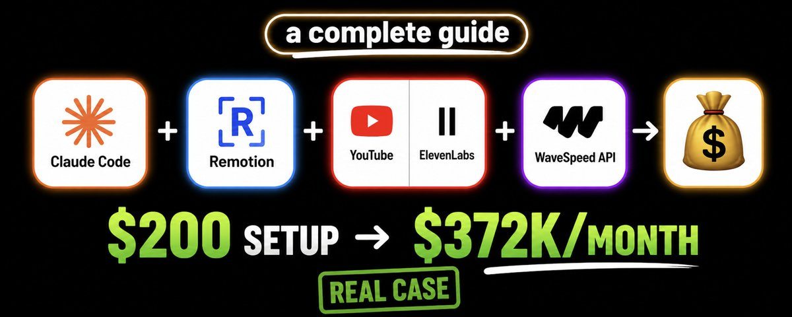

## He's never shown his face. Claude writes everything.

No face. No camera. No editing software skills. Just Claude Code, a few APIs, and a workflow you can set up in one afternoon. **Before we start: the fact-check**

This article is based on a real workflow demonstrated on certain video creators publicly availably on YouTube. The creator behind the "Real Data" channel style apparently used Claude Code + Remotion to generate motion graphics videos - ranking countries by population, land area, birth rates -without recording a single second of footage. Sources: [https://www.youtube.com/](https://www.youtube.com/@RealDatacomparison)[@RealDatacomparison](https://x.com/RealDatacomparison) (500k+) [https://www.youtube.com/](https://www.youtube.com/@Globe-Globe)[@Globe](https://x.com/Globe)\-Globe (100k+) [https://www.youtube.com/](https://www.youtube.com/@WorldData_3D)[@WorldData\_3D](https://x.com/WorldData_3D) (700k+)

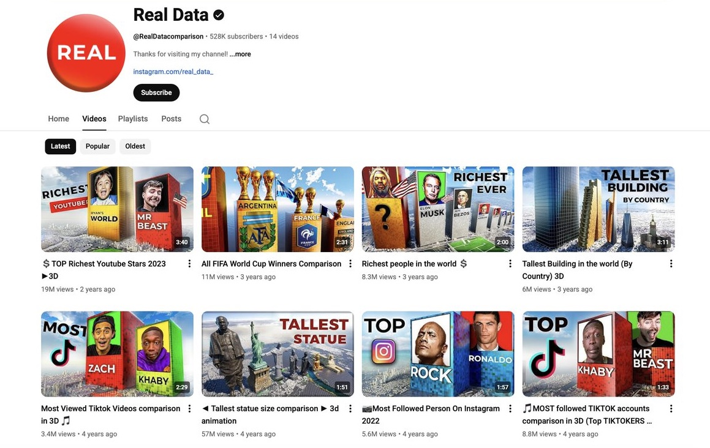

**Channels in this niche (ranking/data visualization) regularly hit:**

- 400K to 1M+ subscribers
- 1–2 million views per day
- $3–$15 CPM in US/European markets
- Estimated $30K–$70K/month at scale

**Is $372K/month realistic?** It's a documented real case — a creator using this exact niche (ranking/data visualization channels) hit $372K/month with a portfolio of channels built over 18 months.

Here's the math behind it. YouTube pays $3–$15 per 1,000 views (CPM) for US/European audiences. A single video hitting 5 million views generates $15,000–$75,000 in ad revenue alone. Now multiply that:

- 10 videos × 5M views = $150,000–$750,000 in potential ad revenue
- Add Shorts: 30 Shorts per month repurposed from long-form content drive millions of additional views
- Add affiliate links in descriptions: $20–$100 per conversion in the AI/finance niche
- Add 3–5 channels running the same system in parallel

That's how $372K/month becomes mathematically real. Not from one viral video - from a production system that compounds every month.

For a single channel starting today - expect $500–$5K in the first year. For a portfolio of 3–5 channels with consistent output - the $372K range becomes achievable. The workflow below is the engine. Your consistency, niche selection, and production quality are the fuel.

Everything in this guide is verifiable. Tools mentioned are real. API costs are current as of May 2026. **Who is this for?**

This system works best if you:

- Have 2–4 hours/week to set things up and iterate
- Are comfortable following step-by-step technical instructions (no coding experience needed)
- Want passive income but are willing to put in real work upfront
- Are interested in data, rankings, history, geography, or science content

This is **not** for you if you want a magic button. Every output depends on how specific your prompts are. Better prompts = better videos = more views = more money. **What you'll need (and what it costs)**

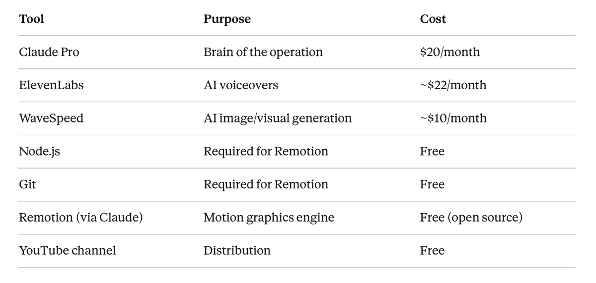

**Total base cost: ~$52/month**

**Real-world cost with errors, retries, and iteration: ~$150–$200/month** - especially in the first 1–2 months while you're learning the prompts and workflow. API calls add up when you're regenerating voiceovers, testing animations, and fixing outputs. Budget $200/month to start comfortably without stress.

Once you find prompts that work, your monthly cost drops back to the base $52.

**STEP 1 - Set up your channel and brand**

**What you're doing:** Creating a YouTube channel with consistent visual branding before you produce a single video.

**Why it matters:** Channels with strong brand consistency (same color, same logo style, same font) look more credible. Credibility = subscribers.

**How to do it:**

Go to [canva.com](https://x.com/thegreatest_sv/status/canva.com) — the free version is enough

Create a Logo using a YouTube channel logo template, then switch to blank canvas

Pick **one** color and stick to it everywhere (logo, banner, thumbnails)

Keep your channel name data-driven: "Ranked Data," "Data Drop," "World by Numbers" — anything that signals: we rank things

For your channel description, keep it under 2 sentences: "We rank the world. New videos weekly."

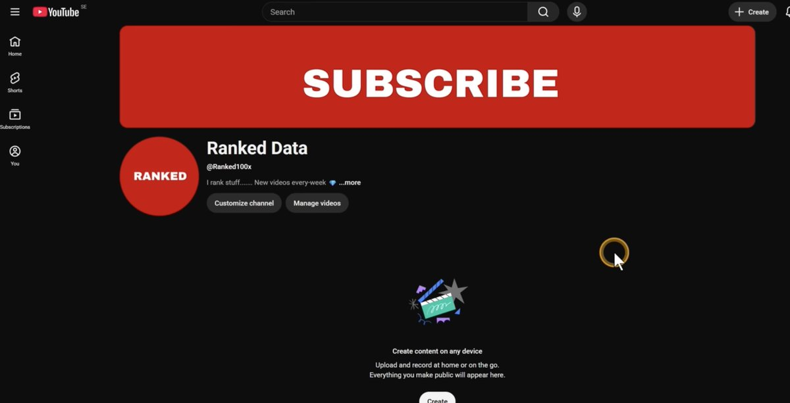

**Note:** YouTube crops banners differently on mobile vs desktop. Design your important text/logo in the center "universal zone." Canva's YouTube banner template shows this layout automatically.

**STEP 2 - Install Claude Desktop and set up Claude Code**

**What you're doing:** Getting Claude Code running on your computer. This is the interface you'll use for everything.

**How to do it:**

Go to [claude.ai/download](https://x.com/thegreatest_sv/status/claude.ai/download)

Download for your OS (Mac or Windows)

Install it — approve all permissions during setup

Sign in with your Claude account (Google login works)

Inside the app, click the **Code** icon (not Chat, not Cowork)

Create a new folder for your project files — name it something like youtube-channel

Set model to **Claude Sonnet 4.6** (good balance of speed and quality)

Leave mode on **Accept Edit**

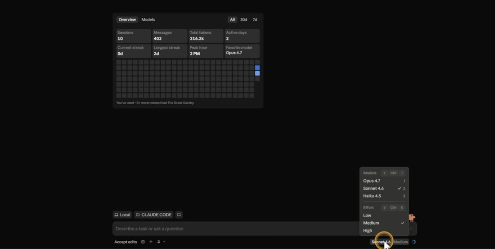

**STEP 3 - Install Node.js and Git**

Remotion (the motion graphics tool) requires these two dependencies. This takes 5 minutes.

Search "download Node.js" → download the LTS version for your OS → install it

Search "download Git" → download for your OS → install it

During installation: click Next, accept everything, finish

**Important:** Make sure Node.js is version 18 or higher. Remotion will not run on older versions.

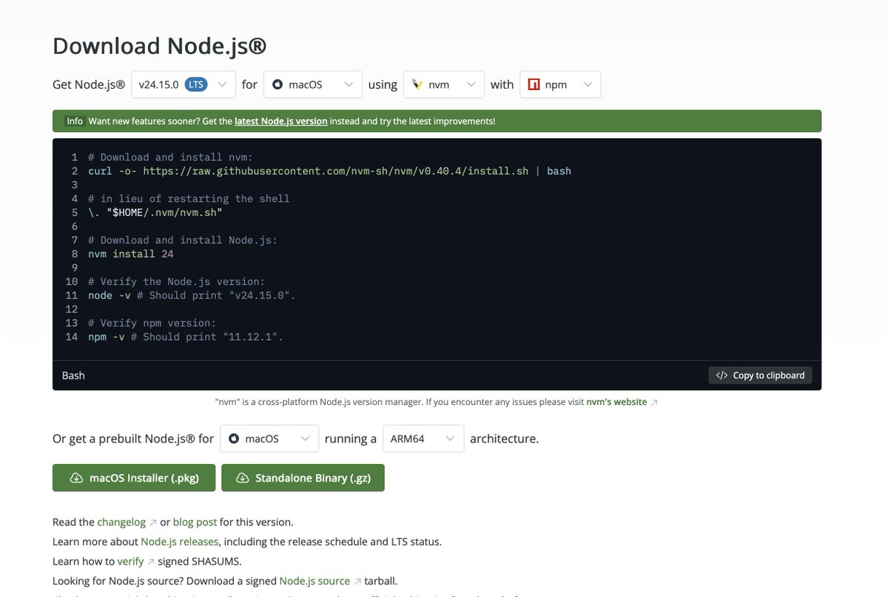

**STEP 4 - Install Remotion via Claude Code**

**What you're doing:** Telling Claude Code to pull and install the Remotion motion graphics framework.

**Prompt to use:**

```
Install the Remotion skill and set it up on my system. 
If it's already installed, confirm it's ready to use. 
If you need permissions to install dependencies or access the web, please ask me.
```

Claude will install Remotion automatically. It may ask for a couple of permissions - approve them.

When it's done, you'll see a confirmation message. That's your signal to move to the next step.

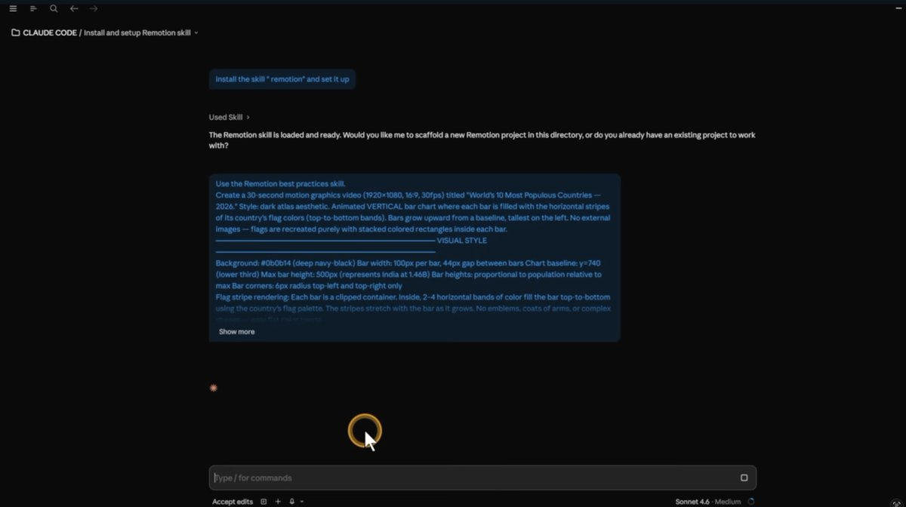

**STEP 5 - Create your first test animation (no APIs needed yet)**

Before connecting any paid APIs, test that your setup works with a free animation.

**Prompt to use:**

```
Create a 30-second Remotion animation ranking the top 10 most populated countries in the world.

Requirements:
- Show each country's name, flag, and population number
- Use a bar chart that grows from left to right
- Color scheme: dark background (#0a0a0a), red bars (#e85d26), white text
- Animate each country appearing one at a time with a 0.3 second delay between entries
- Add a title card at the start: "World's Most Populated Countries"
- End with a summary showing all 10 at once
- Export as MP4 at 1920x1080

Use real 2026 population data.
```

After 1–3 minutes, Claude will give you a localhost:3000 preview link. Open it in your browser.

**If the result looks wrong or incomplete:** Tell Claude specifically what to fix. Example: "The bars are overlapping - add more vertical spacing between each entry." Iterate until it looks clean.

**Don't like the first result? Run it again.** Remotion outputs vary based on how Claude interprets your prompt. A second or third attempt often produces significantly better results. This is normal.

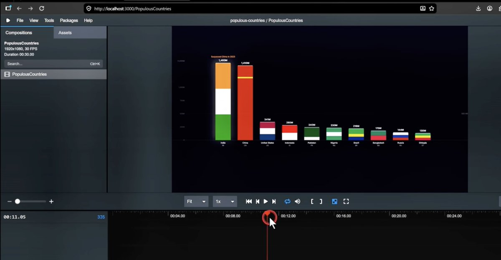

**STEP 6 - Add voiceovers with ElevenLabs API**

**What you're doing:** Connecting ElevenLabs so Claude can automatically generate a professional AI voiceover for your video.

**Setup:**

Go to [elevenlabs.io](https://x.com/thegreatest_sv/status/elevenlabs.io)

Create an account - you need a paid plan (~$5–$22/month) for API access

In the bottom-left corner, click **Developer**

Click **API Keys** → **Create New Key**

Name it: claude-remotion

Leave it as Unrestricted

Copy the key and **save it somewhere private** — never share it publicly

**Security note:** Your ElevenLabs API key gives anyone who has it full access to your account and billing. Treat it like a password.

**Prompt to connect it to Claude:**

```
I need to add my ElevenLabs API key to this project so you can generate voiceovers.
My API key is: [PASTE YOUR KEY HERE]

Please store this key securely in the project environment and confirm it's saved.
Then confirm you can access the ElevenLabs API.
```
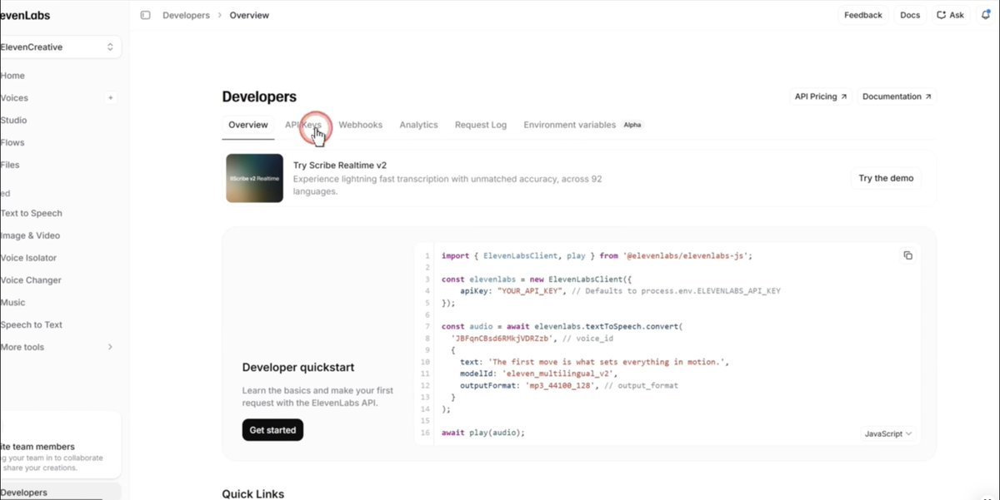

**STEP 7 - Add visuals with WaveSpeed API**

**What you're doing:** Connecting WaveSpeed so Claude can generate images and visual assets for your videos.

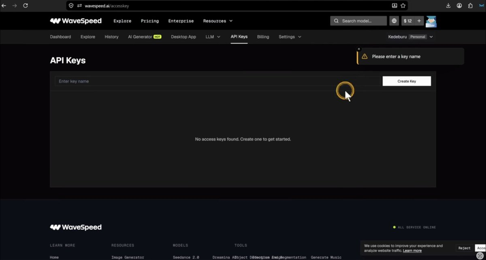

**Setup:**

Go to [wavespeed.ai](https://x.com/thegreatest_sv/status/wavespeed.ai)

Create an account (~$10/month for starter plan)

Click your profile → **API Keys** → **Create API Key**

Name it: claude-remotion

Copy and save the key privately

**Prompt to connect it:**

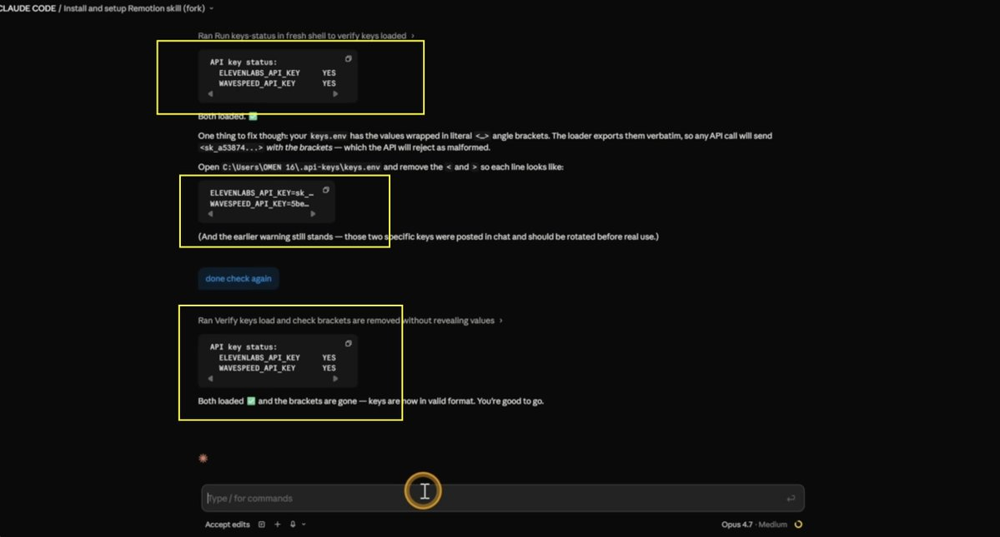

```
I need to add my WaveSpeed API key to this project for image generation.
My API key is: [PASTE YOUR KEY HERE]

Store it securely and confirm it's saved alongside the ElevenLabs key.
```

**STEP 8 - Generate your first full video (the complete workflow)**

This is where everything comes together. Claude will use Remotion for motion graphics, ElevenLabs for voiceover, and WaveSpeed for visuals - all in one prompt.

**Master prompt for a complete video:**

```
Create a complete YouTube video using Remotion, ElevenLabs, and WaveSpeed.

VIDEO TOPIC: Top 10 Countries by GDP (2026 data)

REQUIREMENTS:
- Length: 3–4 minutes (long-form)
- Resolution: 1920x1080
- Style: Dark background, gold/orange accent colors, clean modern typography

VOICEOVER:
- Use ElevenLabs to generate the narration
- Voice: Choose a confident, clear female voice
- Tone: Informative but punchy — not boring
- Pace: Medium-fast, keep it engaging
- Script: Write it yourself based on the data — include surprising facts for each country

VISUALS:
- Use WaveSpeed to generate a unique background image per country (city skyline or landmark, cinematic style, 8k)
- Each country section: flag, GDP number, animated bar, WaveSpeed background image
- Smooth transitions between sections

MOTION GRAPHICS:
- Opening title card: "The World's Richest Countries" (animated entrance, 2 seconds)
- Each country revealed one at a time with bar growing animation
- Progress indicator showing which country we're on (e.g., "7 of 10")
- Closing summary showing all 10 ranked together

OUTPUT:
- Render as MP4
- Provide studio preview link first so I can review before final render
```

This will take 5–10 minutes. Let it run. (You can try and ask Claude to write prompts of you no need to buy. Experiment with promt generation for different video scenarios)

**If Claude asks for permissions during generation:** Approve them. These are standard file access and network requests that Remotion needs.

**If the video doesn't match your vision:** Be specific about what's wrong. "The voiceover is too slow - regenerate with a faster pace" or "The bar animations are too abrupt - add easing." Claude will fix it.

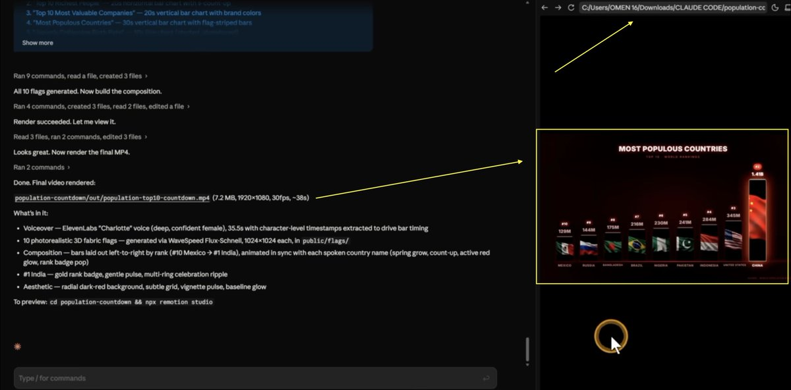

**STEP 9 - Upload and monetize**

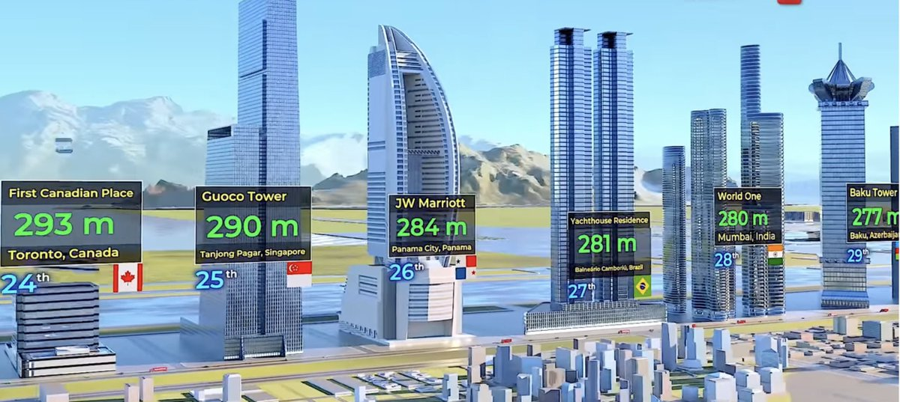

Tallest buildings viral video example made via generation

**Uploading:**

In the Remotion studio, click **Render** → **Render Video**

Find the exported MP4 in your project folder

Upload to YouTube

**Immediate monetization (before 1,000 subscribers):**

Use this prompt in Claude to find affiliate opportunities:

```
I just created a YouTube video about "Top 10 Countries by GDP."
Find 3–5 affiliate programs relevant to this content — finance tools, travel, 
language learning, geography apps. 
For each: name, commission rate, average payout per conversion, and signup link.
Focus on programs with $15+ per sale.
```

Put those affiliate links in your video description with timestamps.

**SEO optimization prompt:**

```
Write a YouTube title and description for a video about "Top 10 Countries by GDP 2026."

Requirements:
- Title: under 60 characters, CTR-optimized, include a number and year
- Description: 200 words, use these keywords naturally: [GDP ranking 2026, richest countries, 
  world economy, top economies]
- Include 10 relevant hashtags
- Add a section for affiliate link placement
- Write 5 thumbnail text options (under 5 words each, high curiosity)
```

**What realistic earnings look like**

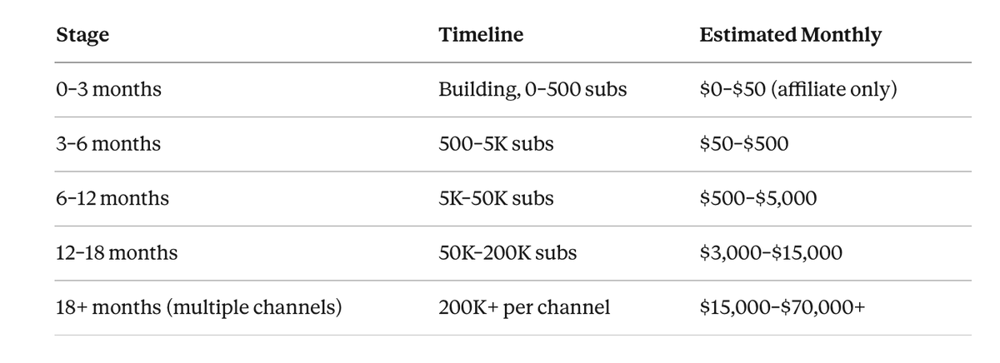

These numbers are based on real channels in the ranking/data niche with US/European audience targeting at $5–$12 CPM. They are not guarantees.

**What changes when you finish reading this**

**Before:** You have an idea but **After:** You have a complete technical setup that can produce a professional motion graphics video in under 10 minutes.

The first video will take you a few hours. The tenth will take 20 minutes.

**Your next step right now:**

Download Claude Desktop

Install Node.js and Git

Run the first test animation with the prompt from Step 5

Do not skip the test animation. You need to see Remotion working before you invest in the APIs. The test costs nothing.

**One honest thing**

This article is not a magic pill.

Everything you create depends on what you put into it. The prompts above are starting points - not scripts. The best channels in this niche iterate constantly: better color choices, better data, sharper scripts, faster pacing. That iteration is what separates a channel earning $500/month from one earning $15,000.

Claude Code handles the execution. Your imagination and your consistency determine the results.

**What you do with this is entirely up to you.** Tools mentioned: Claude Pro ($20/mo) · ElevenLabs ($5–22/mo) · WaveSpeed (~$10/mo) · Remotion (free) · Node.js (free) · Git (free)

All pricing current as of May 2026. API costs vary by usage. **Please bookmark, RT and follow [@thegreatest\_sv](https://x.com/thegreatest_sv) for more alpha, AI tools and quality research.** DISCLAIMER (Earnings & Info) Earnings or statistics shown in this article are examples from my research, own experience with YouTube automation and are not guarantees of what you'll earn. Results differ based on niche, content quality, RPM/CPM, audience engagement, consistency, effort, and other factors. This is not financial, tax, legal, or professional advice-consult the appropriate experts before making business decisions.
