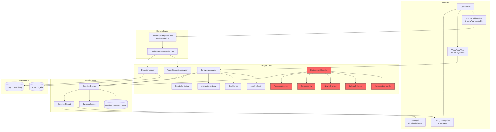

# DetectionApp — Blue-Team Honeypot Architecture

## Overview

An iOS app (Swift/SwiftUI) that detects AI-driven automation controlling the device. Designed as a honeypot: looks like a TikTok-style video feed but silently analyzes all interactions to determine whether the user is human or an automation agent.

## Architecture Diagram



## Detection Layers

### 1. Touch Biometrics (TouchBiometricsAnalyzer)

**Input:** Raw UITouch events from `touchesBegan/Moved/Ended/Cancelled`.

**Signals:**
| Signal | Human Baseline | Machine Signal | Detection Method |
|--------|---------------|----------------|-----------------|
| Path curvature CV | 0.08–0.25 | < 0.03 | Coefficient of variation of curvature ratios |
| Inter-event timing CV | 0.3–0.8 | < 0.10 | CV of inter-event deltas (ms) |
| Pressure variation CV | 0.05–0.30 | < 0.01 | CV of force samples per touch |
| Radius variation CV | 0.05–0.20 | < 0.01 | CV of majorRadius per touch |
| Accidental touch rate | 2–8% | 0% | Ratio of brief palm/edge touches |
| Inter-touch interval CV | 0.4–1.2 | < 0.20 | CV of gap between touch sequences |

**Algorithm pseudocode:**
```
function computeScore():
    sequences = buffer of last 200 touch sequences
    if sequences.count < 5: return (0.0, [])

    curvature_cv = CV(curvature ratios of sequences)
    timing_cv = CV(inter-event deltas across sequences)
    pressure_cv = mean(CV(force samples per sequence))
    radius_cv = mean(CV(radius samples per sequence))
    accidental_rate = count(accidental touches) / total
    interval_cv = CV(inter-touch gaps)

    scores = []
    flags = []

    if curvature_cv < 0.02: scores += [0.9]; flags += [perfectCurvature]
    if curvature_cv < 0.04: scores += [0.7]
    ...

    return (mean(scores), flags)
```

### 2. Behavioral Analysis (BehavioralAnalyzer)

**Input:** Logged interactions, scroll events, keystroke events.

**Signals:**
| Signal | Human Baseline | Machine Signal | Detection Method |
|--------|---------------|----------------|-----------------|
| Scroll velocity CV | 0.3–0.8 | < 0.15 | CV of scroll speed magnitudes |
| Scroll deceleration | Present (2nd half < 1st half × 0.85) | Absent | Speed trend analysis |
| View dwell time CV | 0.3–0.9 | < 0.15 | CV of time between view transitions |
| Transition entropy | > 1.5 | < 0.8 | Entropy of interaction-type transition matrix |
| Keystroke interval CV | 0.25–1.0 | < 0.12 | CV of inter-keystroke times |

**Algorithm pseudocode:**
```
function computeScore():
    speeds = moveNorm(logged scroll velocity samples)
    scroll_cv = CV(speeds)
    has_decel = mean(speeds[second_half]) < mean(speeds[first_half]) * 0.85

    dwells = compute(all view-stay durations)
    dwell_cv = CV(dwells)

    transitions = build(markov chain: prev_action → curr_action)
    entropy = sum(−p_ij * log2(p_ij)) / count(transition sources)

    keystroke_cv = CV(keystroke intervals)

    // Weight and combine
    return (weighted_mean(scores), flags)
```

### 3. Environmental Detection (EnvironmentDetector)

**Input:** I/O Registry, sysctl, CoreMotion, Darwin, process introspection.

**Signals:**
| Signal | Method | Confidence |
|--------|--------|-----------|
| I/O Registry VM entries | IORegistryEntryFromPath for VirtualIO, VirtIO, hv_support, pvgpu | High |
| sysctl hw.model/hw.machine | Check for "VM", "Virtual", "Simulator" substrings | Medium |
| Disk I/O latency < 0.3ms | Write+read 4KB to temp file, measure elapsed | High |
| Battery state == .unknown | UIDevice.current.batteryState | High |
| Jailbreak file paths | access(F_OK) on 20+ known JB paths | High |
| DYLD_INSERT_LIBRARIES | getenv check | High |
| fork() succeeds | Sandbox violation test | High (if positive) |
| Cydia/Sileo URL schemes | canOpenURL | Medium |
| Suspicious dylibs | _dyld_get_image_name scan for substrate/hooker/frida | Medium |
| Accelerometer static | CV of x/y/z < 0.001 over 20 samples | High |
| Gyroscope static | CV of rotation rates < 0.001 | High |
| Network latency < 1ms | CFStream socket connect to captive.apple.com:80 | High |
| XCTest process | ProcessInfo.isRunningXCUITest, env vars | High |
| Frida dylib | _dyld_image_count scan | High |

**Algorithm pseudocode:**
```
function runAllChecks():
    results = parallel(
        checkVirtualization(),  // I/O Registry + sysctl + disk + battery + CPU
        checkJailbreak(),       // Files + dyld + sandbox + URL schemes + dylibs
        checkAutomationProcesses(),  // WDA + XCTest + Frida
        checkSensorSanity(),    // Async: accelerometer + gyroscope CV over 20 samples
        checkNetworkLatency(),  // Async: TCP connect timing to captive.apple.com
    )
    return (weighted_geometric_mean(results), all flags)
```

### 4. ML Scoring (DetectionScorer)

**Input:** Per-layer (score, flags) tuples.

**Strategy:**
- Weighted geometric mean: `exp(Σ w_i × ln(score_i + ε))`
  - Environmental: 40% weight (hardest to fake)
  - Touch biometrics: 35% weight (requires kernel-level injection)
  - Behavioral: 25% weight (adversary can adapt)
- Geometric mean is punitive — if any layer is 0, composite approaches 0.
- Synergy bonus: multiple independent layers flagging → bonus up to +0.35.
- Specific flag combinations: virtualization+jailbreak = +0.15 bonus.

**Algorithm pseudocode:**
```
function compute(touch, behavioral, environmental, sessionID):
    layers = [(touch.score, 0.35), (behavioral.score, 0.25), (environmental.score, 0.40)]
    composite = exp(Σ w_i * log(max(s_i, ε)) / Σ w_i) ** 0.5  // sqrt spread

    // Synergy
    alerting = count(layers where score >= 0.6)
    if alerting >= 3: composite += 0.20
    if alerting >= 2: composite += 0.10
    if unique_flags >= 5: composite += 0.15
    if {virtualization, jailbreak} ⊆ flags: composite += 0.15
    if {virtualization, staticSensor} ⊆ flags: composite += 0.10
    composite = clamp(composite, 0, 1)

    return DetectionResult(
        touchScore, behavioralScore, environmentalScore,
        composite, flags, timestamp, sessionID
    )
```

## File Structure

```
packages/ios-control/src/DetectionApp/
├── DetectionApp.swift              # @main App entry point
├── ContentView.swift               # Root view + DetectionEngine ViewModel
├── Models/
│   ├── TouchEvent.swift            # TouchEvent, TouchSequence structs
│   ├── DetectionResult.swift       # DetectionResult, ScoreSnapshot structs
│   └── VideoItem.swift             # VideoItem, InteractionType
├── Detectors/
│   ├── TouchBiometricsAnalyzer.swift   # Touch event stream analysis
│   ├── BehavioralAnalyzer.swift        # Interaction pattern detection
│   ├── EnvironmentDetector.swift       # VM/jailbreak/automation detection
│   └── DetectionScorer.swift           # Weighted combination + ML
├── Views/
│   ├── TouchTrackingView.swift     # UIViewRepresentable for touch capture
│   ├── VideoFeedView.swift         # TikTok-style vertical feed
│   └── DebugOverlayView.swift      # Score debug panel
├── Utils/
│   └── DetectionLogger.swift       # JSONL + OSLog structured logging
├── Resources/
│   └── Info.plist                  # App manifest + permissions
└── ARCHITECTURE.md                 # This document
```

## Key Swift Classes

| Class/Struct | Responsibility |
|---|---|
| `DetectionApp` | @main SwiftUI App. Dark mode, status bar hidden. |
| `ContentView` | Root view. Owns DetectionEngine. Wires TouchTrackingView → VideoFeedView. |
| `DetectionEngine` | @MainActor ObservableObject. Orchestrates analyzers, periodic scoring (2s), async env checks (30s). |
| `TouchTrackingView` | UIViewRepresentable wrapping TouchCapturingHostView. |
| `TouchCapturingHostView` | UIView subclass. Overrides touchesBegan/Moved/Ended/Cancelled. Feeds events to TouchBiometricsAnalyzer and DetectionLogger. `isMultipleTouchEnabled = true`. |
| `TouchBiometricsAnalyzer` | Maintains buffer of 200 TouchSequences. Computes CVs for curvature, timing, pressure, radius, inter-touch intervals. Detects accidental touches. |
| `BehavioralAnalyzer` | Tracks 500 interactions, 200 scroll samples, 100 keystroke intervals. Entropy over transition matrix. |
| `EnvironmentDetector` | IORegistry + sysctl + battery + disk I/O + jailbreak files + dyld + fork + sensor + network + process detection. |
| `DetectionScorer` | Weighted geometric mean. Synergy bonus. Statistical outlier (MAD-based Z-score). |
| `DetectionLogger` | Append-only JSONL file in Documents/DetectionLogs/. OSLog for Console.app. |
| `VideoFeedView` | TabView(page) with 5 sample videos. Tracks swipes, taps, likes. |
| `DebugOverlayView` | Sheet showing per-layer scores, composite, risk level, flags with descriptions. |
| `DebugPill` | Compact floating indicator: composite score % + risk level. |
| `TouchEvent` | Immutable struct capturing all UITouch properties (phase, location, force, radius, altitude, azimuth, type). |
| `TouchSequence` | Ordered list of TouchEvents from began→ended. Computes pathLength, curvatureRatio, forceSamples. |
| `DetectionResult` | Aggregated result: per-layer scores, composite, flags, risk level, timestamp. |
| `ScoreSnapshot` | Lightweight version for UI binding. |
| `VideoItem` | TikTok-style video metadata with 5 samples. |

## Data Flow

```
UITouch events
    ↓
TouchCapturingHostView.touchesBegan/Moved/Ended/Cancelled
    ↓
TouchBiometricsAnalyzer.ingest(event:in:)     DetectionLogger.log(eventType:payload:sessionID:)
    ↓                                           ↓
TouchSequence buffer (200)                     JSONL file (Documents/DetectionLogs/)
    ↓
Every 2 seconds: Timer fires
    ↓
DetectionEngine.periodicScoreUpdate()
    ├── TouchBiometricsAnalyzer.computeScore() → (score, flags)
    ├── BehavioralAnalyzer.computeScore() → (score, flags)
    ├── EnvironmentDetector.runSyncChecks() → (score, flags)
    └── DetectionScorer.compute(...) → DetectionResult
        ↓
    @Published latestSnapshot → DebugPill + DebugOverlayView
    DetectionLogger.logScore(snapshot) → JSONL
```

## Deployment to vphone-cli VM for Testing

### Option 1: Direct .app install

```bash
# Build in Xcode for a generic iOS device
xcodebuild -project DetectionApp.xcodeproj \
  -scheme DetectionApp \
  -configuration Debug \
  -sdk iphoneos \
  -destination 'generic/platform=iOS' \
  build

# Locate the .app
# ~/Library/Developer/Xcode/DerivedData/DetectionApp-*/Build/Products/Debug-iphoneos/DetectionApp.app

# Install to vphone-cli VM via devicectl
xcrun devicectl device install app --device <VM_UDID> DetectionApp.app

# Or via go-ios
ios install --path=DetectionApp.app
```

### Option 2: Archive + Export

```bash
# Archive
xcodebuild archive \
  -project DetectionApp.xcodeproj \
  -scheme DetectionApp \
  -archivePath DetectionApp.xcarchive

# Export .ipa
xcodebuild -exportArchive \
  -archivePath DetectionApp.xcarchive \
  -exportPath output \
  -exportOptionsPlist ExportOptions.plist

# Install
ios install --path=output/DetectionApp.ipa
```

### Testing the Detection

1. **Launch the app** on the vphone-cli VM.
2. **Use vphone-cli to interact** — the Python `ios_computer_use.py` with `humanize=True`.
3. **Watch the debug pill** — it should climb from green → yellow → orange → red as more signals accumulate.
4. **Open the debug sheet** (eye icon, top-right) — see per-layer scores and active flags.
5. **Export logs** — the JSONL file in `Documents/DetectionLogs/` contains every touch event, interaction, and score update with timestamps.

### Expected Results

| Scenario | Expected Score | Expected Flags |
|---|---|---|
| Human on real iPhone | < 0.2 | None (0–1 minor flags) |
| vphone-cli + humanize=True | 0.4–0.7 | perfectCurvature, unnaturalTiming, constantRadius |
| vphone-cli + humanize=False | 0.7–1.0 | All touch flags + behavioral flags |
| vphone-cli + EXP variant | 0.7–1.0 | virtualizationDetected (I/O Registry, disk I/O, battery), staticSensorData |
| Jailbroken iPhone + WDA | 0.6–0.9 | jailbreakDetected, automationProcessDetected |
| Real iPhone + manual WDA control | 0.5–0.8 | automationProcessDetected (WDA port), behavioral flags |

## No External Dependencies

This app uses only iOS-shipped frameworks:
- **SwiftUI** — UI framework
- **UIKit** — UIView touch handling, UIDevice
- **CoreMotion** — CMMotionManager for accelerometer/gyroscope
- **IOKit** — IORegistryEntryFromPath for VM detection
- **Darwin** — sysctl, fork, getenv, _dyld_image_count, _dyld_get_image_name
- **CFNetwork** — CFStreamCreatePairWithSocketToHost for network timing
- **OSLog** — Logger for Console.app output
- **Foundation** — FileManager, ProcessInfo, JSONEncoder, Timer
