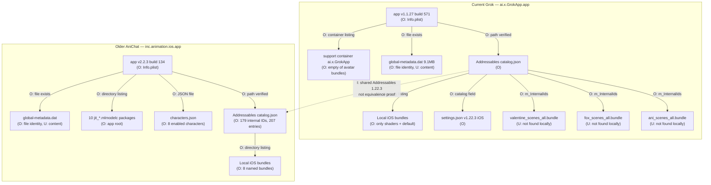
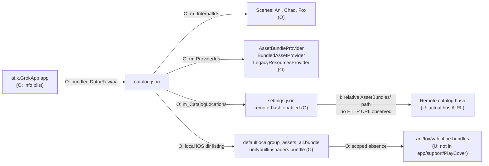
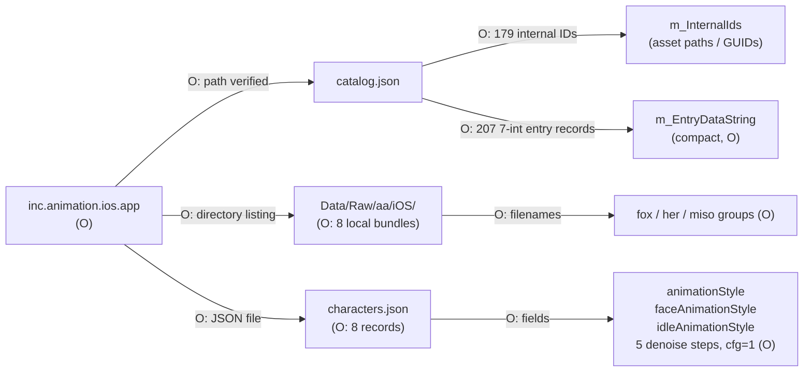
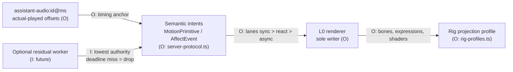

# Diagrams — AniChat / Grok pose investigation

All diagrams are static architecture maps. Every node and edge is tagged:

- **O** = **Observed** (readable local metadata or file identity)
- **I** = **Inferred** (strong but unproven implication)
- **U** = **Unknown** (not recoverable from permitted evidence)

Sources: `history://CurrentGrokScout`, `history://OlderAniScout`, `history://CoreMLScout`, `history://CompanionArchScout`, `streams/companion/notes/anichat-pipeline-recon.md`.

---

## 1. Cross-generation artifact comparison



---

## 2. Current Grok Addressables loading



---

## 3. Older AniChat Addressables and config



---

## 4. State and authority

```mermaid
flowchart TD
    subgraph Older_AniChat ["Older AniChat — state hypotheses"]
        Idle["Idle"] -->|"I: character/scene selected from characters.json"| Listen["Listening"]
        Listen -->|"I: audio-conditioned"| Think["Thinking"]
        Think -->|"I: class/style + audio"| Speak["Speaking"]
        Speak -->|"I: barge-in/interrupt"| Listen
        Speak -->|"U: recovery path"| Idle
        Interrupt["Interrupt/Cancel"] -->|"U: exact propagation"| Speak
    end

    subgraph Current_Grok ["Current Grok — state unknown"]
        CG_Unknown["Runtime state machine<br/>(U: IL2CPP names indexed; behavior unobserved)"]
        CG_CatalogScenes["Catalog scene names<br/>Ani, Chad, Fox (O)"]
        CG_Unknown -->|"U: no runtime evidence"| CG_CatalogScenes
    end

    subgraph Companion ["Companion — observed authority"]
        User["User audio/VAD<br/>(O)"] -->|"O: source=user"| L1["L1 rules reflex<br/>(O: reactor.ts)"]
        Self["Assistant output<br/>(O)"] -->|"O: source=self<br/>filtered by L1"| L2["L2 speaker sync<br/>(O)"]
        L1 -->|"O: react lane ≤0.6, ≤2s"| L0["L0 renderer<br/>sole writer (O)"]
        L2 -->|"O: sync lane"| L0
        Cancel["Cancel/Interrupt<br/>(O)"] -->|"O: targeted utterance/epoch"| L2
        Cancel -->|"O: clears scheduled acts"| L0
    end
```



---

## 5. Exact model I/O graph

```mermaid
flowchart TD
    subgraph Audio
        AIn["Audio input<br/>F32 [1,1,80,40]"] -->|"O: jit_audio_enc metadata"| AEnc["jit_audio_enc<br/>output linear_0 F32 []"]
    end

    subgraph Face
        FEmbIn["input_1<br/>F32 [1,2,52]"] -->|"O: metadata"| FEmb["jit_face_embedding"]
        FEmb -->|"O: linear_0 F32 [1,2,128]"| FEmbOut["face embedding"]
        FHist["history_features_1<br/>F32 [1,2,128]"] -->|"O: metadata"| FDeno["jit_face_denoiser"]
        FBodyLatent["body_motion_latent_1<br/>F32 [1,256]"] -->|"O: metadata"| FDeno
        FTime["times_1<br/>F32 [1]"] -->|"O: metadata"| FDeno
        FClass["class_labels_1<br/>Int32 [1]"] -->|"O: metadata"| FDeno
        FAudio["audio_1<br/>F32 [1,10,256]"] -->|"O: metadata"| FDeno
        FEmbOut -->|"I: latent conditioning"| FDeno
        FDeno -->|"O: var_647/var_648 F32 [1,128] each"| FDenoOut["denoised face latent"]
        FDecInZ["z_1<br/>F32 [1,128]"] -->|"O: metadata"| FDec["jit_face_dec"]
        FDecInH["history_embed_1<br/>F32 [1,2,128]"] -->|"O: metadata"| FDec
        FDenoOut -->|"I: candidate z input"| FDec
        FDec -->|"O: linear_27 F32 [1,8,52]"| FOut["face output"]
    end

    subgraph Body
        BEmbIn["input_1<br/>F32 [1,2,211]"] -->|"O: metadata"| BEmb["jit_body_embedding"]
        BEmb -->|"O: linear_0 F32 [1,2,256]"| BEmbOut["body embedding"]
        BHist["history_features_1<br/>F32 [1,2,256]"] -->|"O: metadata"| BDeno["jit_body_denoiser"]
        BTime["times_1<br/>F32 [1]"] -->|"O: metadata"| BDeno
        BClass["class_labels_1<br/>Int32 [1]"] -->|"O: metadata"| BDeno
        BAudio["audio_1<br/>F32 [1,10,256]"] -->|"O: metadata"| BDeno
        BGaze["gaze_dir_1<br/>F32 [1,3]"] -->|"O: metadata"| BDeno
        BEmbOut -->|"I: latent conditioning"| BDeno
        BDeno -->|"O: var_1189/var_1190 F32 [1,256] each"| BDenoOut["denoised body latent"]
        BDecInZ["z_1<br/>F32 [1,256]"] -->|"O: metadata"| BDec["jit_body_dec"]
        BDecInH["history_embed_1<br/>F32 [1,2,256]"] -->|"O: metadata"| BDec
        BDenoOut -->|"I: candidate z input"| BDec
        BDec -->|"O: linear_55 F32 [1,8,211]"| BOut["body output"]
    end

    subgraph Wrist
        WEmbIn["input_1<br/>F32 [1,2,225]"] -->|"O: metadata"| WEmb["jit_wrist_embedding"]
        WEmb -->|"O: linear_0 F32 [1,2,256]"| WEmbOut["wrist embedding"]
        WHist["history_features_1<br/>F32 [1,4,256]"] -->|"O: metadata"| WDeno["jit_wrist_denoiser"]
        WBodyLatent["body_motion_latent_1<br/>F32 [1,256]"] -->|"O: metadata"| WDeno
        WTime["times_1<br/>F32 [1]"] -->|"O: metadata"| WDeno
        WClass["class_labels_1<br/>Int32 [1]"] -->|"O: metadata"| WDeno
        WAudio["audio_1<br/>F32 [1,10,256]"] -->|"O: metadata"| WDeno
        WEmbOut -->|"I: latent conditioning"| WDeno
        WDeno -->|"O: var_1206/var_1207 F32 [1,2,256] each"| WDenoOut["denoised wrist latent"]
        WDecInZ["z_1<br/>F32 [1,256]"] -->|"O: metadata"| WDec["jit_wrist_dec"]
        WDecInH["history_embed_1<br/>F32 [1,2,256]"] -->|"O: metadata"| WDec
        WDenoOut -->|"I: candidate z input"| WDec
        WDec -->|"O: linear_55 F32 [1,8,225]"| WOut["wrist output"]
    end

    AEnc -.->|"U: [] -> [1,10,256] bridge"| FDeno
    AEnc -.->|"U: [] -> [1,10,256] bridge"| BDeno
    AEnc -.->|"U: [] -> [1,10,256] bridge"| WDeno
```



---

## 6. Protocol, timing, and cancellation (predecessor hypotheses)

    subgraph InputPath ["Audio / input path"]
        Mic["Microphone capture<br/>(O: capture clock)"] -->|"U: sample rate/hop/norm"| Pre["Audio preprocessing<br/>(U)"]
        Pre -->|"U: feature framing"| AEnc["jit_audio_enc<br/>(O: metadata)"]
        AudioClip["Authored audio clip<br/>(U: format)"] -->|"U: preprocessing"| Pre
    end

    subgraph Conditioning ["Conditioning"]
        Style["class_labels Int32[1]<br/>(O: denoiser metadata)"] -->|"O"| Deno["Denoiser"]
        TimeStep["times F32[1]<br/>(O: diffusion timestep)"] -->|"O"| Deno
        Hist["history features<br/>(O: metadata)"] -->|"U: init/rollover"| Deno
        Gaze["gaze_dir F32[1,3]<br/>(O: body denoiser)"] -->|"O"| Deno
    end

    subgraph GenerationLoop ["Generation loop"]
        Deno -->|"I: 5 steps, CFG=1<br/>from characters.json"| Dec["Decoder"]
        Dec -->|"O: 8-frame output chunks"| Post["Post-processing<br/>(U: scale/retarget/smooth)"]
    end

    subgraph Composition ["Composition"]
        Authored["Authored clips<br/>(O: catalog names)"] -->|"U: blend weights"| Post
        Post -->|"U: rig/Unity renderer"| Render["Unity renderer"]
    end

    subgraph Cancel ["Cancellation"]
        Interrupt["Interrupt/Cancel event<br/>(U: propagation path)"] -->|"U: deadline/drop behavior"| Deno
        Interrupt -->|"U: history reset?"| Hist
    end

    subgraph TimingBounds ["Timing bounds"]
        Chunk["8-frame chunk<br/>(O: decoder output shape)"]
        History["2-frame history<br/>(O: decoder input)"]
        AudioSteps["10 audio steps<br/>(O: face denoiser)"]
    end
```

---

## 7. Companion adoption boundary



---

**No runs claimed.** These diagrams encode observed/inferred/unknown architecture only. For exact evidence paths, see `static-findings.md` and the source-index section.
