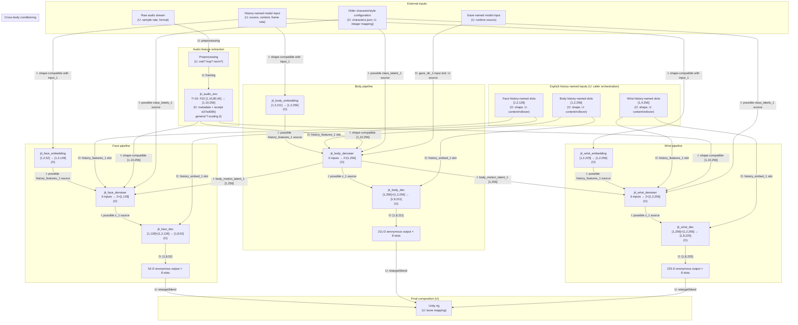
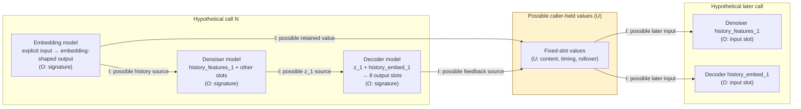
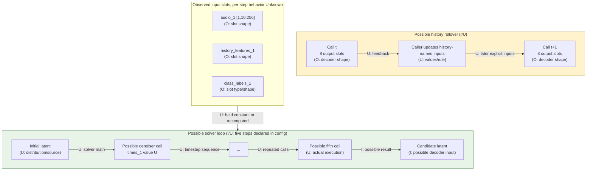
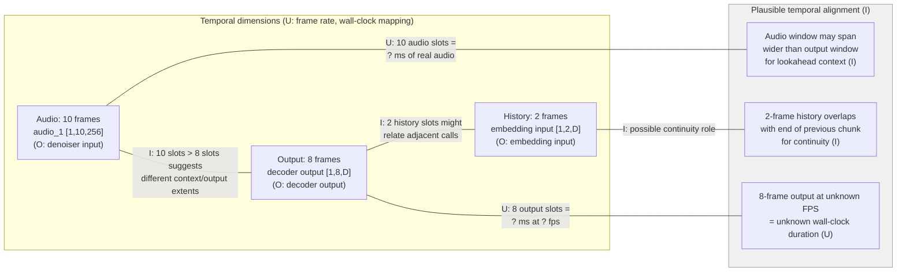
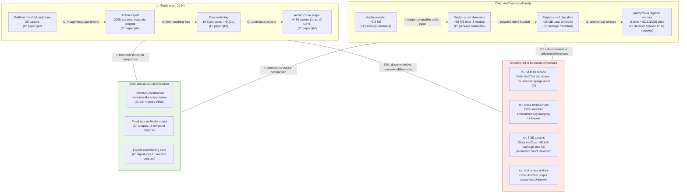
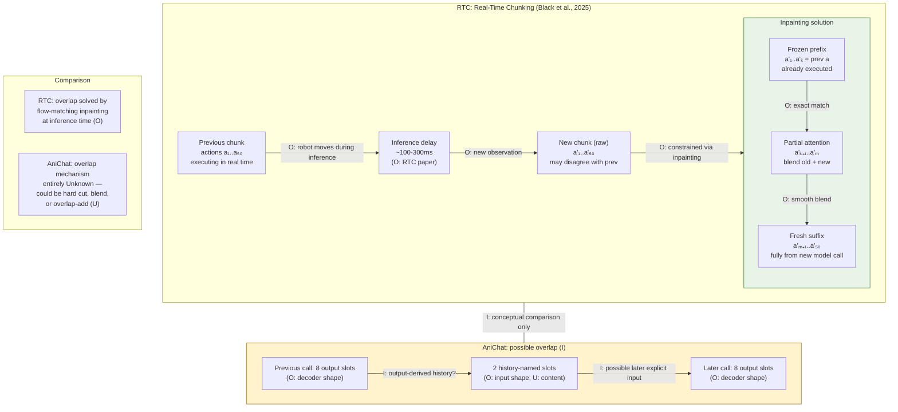
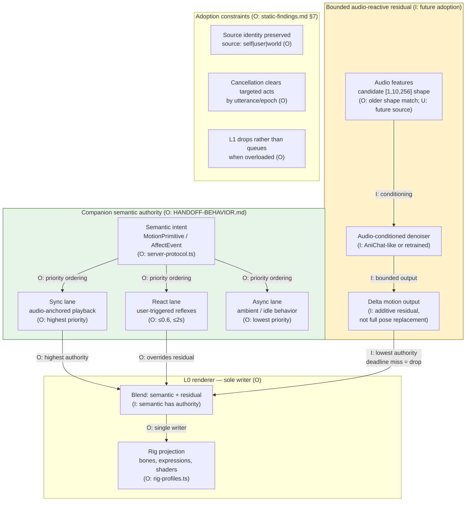
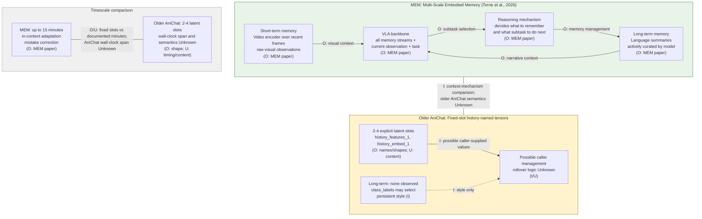

# Research diagrams — AniChat architecture and comparative analysis

> **Purpose:** Explanatory diagrams for older AniChat's motion-model signatures, a possible recurrent orchestration, and comparison to π₀/RTC/MEM. Every edge is tagged O (Observed), I (Inferred), or U (Unknown). Model evidence is `older_anichat` only; `current_grok` equivalence is Unknown. For exact I/O inventories see `diagrams.md`.
>
> **Citations:**
> - [π₀](https://arxiv.org/html/2410.24164v1) (Black et al., 2024)
> - [RTC](https://www.pi.website/research/real_time_chunking) (Black, Galliker, Levine, 2025)
> - [MEM](https://www.pi.website/research/memory) (Torne et al., 2026)

---

## 1. End-to-end tensor DAG

How the 10 model signatures are shape-compatible. This is not an observed runtime call graph; caller wiring remains Inferred or Unknown.

---

## 2. Possible caller-managed recurrence

This is a hypothesis diagram, not an observed call graph. Individual signatures are **Observed**; every handoff and feedback edge below is **Inferred**, while values, timing, initialization, and rollover are **Unknown**.

**Evidence boundary:** Empty `stateSchema` proves no hidden Core ML-managed state. Matching history-named slots plus measured sensitivity make caller-managed temporal feedback plausible (**Inferred**), not established. Rollover implementation, initialization, content, timing, and recovery behavior are **Unknown**:
- Initial values supplied to history-named inputs: **Unknown**
- Behavior after interruption or discontinuity: **Unknown**
- Values supplied during character/style changes: **Unknown**

---

## 3. Hypothesized within-call solver vs possible between-call rollover

These are two distinct unknown orchestration concerns. Older configuration declares five face/body inference steps, but neither process below was observed as a runtime loop.

**Important distinction:** timestep sensitivity and history-input sensitivity are measured, but they do not recover a solver or rollover loop. Initialization, step sequence, repeated-call count, conditioning reuse, feedback, slot timing, and continuity behavior remain **Unknown**.

---

## 4. Temporal alignment: 2 / 10 / 8 — what we know and don't know

---

## 5. AniChat vs π₀ — structural comparison

Where the architectures align and where they diverge.

---

## 6. RTC overlap-inpainting — concept and AniChat parallel

---

## 7. Companion semantic authority + bounded residual

How AniChat-like audio-conditioned motion fits into Companion's existing architecture.

---

## 8. Multi-scale memory comparison: MEM vs AniChat history

---

**Probe scope:** The diagrams cite only two synthetic runtime effects: the T=10 audio-encoder shape receipt and measured sensitivity of history/timestep inputs. They do not infer output semantics, caller wiring, solver math, or rollover from those probes. See `probe-findings.md`; other runtime evidence remains in `runtime-findings.md`.
