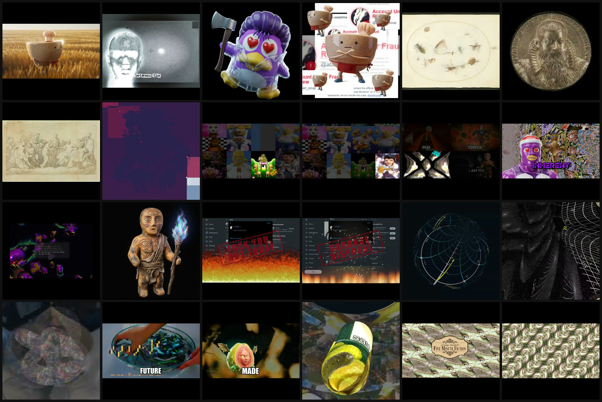

## Summary

Arthur's ask: save @abelian_soup's recent videos. Done via the multi-handle sync — **57 video items**, no rate-limit walls, manifest + media at `data/inspiration/abelian_soup/`.



Companion piece: his 2026 **method writeups** are archived and distilled in the [methods report](../2026-07-06-abelian-soup-methods/report.md) — including his public `latwalk` repo (DINO/CLIP latent-walk + FILM + beat/onset timing) and the March "pleorama slopcore harness" thread where @pleometric advises constraining style guides.

## Details

- Run: 10 pages, stopReason `max-pages` (more history available if wanted — bump `--max-pages`).
- Full run data: [`sync-summary.json`](sync-summary.json).
- Known gap: LABEL view currently reads only the pleometric manifest; abelian_soup items aren't labelable yet (queued).

## Rerun

```bash
bun scripts/pleometric-media-sync.boundary.ts --handle abelian_soup --max-items 60 --max-pages 10
```
