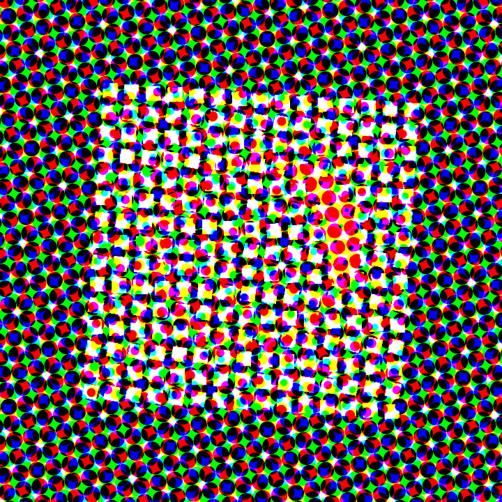
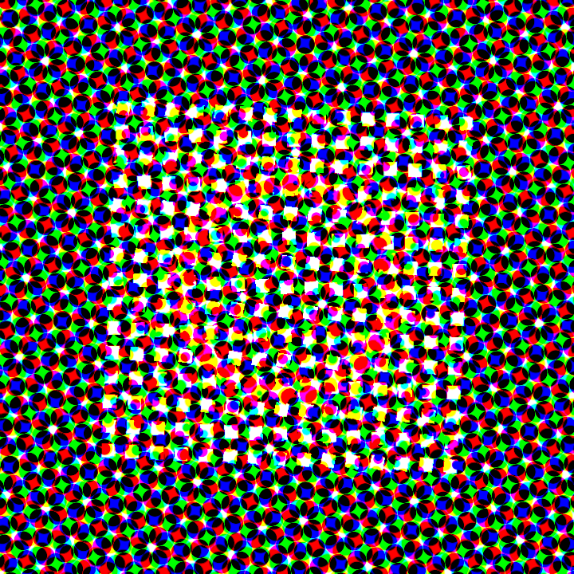
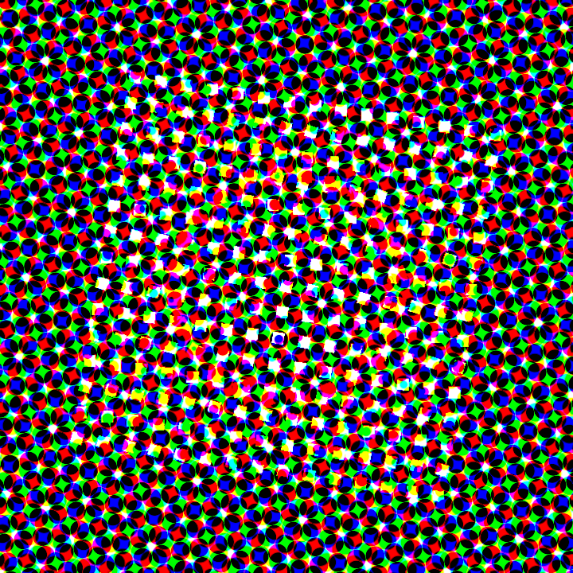

# Clone Field Pulse

_Dense clone-field rhythm piece — 720×720, 20s, 30fps, beat-locked to `pleo-track-20s.wav` at 100 BPM._



## Creative intent

The style rule I was chasing: **a beat is a compression event.** On every downbeat the whole
clone-field should snap tighter and brighter, then breathe back open between beats — the rhythm
lives in the *density* of the field, not in one moving object. Two simple repeated elements (bone
plane + vermilion plane) are stamped into three stacked clone fields: a dim warm back-grid for
parallax depth, a 15×15 bone-cream front-grid that pulses hard on every beat (`from 0.6 → 0.95`,
0.035s attack, musical 0.3s decay), and a 24-plane vermilion **orbit halo** whose scale kicks only
on every 4th beat (`from 0.55 → 1.45`) — the "second beat track with `every:4`" that lands the peak
accent. Traveling `phasePerClone` waves run rotation and opacity across each field so the pulse
sweeps rather than flashes flat. The camera does one slow thing — a gentle push (z 8.6 → 6.9) with
a continuous 15° roll — so the whole print rotates under itself. Post is a print-machine stack:
halftone dot-screen (rgbSplit, coarse dots) → light chromatic aberration, with bloom held down to a
glint that spikes with the `every:4` accent. Two inks only (bone + vermilion on warm near-black),
a deliberate self-constraint against palette sprawl.

## Style bucket

Retro-shader machine aesthetic / dense clone fields / beat-locked motion / print (halftone + CA)
texture. Abstract geometry, no photo plates — pleometric pieces are mostly abstract, so this leans
fully into repeated primitives + shader treatment.

## Stills

| t = 5.05s (4th-beat accent, orbit + bloom spike) | t = 3.5s (between beats, field open) | t = 12.2s (mid-piece accent, camera pushed/rolled) |
|---|---|---|
|  |  |  |

## Video

[`clone-field-pulse.mp4`](clone-field-pulse.mp4) — 720×720, 20.0s, h264 + aac (track muxed in).
Copied here so the feed can play it; source render at
`workflows/scene-lab/renders/clone-field-pulse/scene.mp4`.

## Spec

`workflows/scene-lab/specs/clone-field-pulse.scene.json` — passes the check CLI (3 objects,
1 asset, 600 frames). The spec is **live-editable in STUDIO at `scene.localhost:1355`** — open it
there to scrub the beat pulse and retune the fields in real time.

## Beat lock

`timeline.bpm` is 100 and `timeline.beats` is an explicit 0.6s grid **phase-shifted to a 0.2s
downbeat** (`0.2, 0.8, 1.4, …`). The provided `pleo-track-20s.beats.json` onset detection is too
sparse to use directly, but its two clean early onsets (0.2s and 0.8s, exactly 0.6s apart) confirm
the 100 BPM period and the 0.2s phase, so the visual grid lands on the audible hits. Audio is muxed
in-spec via the `audio` block (offset 0) — no ffmpeg lavfi synthesis.

## Design note — halftone rgbSplit tradeoff (honest)

The `halftone` pass with `rgbSplit: 1` is, by construction, a per-channel dot-screen at three
different angles. On any dark region it lights ~20% corner-coverage **per channel**, so a near-black
void becomes a ~50% union of full-value R/G/B dots — a dense multicolor rosette with a faintly
green-tinted void. This is inherent to the shader (confirmed against the lane's shipped
`halftone-print.scene.json` reference, which shows the identical texture) and cannot be tuned away
while keeping `rgbSplit: 1`. I made three moves to keep it composed rather than confetti:

1. **Fill the frame.** The front-grid + warm back-grid cover the frame edge-to-edge so the halftone
   screens *content*, not empty void — coarse dots over a structured field read as a coarse color
   print, not noise-on-black.
2. **Kill the blowout.** Opened the tile gaps (spacing 0.62 vs tile 0.46 → tiles never merge) and
   dropped bloom to a glint (`strength 0.1`, `threshold 0.86`); center luminance fell from a
   blown 0.71 to a structured ~0.49, so the halftone reproduces dots everywhere instead of a white
   blob.
3. **Warm the ground.** Background and back-grid are warm-dark so void specks skew warm.

I kept `rgbSplit: 1` deliberately: it is the literal directive **and** it preserves the two-ink
color identity (the vermilion orbit survives as red-dominant dots). A monochrome `rgbSplit: 0`
screen reads cleaner and darker but erases the orange ring entirely — a worse pleometric result.
The residual dense-dot character is the requested print-machine texture; in motion the beat-locked
compression/expansion of the field reads as a living print rather than a static dot pattern. If a
quieter ground is ever preferred, flip `rgbSplit` to 0 in the spec (one edit, re-check, re-render).

## Rerun commands

```sh
# validate
bun run --cwd packages/scene-renderer check -- \
  --scene ../../workflows/scene-lab/specs/clone-field-pulse.scene.json

# single still (any second, e.g. an every:4 accent peak)
bun run --cwd packages/scene-renderer render -- \
  --scene ../../workflows/scene-lab/specs/clone-field-pulse.scene.json \
  --out ../../workflows/scene-lab/renders/clone-field-pulse --still 5.05

# full deterministic MP4 (+ muxed audio)
bun run --cwd packages/scene-renderer render -- \
  --scene ../../workflows/scene-lab/specs/clone-field-pulse.scene.json \
  --out ../../workflows/scene-lab/renders/clone-field-pulse
```
