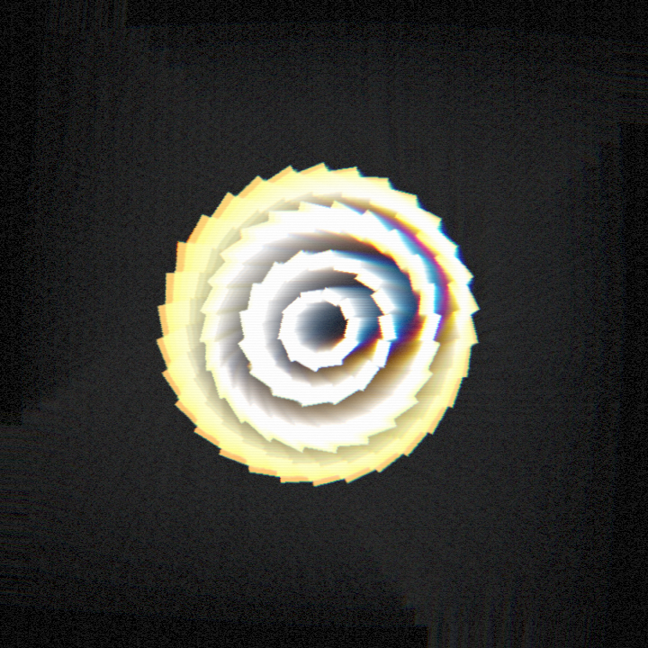
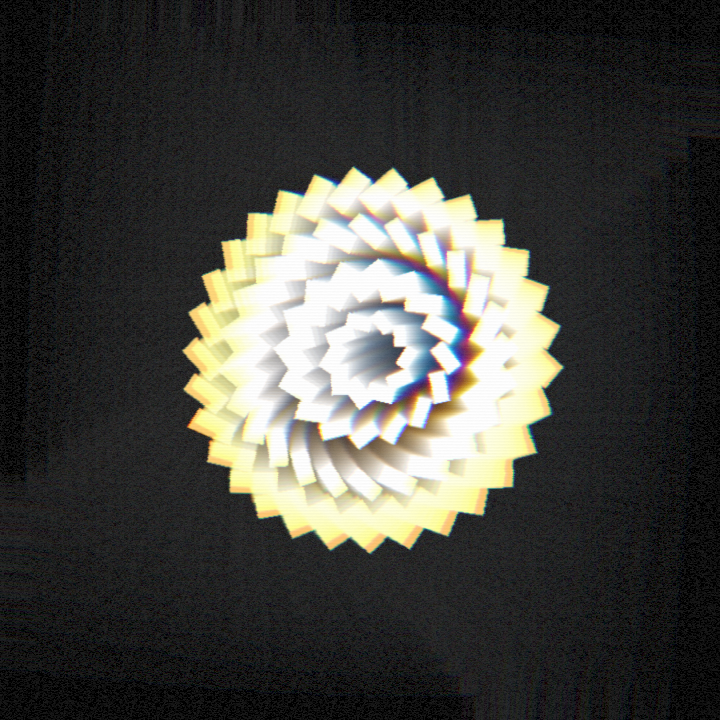
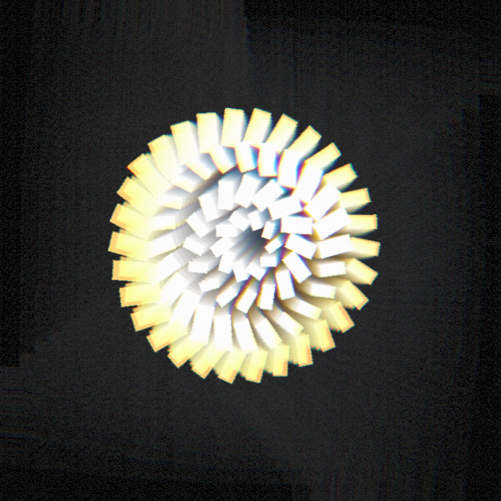

# Feedback Tunnel

_This spec is **live-editable in STUDIO at scene.localhost:1355** — open it there to drag `feedback.decay` / `zoom` / `rotate` and watch the vortex breathe in real time. Every number below is a starting point, not a law._

## Creative intent

The style rule I chased: **an infinite echo that never stops falling into itself.** One dense clone field of glowing warm-phosphor geometry — four counter-cadenced orbit rings (edge → outer → mid → inner, 80 clones total), no persona, no plate, pure machine light — fed through the new `feedback` pass so every frame the previous fully-processed frame is scaled a hair and rotated a hair. The echoes coil into a spiral that winds toward a small dark central aperture: a glowing well you fall down. Ambient audio (`pleo-update-13s.wav`, 13.3 s) → all motion is slow and hypnotic. No beat-slammed pops; only breathing `osc` waves with `phasePerClone` travelling around each ring, opposite directions on alternating rings, plus slow per-lozenge rotation ramps.

Palette is a deliberate rejection of the cyan-on-dark + purple-gradient AI cliché: hot amber at the rim → cream → white-hot core, on a warm near-black indigo (`#0b0710`). Molten, printed, machine — not nightclub. Chromatic aberration splits the coiling arms into red/magenta/cyan fringes; a restrained VHS grain + faint scanline keeps it from looking like clean tech branding.

## Pass-order decision (why `feedback` is EARLY) — the thing the brief asked me to document

The chain records history **after all passes**, then the `feedback` pass re-injects that history at its own position in the chain. So *where* feedback sits changes everything:

- **Feedback EARLY** (my choice: right after `bloom`, before `displacement`/`chromaticAberration`/`vhs`): the downstream liquid-warp and grime re-process the **entire accumulated tunnel every frame**. Trails visibly flow, bend and re-grain as they coil inward — the whole echo structure is alive, not a rigid geometric zoom.
- **Feedback LAST**: only the fresh geometry gets warped; the tunnel becomes a clean geometric zoom of already-finished frames — crisper but deader.

I chose flow over crispness because the brief wants "liquid warp" of the tunnel and unmistakable smearing.

**Chosen chain:** `bloom → feedback → displacement → chromaticAberration → vhs`

Final feedback params: `decay 0.85, zoom 0.987 (inward), rotate 0.017`.

## What I learned tuning the feedback pass (documented experiments)

I measured radial brightness fill (pure-Python over ffmpeg-decoded raw RGB, banded by radius) at 3 timestamps each pass to stop guessing from eyeballs:

1. **Inward, small central rings, high decay (0.9–0.95)** → the pass has a **central attractor**: energy piles into a blown-white core and the periphery evacuates to black within ~5 s (content collapsed to radius < 0.48 of half-width). Reads as a hot blob on black.
2. **Outward (`zoom > 1`)** → echoes expand but **decay outruns the slow expansion**: a ring spawned near center is invisible long before it reaches the frame edge. Also a compact core.
3. **Key finding:** in this renderer the feedback loop concentrates brightness centrally *regardless of zoom sign* — so you cannot rely on the pass to transport light out to the edges. The source field itself must carry the periphery.
4. **Resolution:** four bold, near-uniform-brightness rings spanning radius 0.55 → 2.55, a low bloom threshold (0.42) so every warm tone glows, **decay dropped to 0.85** (less central pile-up), and vignette cut to 0.18. The result reads as a layered spiral coiling to a dark central aperture — a real vortex with depth at both ends.

**Honest weakness:** it is center-weighted, not edge-to-edge — the corners stay dark. For an ambient piece I treat that as intentional composition (a glowing well in darkness, negative space doing work), but a future pass could add a full-frame grid layer so the tunnel bleeds into the corners.

## Spec

- Path: `workflows/scene-lab/specs/feedback-tunnel.scene.json`
- 720×720, 30 fps, 13.3 s (locked to the 13.312 s audio), 4 objects / 80 clones, deterministic (fixed seeds, no runtime randomness — history clears at frame 0).

## Stills





## Video

- `feedback-tunnel.mp4` (in this dir, audio muxed) — source render at `workflows/scene-lab/renders/feedback-tunnel/scene.mp4`.

## Rerun commands (run from repo root)

```sh
# validate
bun run --cwd packages/scene-renderer check -- --scene ../../workflows/scene-lab/specs/feedback-tunnel.scene.json

# single stills (feedback warms up from frame 0 automatically)
bun run --cwd packages/scene-renderer render -- --scene ../../workflows/scene-lab/specs/feedback-tunnel.scene.json --out ../../workflows/scene-lab/renders/feedback-tunnel --still 7

# full deterministic render (audio muxed automatically)
bun run --cwd packages/scene-renderer render -- --scene ../../workflows/scene-lab/specs/feedback-tunnel.scene.json --out ../../workflows/scene-lab/renders/feedback-tunnel
```

## Verification

- `check` passes: `OK: 4 objects, 1 assets, 399 frames`.
- Full render produced `scene.mp4`: h264 13.30 s video + aac 13.29 s audio (ffprobe-confirmed), 7.0 MB.
- Radial fill measured at frames 75/210/345: solid bright coil to ~0.6 of half-width, dark central aperture + dark surround; echo trails present and increasing with the slow camera push-in.
