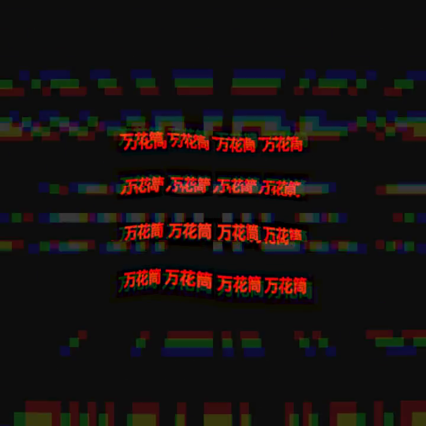
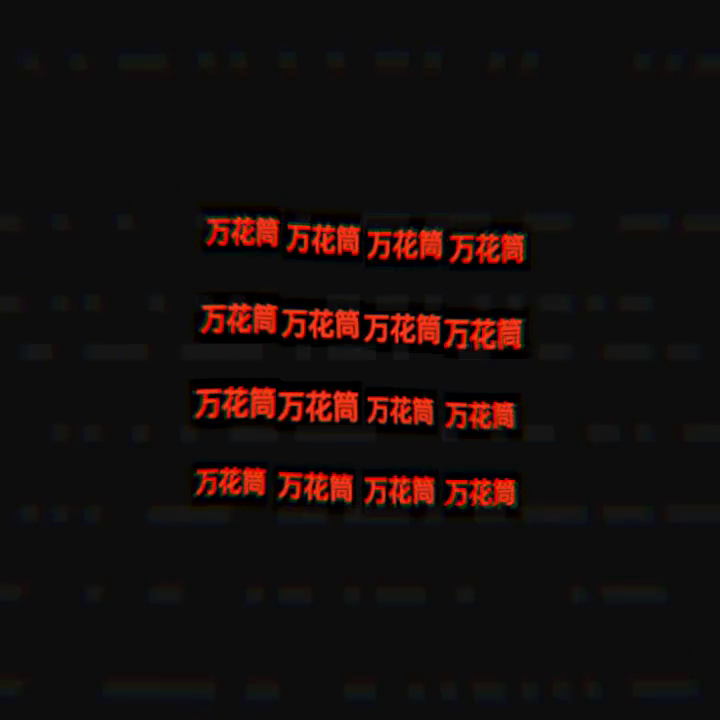
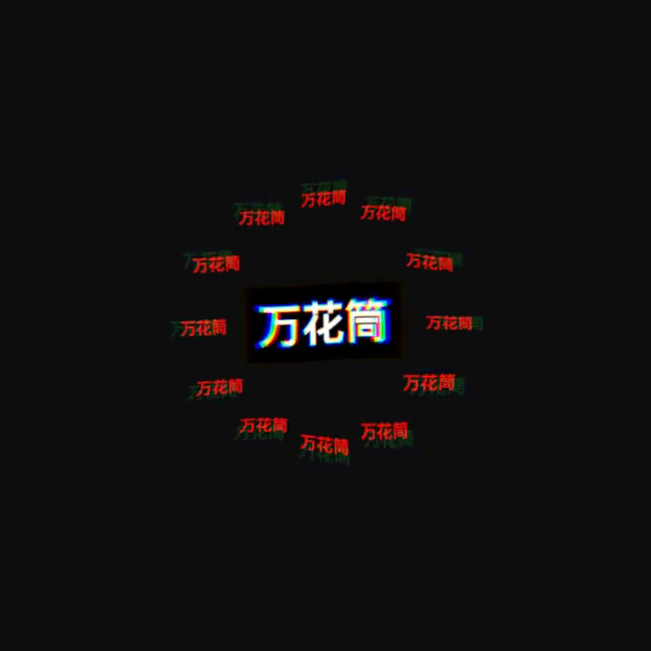

# TYPE GLITCH

_This spec is **live-editable in STUDIO at scene.localhost:1355** — open it there to
scrub the 100 BPM pulse, retune each field's scale pop, and drag the glitch/chromatic
beat-reactivity in real time. Every number below is a starting point, not a law._

## Creative intent

Kinetic typography in the Pleometric / @abelian_soup abstract-machine idiom: short
words with attitude — **PLEO**, **万花筒** (kaleidoscope), **SCENE LAB** — cloned into
line / grid / scatter / orbit fields, beat-locked at 100 BPM, the arrangement hard-cut
phase-by-phase, with glitch tear + displacement kicks + RGB fringe pulsing on the beat.

Four movements, hard-cut on the bar (opacity step, not crossfade — the type *slams*
into the next arrangement):

| t (s)        | word        | field  | clones | feel |
|--------------|-------------|--------|--------|------|
| 0.0 – 4.8    | `PLEO`      | line   | 4      | statement of intent, sparse and loud |
| 4.8 – 9.6    | `万花筒`    | grid   | 16     | full kaleidoscope wall, densest hit |
| 9.6 – 14.4   | `SCENE LAB` | scatter| 9      | thrown across the frame, biggest pops |
| 14.4 – 20.0  | `万花筒`    | core + orbit | 1 + 12 | one huge title with a ring falling around it — resolution |

Palette is a deliberate rejection of the cyan-on-dark + purple-gradient AI cliché:
bone `#f2ead9` and vermilion `#ff3b1d` on a warm near-black `#0a0810`. Printed, molten,
machine — not nightclub. The camera is real (it dollies `z 8.2 → 6.9` over the 20 s and
rolls ±0.07 rad every 4 beats); the type is not — see Findings.

## Style guide (self-imposed constraints)

- **Rest is full size.** Every readable field sits at `scale 1.0` between beats and
  *pops up* on the beat (never shrinks). The type is legible at rest and gains energy
  on the hit, rather than living small and only reaching full size on the pulse.
- **Crisp between beats, punch on the beat.** Base RGB-split / chromatic is low
  (`strength 0.012`) so the glyphs read clean; the beat spikes it (`+0.06`, every beat,
  decay `0.16`) for the fringe punch. Same gating on the glitch tear
  (`intensity 0.02` base → `+0.4` on beat) and displacement (`+0.02` every 2 beats).
- **Two words, three scripts, one attitude.** CJK renders clean (no tofu); the Latin
  words carry the "brand" beats.
- Deterministic: fixed clone seeds, no runtime randomness. Same input → same 600 frames.

## Final edit (what landed last)

The piece was finished on this pass by applying the tuning the previous designer had
staged but not yet committed:

1. **Rest scale → 1.0 with bigger beat pops.** Every field's `scale` beat track now
   rests at `1.0` and pops to `1.06 – 1.28` (biggest on the SCENE LAB scatter). Earlier
   drafts rested below 1.0, which shrank the type between beats and made it read timid.
2. **Beat-gated RGB-split / chromatic.** Base `strength` held low (`0.012`) for crisp
   glyph edges between beats; the beat-reactive spike (`+0.06`, decay `0.16`) supplies
   the punch on each beat. Verified in the pixels: the grid *rest* frame is full-size
   and clean, the *on-beat* frame splits into red/green/blue fringes with horizontal
   tear (stills below).

## Spec

- Path: `workflows/scene-lab/specs/type-glitch.scene.json`
- 720×720, 30 fps, 20.0 s (locked to `pleo-track-20s.wav`, 100 BPM), 5 objects /
  42 clones, 4 post passes (displacement → glitch → chromaticAberration → bloom),
  deterministic.

## Stills





## Video

<video src="type-glitch.mp4" controls loop muted playsinline width="480"></video>

- `type-glitch.mp4` (in this dir, 720×720 h264 + aac, 20.0 s, audio muxed) — source
  render at `workflows/scene-lab/renders/type-glitch/scene.mp4`.

## Interactive toy

- [`artifact.html`](artifact.html) — a self-contained, no-build three.js toy (three
  `0.166.1` via CDN import map, works from `file://`). It distills the piece's core
  motif: a **clone field of pulsing text sprites** with the same glitch/RGB-split
  post shader.
  - **Drag** to orbit the field.
  - **CLONES** slider (1 – 64) grows/shrinks the field; **GLITCH** slider drives the
    RGB-split + scanline-tear intensity (plus PULSE and HALFTONE sliders for extra
    reach).
  - **Space** = manual pulse; the field also auto-pulses on the 100 BPM beat.
  - **万花筒 ↺** button cycles the word (万花筒 → PLEO → SCENE LAB).

## Rerun commands (run from repo root)

```sh
# validate
bun run --cwd packages/scene-renderer check -- --scene ../../workflows/scene-lab/specs/type-glitch.scene.json

# single still (e.g. the on-beat peak)
bun run --cwd packages/scene-renderer render -- --scene ../../workflows/scene-lab/specs/type-glitch.scene.json --out ../../workflows/scene-lab/renders/type-glitch --still 6.03

# full deterministic render (audio muxed automatically)
bun run --cwd packages/scene-renderer render -- --scene ../../workflows/scene-lab/specs/type-glitch.scene.json --out ../../workflows/scene-lab/renders/type-glitch
```

## Verification

- `check` passes: `OK: 5 objects, 1 assets, 600 frames`.
- Render (`scene.mp4`, 3.0 MB) is `ffprobe`-confirmed 720×720 **h264** video +
  **aac** 48 kHz stereo audio, `duration = 20.000000` — the audio block is muxed.
  Render is deterministic and was produced from the final (post-edit) spec; the MP4
  is copied into this dir as `type-glitch.mp4`.
- Pixel-level confirmation of the final edit via three stills pulled from the MP4:
  the grid **rest** frame is full-size and crisp with minimal fringing; the grid
  **on-beat** frame shows the scale pop + RGB channel split + horizontal tear; the
  **finale** frame reads as a resolved central title with an orbiting ring.
- `artifact.html` browser-QA (headless Chromium via cmux): loads from `file://`,
  title `TYPE GLITCH · toy`, three.js resolves from the unpkg import map (verified
  `200`, 1.29 MB), and the WebGL clone field renders (grid of red 万花筒 sprites).
  Controls fire: the CLONES slider moved the value `25 → 33`, the word button flipped
  the field to `PLEO`, and the drag/space/keyboard handlers are wired.
  _QA caveat:_ the cmux headless surface composites the DOM overlay live but snapshots
  the WebGL canvas as a frozen first frame, so the *live* re-render after each
  interaction could not be captured in a screenshot — the DOM-side confirmations
  (slider value, button label) prove the handlers that drive `rebuild()` / `params`
  are executing.

## Findings (renderer gaps + latent bugs)

1. **Text objects are `THREE.Sprite`, so `rotation.z` on a text track is silently
   ignored.** Sprites always face the camera and do not roll, so any `rotation` track
   on a `text` object is a no-op. This piece works around it: motion comes from `scale`
   + `position` tracks and a **real camera roll** (`camera.rotation.z` beat track),
   which is why the whole frame appears to cant on the downbeat even though no glyph
   itself rotates.
   _Suggested renderer fix (future, out of scope here):_ either render text as a
   `PlaneGeometry` carrying the glyph texture (a real mesh that honors `rotation`), or
   drive `sprite.material.rotation` (which three.js *does* support for sprites) from the
   `rotation.z` track so existing specs get in-plane spin for free.

2. **`y2k-chrome.scene.json` glitch pass is a latent no-op (FLAGGED, not fixed —
   out of owner scope).** Its glitch pass targets `strength`:
   ```json
   { "pass": "glitch", "params": { "strength": 0.08 },
     "beatReactive": { "param": "strength", "every": 1, "amount": 0.45, "decay": 0.16 } }
   ```
   but the glitch shader's uniforms are **`intensity`** and **`blockiness`** — `strength`
   is bloom's uniform, not glitch's. So both the static param and the beat-reactive
   modulation write to a uniform the glitch pass never reads: that scene's glitch is
   effectively off and never reacts to the beat. (`type-glitch.scene.json` correctly
   uses `intensity` / `blockiness`.) Left as-is per scope; noted here for whoever owns
   the y2k lane.
