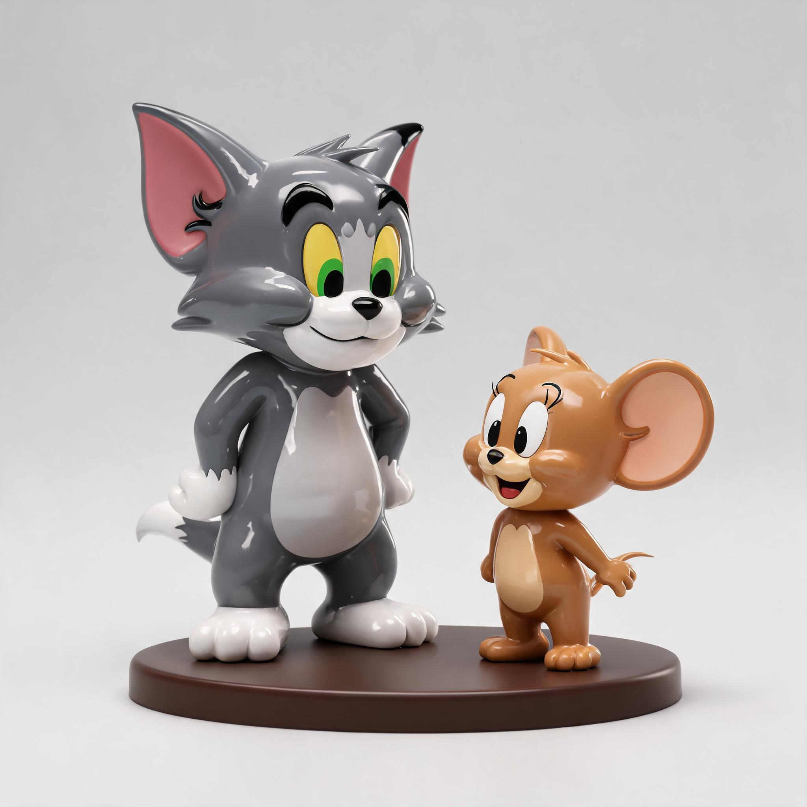
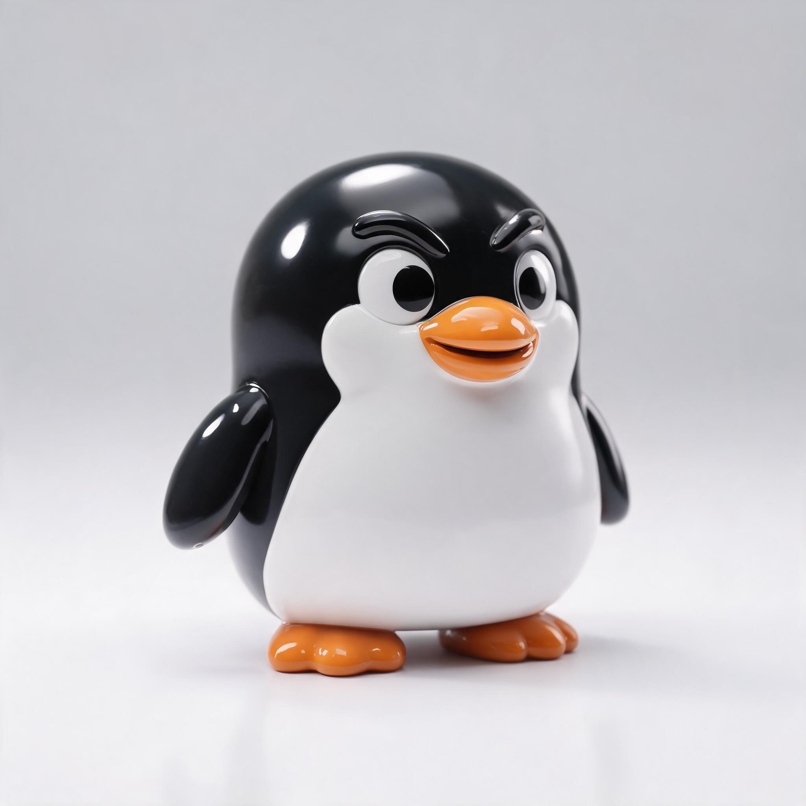

## The cast (4 variants each in `workflows/scene-lab/assets/characters/`)

| | |
|---|---|
|  | **Aschenbrenner × Orange** — the founding meme. Chubby citrus-bodied blond nerd, wire glasses, smug grin. (First submit hit ret=3018, retry succeeded; manifest kept the error flag — images are real.) |
|  | **Gigachad Sonic** — six-pack, smirk, glossy figurine finish. |
|  | **Suit Claude** — starburst-flower head, gray suit, crossed arms, ceramic gloss. |
|  | **Hyper-shiny Peach** — humanized, wet-gloss PVC. |
|  | **Cat & Mouse duo** — Tom-and-Jerry-shaped, house style. |
|  | **Pernicious Penguin** — chubby glossy figurine, one arched eyebrow, sideways side-eye and a cheeky up-curved beak-grin: cute-but-untrustworthy. (Landed on the 4th real submit after 3× `2038/InputTextRisk` — the "menacing/scheming/untrustworthy" wording tripped Jimeng's text filter, so villainy had to be carried by physical features, not psychology words.) |

**Cast complete — all six shipped.** The pernicious penguin (previously missing on a workbench UI-state error) landed this session via the exact proven submit path with a physical-only prompt. Forensics: `workflows/scene-lab/assets/characters/pernicious-penguin/manifest.json` + `history://PenguinRetry`.

## Spend + auth story

~5 submits on jimeng-5.0 (`high_aes_general_v50`, 2k, 2:3), 4 variants per submit — within the 10-submit cap, concurrency 1, no risk-control hits. The worker first proved the Helium agent profile is **logged out** (no passport cookies → 1015) via non-spending probes, then succeeded through the direct-submit path. Full forensics: `history://CharacterMashups`.

## Prompt scaffold (full playbook: `docs/research/jimeng-prompting-playbook.md`)

`[figurine wrapper] — [subject fusion clause] — [meme-mascot disclaimer] + negative prompt`. Seeds + full prompts in each character's `manifest.json`.

## Rerun

Re-login Jimeng in the Helium profile first (only blocker for scale-up), then rerun per manifest prompts with jimeng-client's text2image capture flow.
