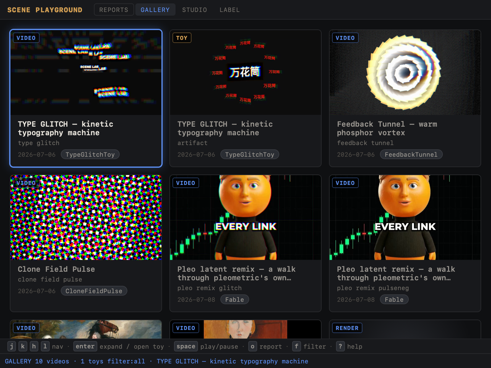
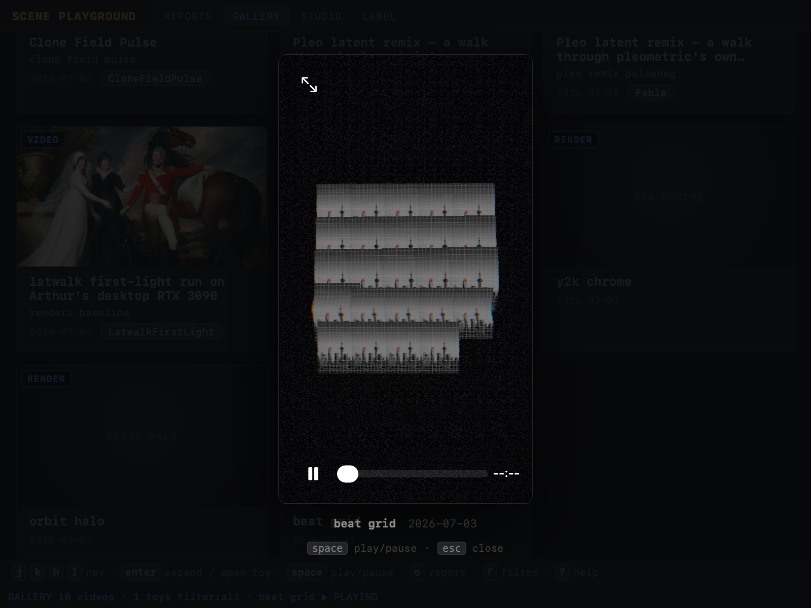

A fourth top-nav view for `apps/scene-playground`: a flat, keyboard-driven grid
of every playable scene-lab artifact. It folds the reports feed's media and the
standalone `renders/*/scene.mp4` clips into one showcase — ~10 videos + 1 toy
today — and drives it entirely with vim keys over a stable DOM.

## What shipped

- **Flat artifact model** (`src/ui/gallery/data.ts`, pure/tested). Every report
  `.mp4` becomes a VIDEO card (poster = sibling `.png` still, prefix-matched);
  every report `artifact.html` becomes a TOY card; each `renders/<slug>/scene.mp4`
  folds in as a RENDER card **unless a report already covers that slug** — the
  curated report copy wins the slug-dedupe.
- **CSS-patch navigation** (`src/ui/gallery/keymap.ts`, pure/tested). `j/k/h/l`
  move focus one grid cell; the grid DOM is built once and navigation only
  patches the `focused` class on ≤2 cards + swaps a single live `<video>`.
- **View shell** (`src/ui/gallery/view.ts`). Focused video autoplays muted;
  `Enter` opens a sound-on overlay player (`Esc` close, `Space` play/pause);
  `Enter` on a TOY opens `artifact.html` in a new tab; `o` jumps to the parent
  report; `f` cycles the filter; `?` toggles help. Errors route through
  `reportClientError`.
- **Server media-scan extension** (`src/server.ts`). `.html` added to the report
  media regex + the `/report` allow-list so toys are scannable and servable.

## Front-matter latent bug (fixed, pre-existing)

`parseFrontMatter` only understood **bare `key: value`** front matter. A report
whose first line was a YAML fence (`---`) hit the colon-less-first-line branch,
bailed immediately with **empty meta**, and its `title` fell back to the report
**directory name**. Newer reports (all the 2026-07-06/07-08 scene work:
type-glitch-toy, feedback-tunnel, clone-field-pulse, latwalk-first-light,
pleo-latent-remix, …) were all silently showing dir-name titles in REPORTS.

The fix adds a fenced branch: if line 0 is `---`, parse `key: value` lines until
the closing `---`, then treat the remainder as body. Legacy colon-style parsing
is untouched.

**Verified both styles via `/api/reports` — no regression:**

| style | example dir | resolved title |
|---|---|---|
| fenced `---` | `2026-07-06-type-glitch-toy` | `TYPE GLITCH — kinetic typography machine` |
| fenced `---` | `2026-07-06-clone-field-pulse` | `Clone Field Pulse` |
| colon | `2026-07-03-scene-lab-boot` | `Scene Lab online` |
| colon | `2026-07-03-first-light` | `First Light Scene Lab Demos` |
| no front matter (`#` heading) | `2026-07-06-label-autoplay` | `2026-07-06-label-autoplay` (dir-name — correct: no title key exists) |

## Keymap

| Key | Action |
|---|---|
| `j` / `k` | Move focus down / up one grid row |
| `h` / `l` | Move focus left / right (clamps at column edges) |
| `Home` / `G` / `End` | Jump to first / last card |
| `Enter` | Expand focused video in sound-on overlay · open TOY in new tab |
| `Space` | Play / pause (overlay only) |
| `Esc` | Close overlay / help |
| `o` | Open the parent report (switches to REPORTS, scrolls + flashes the card) |
| `f` | Filter: all → videos → toys → all |
| `?` | Toggle help overlay |

Overlay and help modes swallow all grid keys so focus never drifts under a modal
(`mapGalleryKey` checks `overlayOpen` then `helpVisible` before the grid switch).

## DOM-stability & video discipline

The grid is a **flat, stable DOM** — 11 cards built once (`renderGrid`) and only
rebuilt on a data/filter change, never on navigation. `j/k/h/l` merely toggle the
`focused` class on two cells and move one live `<video>`. Media budget: only the
focused video card holds a muted, looping, inline `<video>`; the expand overlay
tears down that grid video and owns the single sound-on player. **At most one
`<video>` is ever live**, well inside the ≤2 budget. Browser QA confirmed:

- Grid card: focus on a video → `liveVideos = 1`; focus on the TOY → `liveVideos = 0`.
- Overlay open → grid live videos `= 0`, overlay video `muted = false`, `paused = false`.
- `Esc` closes overlay → grid autoplay restored (`liveVideos = 1`).

`currentCols()` reads live geometry (first-row `offsetTop` run) so `j/k` always
jump exactly one visual row regardless of viewport width.

## QA evidence (own instance, port 4611 — Arthur's live server on :1355 untouched)

- **Grid** (`qa-grid.png`): 11 cards = 7 VIDEO + 3 RENDER + 1 TOY. Status line
  `GALLERY  10 videos · 1 toys  filter:all`. Focused card shows accent ring +
  autoplaying video; posters + badges + agent pills on the rest.
- **Overlay** (`qa-overlay.png`): dimmed backdrop, centered sound-on player with
  native controls, caption (`beat grid  2026-07-03`), `space`/`esc` hint,
  status `▶ PLAYING`.
- Navigation trace (cols=3): `l`→idx1, `j`→idx4, `h`→idx3, `k`→idx0, `G`→idx10.
- Dedupe: renders `clone-field-pulse`, `feedback-tunnel`, `type-glitch` are
  covered by reports and dropped; `y2k-chrome`, `orbit-halo`, `beat-grid` surface
  as orphan RENDER cards.





## Tests

- `test/gallery-data.test.ts` — 18 tests: poster pairing, reports flatten +
  filename/kind ordering, image-only reports produce no cards, newest-first
  order, `isRenderCovered` (exact / suffix / video-stem / orphan), renders
  fold-in + slug-dedupe + mtime-desc orphan sort, filter, `countKinds`, helpers.
- `test/gallery-keymap.test.ts` — 18 tests: `gridMove` (row/column clamps, empty
  grid, single column), `cycleFilter` ring, `mapGalleryKey` grid mode
  (hjkl/arrows/Home/G/End/Enter/o/f/?), overlay mode (grid keys swallowed),
  help mode, overlay-over-help precedence.
- `test/server.test.ts` — added a regression: fenced front matter resolves the
  quoted title (not the dir name) and `.html` toys are scanned into media.

Full app suite: **177 pass / 0 fail** (6 files). No project-wide gates run here
(coordinator owns tsc + full tests).

## Rerun / QA commands

```sh
cd apps/scene-playground
bun test                                   # 177 pass
bun test test/gallery-data.test.ts         # 18 pass
bun test test/gallery-keymap.test.ts       # 18 pass

# Boot an isolated instance (any free port ≠ Arthur's :1355)
PORT=4611 bun src/server.ts
#   open http://127.0.0.1:4611/  → click GALLERY
curl -s http://127.0.0.1:4611/api/reports  # spot-check both title styles
curl -s http://127.0.0.1:4611/api/renders  # 6 renders; 3 fold in after dedupe
```
