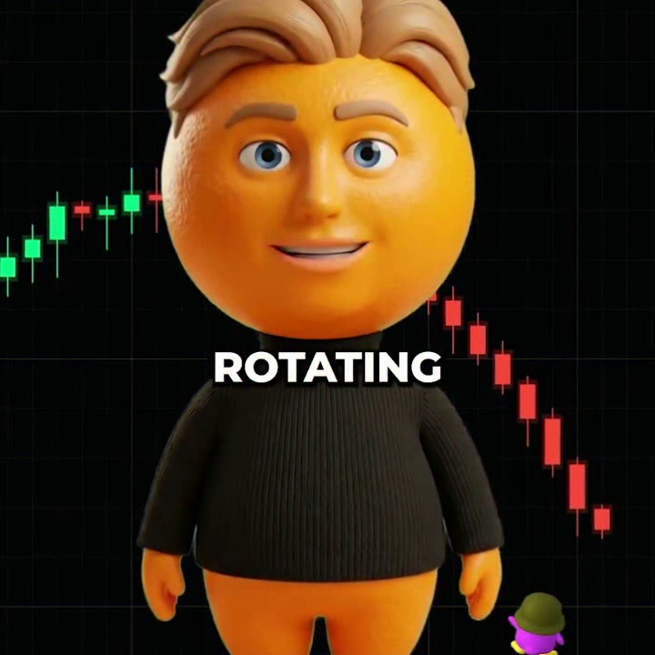
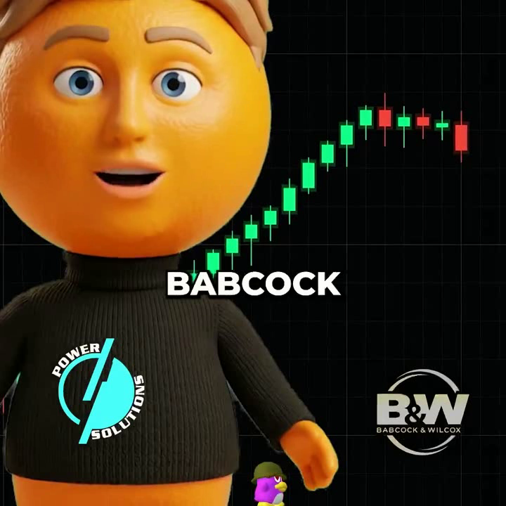

## What this is

The 82-video pleometric corpus, exploded into 1077 frames, embedded (DINO 0.55 / CLIP 0.35 / hist 0.10 on the RTX 3090), ordered by visual similarity, and re-rendered as beat-synced walks **to pleometric's own audio** (`pleo-track-20s.wav`, tempo estimated 99.4 BPM by latwalk's `middlepath` — 33 beats, 37 image changes, 2 strong-onset inserts). Abel's tool, pleometric's pixels, our corpus plumbing.

Two prune candidates:

| Variant | File | Flavor |
|---|---|---|
| glitch | `pleo-remix-glitch.mp4` | chromatic offsets + pulse-triggered glitch bands (13.8MB) |
| pulse-negative | `pleo-remix-pulseneg.mp4` | brightness pulse + negative flashes on strong hits (7.1MB) |





## Why it's interesting

- The similarity ordering makes the corpus *self-narrate*: adjacent frames are visually related across different source videos — you see pleometric's recurring motifs (grids, charts, figures, type) cluster and morph.
- 37 of 1077 frames selected per 20s render → enormous unexplored remix space from one feature cache (re-render ≈ 1 min).
- This is the babble half; your labels are the prune half. Same machinery points at abelian_soup's 57 videos, your plates, or jimeng outputs.

## Rerun (desktop, idempotent)

```bash
ssh desktop '~/latwalk-lab/pleo-remix.sh'   # rm generations/pleo-remix-*.mp4 to force re-render
scp 'desktop:~/latwalk-lab/generations/pleo-remix-*' workflows/scene-lab/reports/2026-07-08-pleo-latent-remix/
```

Frames: `desktop:~/latwalk-lab/pleo_frames/` (1077, 1fps extraction, ≤1024px). Feature cache: `~/latwalk-lab/latwalk/.latmatch_cache/`.
