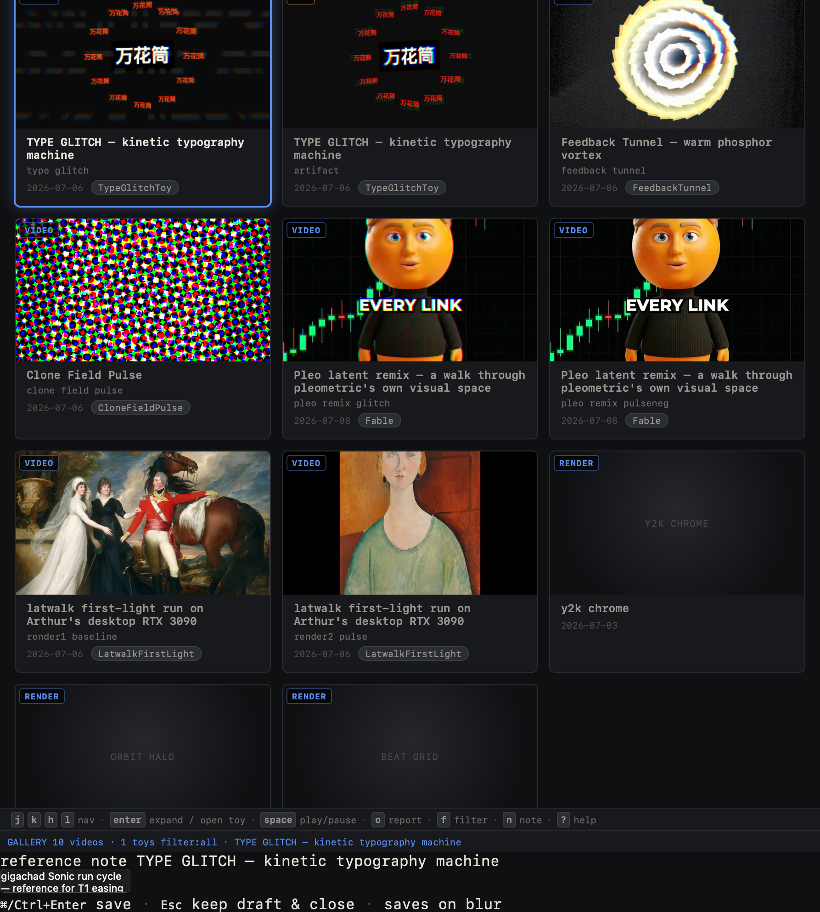
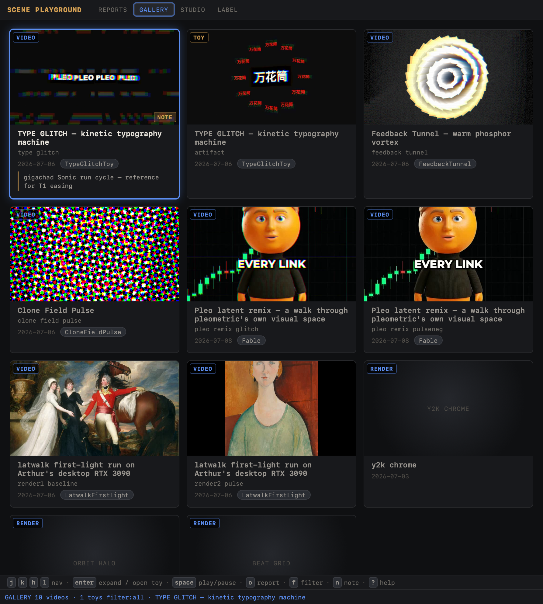
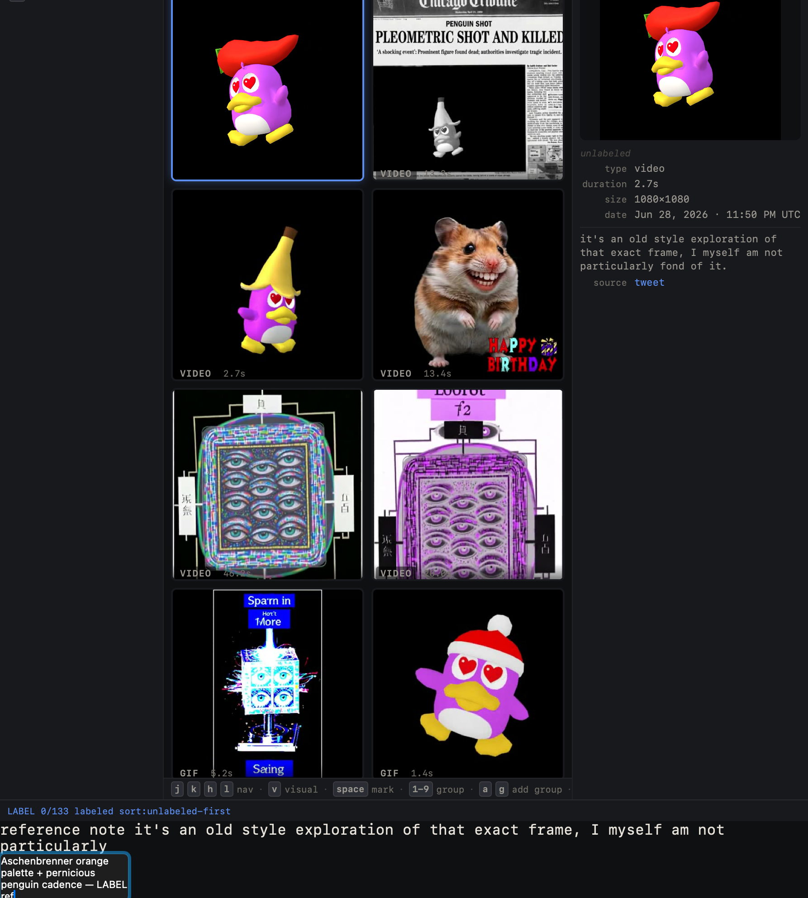
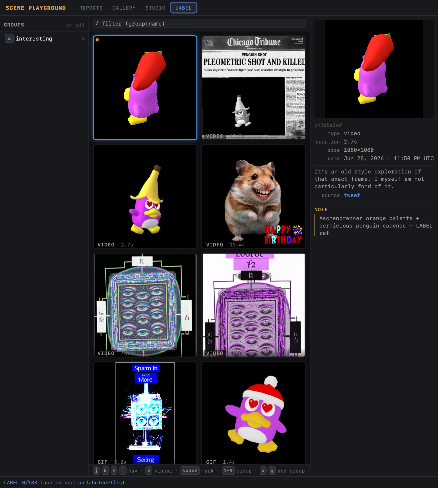
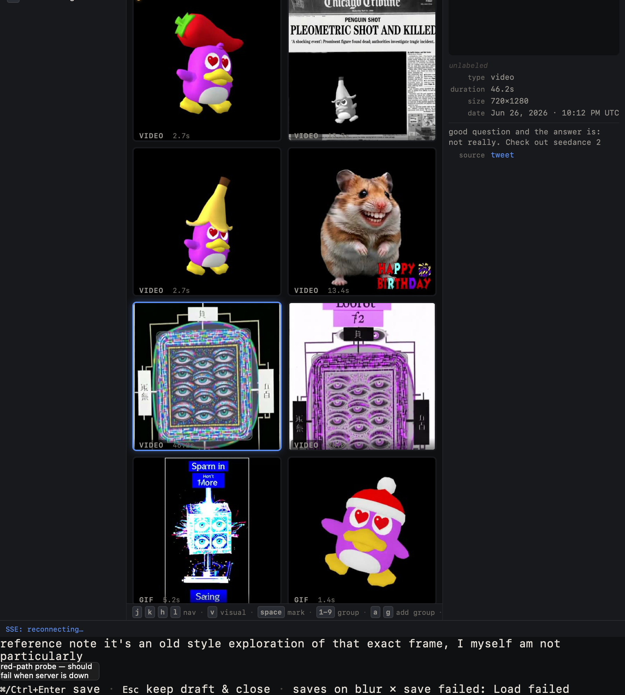

# Reference Notes

Free-text reference notes attached to any corpus item (LABEL) or gallery
artifact (GALLERY), keyed by a stable `item_key`, persisted in
`data/scene-lab/labels.sqlite`, and provenance-recorded in the ledger as a
human edit. Built to support Arthur's dictation workflow: focus an item, press
`n`, dictate the cultural references through VoiceInk (which arrives as pasted
text, so bodies can be multi-paragraph), then `⌘/Ctrl+Enter` to save.

## Arthur's dictation workflow

1. **Focus** the item in either view (`j/k/h/l` grid nav; the focused
   card/cell gets the accent ring).
2. **`n`** opens the inline note panel over the view, textarea pre-loaded with
   any existing note.
3. **Dictate** via VoiceInk — the transcribed text lands in the textarea as if
   pasted, so full sentences and paragraphs are fine.
4. **`⌘/Ctrl+Enter`** (or click away → blur) saves. The save is only "done"
   once the server confirms it: green flash in the view's save-status strip on
   success, red in-panel status + draft kept on failure. `Esc` closes without
   saving but keeps the draft cached, so an accidental dismiss never loses
   dictation.

## What was built

| Layer | Change |
| --- | --- |
| Store (`src/labels.ts`) | `notes` table (`id`, `item_key UNIQUE`, `body`, `ts`) + `getNote`/`setNote`/`allNotes`. Empty/whitespace body clears the row (no blank notes). `setNote` upserts by `item_key`. |
| API (`src/server.ts`) | `GET /api/notes` (all) / `GET /api/notes?item=<key>` (one, or `null`) / `PUT /api/notes` (`{ itemKey, body }`, 400 on missing key or `>20000` chars). Every write is ledgered as `note:<item_key>` actor `human`. |
| Shared panel (`src/ui/notes.ts`) | Single reused fixed overlay + auto-growing textarea. `⌘/Ctrl+Enter`/blur → server-confirmed save; `Esc` → keep-draft close; failures flash red and call `reportClientError`. |
| GALLERY (`src/ui/gallery/view.ts` + `keymap.ts`) | `n` → `open-note` on the focused artifact (`item_key` = artifact repo-rel path). `NOTE` badge on noted cards, 3-line excerpt under the meta, `n note` in the hint strip + `?` help, save-status strip, note-map fetched in `loadData`, timer cleared on unmount. |
| LABEL (`src/ui/label/view.ts` + `keymap.ts`) | `n` → `note` on the focused corpus item (`item_key` = `media_path`). Accent dot on noted cells, `NOTE` block in the detail pane, `n note` hint + `?` help, note-map fetched in `loadData`, panel-open guard in `handleLabelKeydown`, reuses the existing `showSaveStatus` green/red strip. |

Keymap routing was verified free of duplicate `case` labels in both views
(the earlier `case "o"`/`case "p"` collisions are gone; `n` is unique).

## Verification

### Test suite — `bun test` (full app suite)

```
196 pass
0 fail
480 expect() calls
Ran 196 tests across 6 files.
```

Baseline was 177; +19 new tests cover the notes store CRUD (create/upsert/
clear/verbatim-body/allNotes), the `/api/notes` contract (GET all/one/null, PUT
create/upsert/clear, 400 on missing key, 400 on over-length, ledger
provenance), and `n` keymap routing in both views (opens in normal mode, inert
while filter-focused / inspecting / overlay / help; no `n`↔`p` collision).

`tsc --noEmit` → clean (Arthur's live watch server depends on this).

### Browser QA (isolated server on :4733, fresh sqlite, real corpus via symlink — never Arthur's :1355)

**GALLERY:** focus → `n` → type → `⌘+Enter`. Panel and hint strip:



After **reload**, the `NOTE` badge + excerpt persist on the card:



**LABEL:** focus → `n` → type → `⌘+Enter`:



After **reload**, the detail-pane `NOTE` block + noted-cell dot persist:



**Red-path** — server killed mid-edit, then save attempted: red
`✗ save failed: Load failed`, panel stays open, draft preserved, `reportClientError` fired:



### SQLite proof (isolated QA DB after both saves)

```
CREATE TABLE notes (
        id INTEGER PRIMARY KEY,
        item_key TEXT NOT NULL UNIQUE,
        body TEXT NOT NULL,
        ts TEXT NOT NULL
      )

id | item_key                                                         | body
1  | workflows/scene-lab/reports/2026-07-06-type-glitch-toy/type-glitch.mp4 | gigachad Sonic run cycle — reference for T1 easing   (GALLERY)
2  | 2071380864395596086-1.mp4                                        | Aschenbrenner orange palette + pernicious penguin cadence — LABEL ref   (LABEL)

-- ledger.sqlite (provenance)
note:workflows/scene-lab/reports/2026-07-06-type-glitch-toy/type-glitch.mp4 | human
note:2071380864395596086-1.mp4                                              | human
```

Note the two key schemes: GALLERY keys by artifact repo-rel path, LABEL keys by
`media_path` — exactly as the contract requires.

## Rerun commands

```bash
# Type-check + full test suite
cd apps/scene-playground
bunx tsc --noEmit
bun test

# Isolated browser-QA server (fresh sqlite, real corpus via symlink; own port)
QA=/tmp/scene-qa-notes
rm -rf "$QA"; mkdir -p "$QA/root/data/scene-lab" "$QA/root/workflows" "$QA/root/packages" "$QA/dist"
R="$(git rev-parse --show-toplevel)"
ln -s "$R/data/inspiration"            "$QA/root/data/inspiration"
ln -s "$R/data/video-recreation"       "$QA/root/data/video-recreation"
ln -s "$R/data/scene-lab/thumbs"       "$QA/root/data/scene-lab/thumbs"
ln -s "$R/workflows/scene-lab"         "$QA/root/workflows/scene-lab"
ln -s "$R/packages/scene-renderer"     "$QA/root/packages/scene-renderer"
cat > "$QA/launch.ts" <<'EOF'
import { createScenePlaygroundApp } from "REPO/apps/scene-playground/src/server.ts";
const app = await createScenePlaygroundApp({
  repoRoot: "/tmp/scene-qa-notes/root",
  appDir: "REPO/apps/scene-playground",
  distDir: "/tmp/scene-qa-notes/dist",
  buildUi: true, watchUi: false,
});
Bun.serve({ port: Number(Bun.env.PORT ?? 4733), fetch: app.fetch, idleTimeout: 0 });
EOF
sed -i '' "s#REPO#$R#g" "$QA/launch.ts"
PORT=4733 bun "$QA/launch.ts"   # open http://127.0.0.1:4733/ , GALLERY/LABEL, press n

# Inspect the notes table
bun -e 'const {Database}=require("bun:sqlite");const db=new Database("/tmp/scene-qa-notes/root/data/scene-lab/labels.sqlite");console.log(db.query("SELECT * FROM notes").all())'
```
