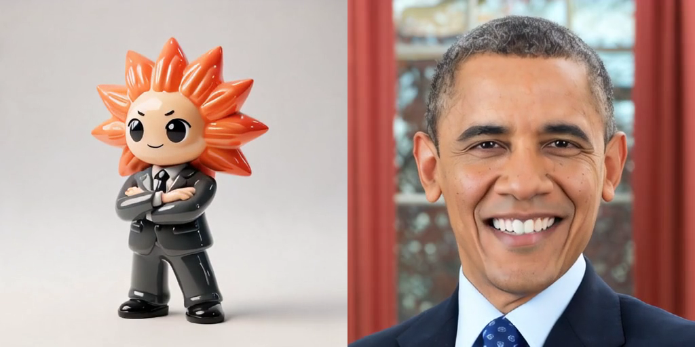
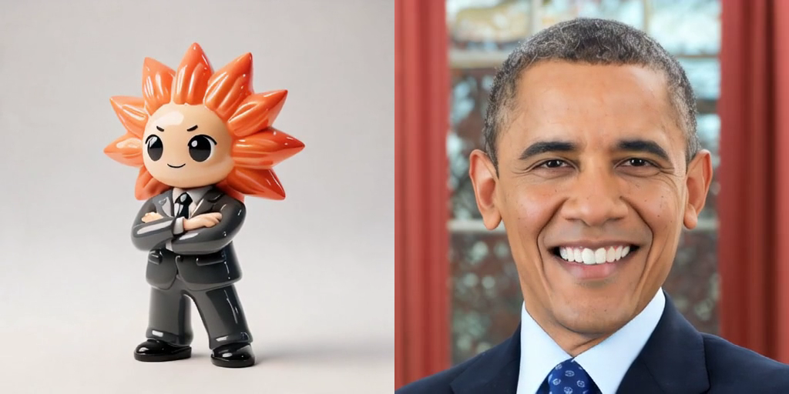
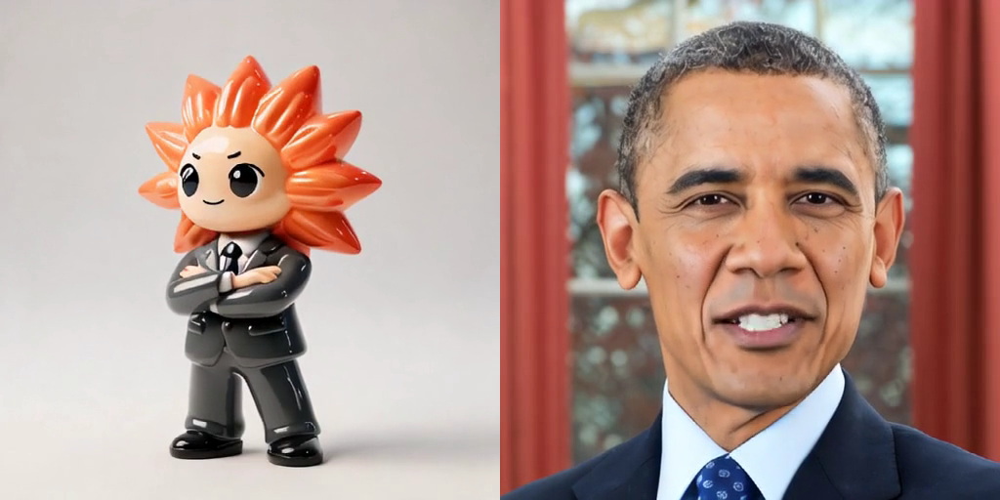

# Sonic photoreal portrait evaluation

## Result

Sonic completed the same 10-second inference used for the stylized figurine, with `--crop` and seed `72589`. Unlike the figurine, the photoreal face shows clear open, closed, rounded, and dental mouth shapes while retaining a stable, recognizable identity.

**LANE DECISION: (a) Sonic is viable for photoreal talking heads. Keep it for the persona lane when driven by real-face plates; do not use it for the stylized figurine lane.**

This is a lane-level go, not final production approval: the sampled visual evidence establishes articulation and identity stability, but this run did not establish frame-accurate audio/viseme timing. A production candidate still needs a real-time playback review against the audio.

## Source portrait and license

- Asset: Barack Obama official portrait (2012), 2,687 × 3,356 px.
- Source page: https://commons.wikimedia.org/wiki/File:President_Barack_Obama.jpg
- Original file: https://upload.wikimedia.org/wikipedia/commons/8/8d/President_Barack_Obama.jpg
- Author: Official White House Photo by Pete Souza.
- License: **Public domain (`PD-USGov-POTUS`)**. Wikimedia states that it was made by an Executive Office of the President employee as part of official duties and is therefore a work of the U.S. federal government.
- Suitability: front-facing, evenly lit official portrait. OpenCV's frontal-face detector measured an 821 × 821 px face box (`x=922, y=243, w=821, h=821`), satisfying the ≥768 px face requirement.
- Local source asset: [`portrait-obama-pd.jpg`](portrait-obama-pd.jpg).

## Comparable run

Immediately before launch, `nvidia-smi` reported no compute process, 1 MiB / 24,576 MiB used, and 0% GPU utilization, so no GPU handoff was required.

The portrait was copied to desktop `~/sonic-lab/portrait-obama-pd.jpg`. Inference ran in the dedicated `sonic-photoreal` tmux session at `~/sonic-lab/Sonic`:

```bash
/usr/bin/time -v .venv/bin/python demo.py \
  ~/sonic-lab/portrait-obama-pd.jpg \
  ~/sonic-lab/what-lab-10s.wav \
  ~/sonic-lab/sonic-obama-10s.mp4 \
  --crop --seed 72589
```

The Sonic log reports one detected face, crop box `[651, 18, 1990, 1357]`, 5:33.91 wall time, and exit status 0. Full log: [`sonic-obama-inference.log`](sonic-obama-inference.log).

## Artifacts and ffprobe evidence

- [`sonic-obama-10s.mp4`](sonic-obama-10s.mp4) — 867,427 bytes; SHA-256 `c94ac40f4ee956767bde625bc23b2eb000cf7dd5dd8c688405f0039b4282a49a`.
- [`still-02s.png`](still-02s.png), [`still-05s.png`](still-05s.png), [`still-08s.png`](still-08s.png).
- Side-by-side pairs (figurine left, photoreal right): [`comparison-02s.png`](comparison-02s.png), [`comparison-05s.png`](comparison-05s.png), [`comparison-08s.png`](comparison-08s.png).
- Dense temporal comparison: [`contact-sheet-photoreal-2fps.png`](contact-sheet-photoreal-2fps.png) and [`contact-sheet-figurine-2fps.png`](contact-sheet-figurine-2fps.png).
- Close transition review: [`transition-sheet.png`](transition-sheet.png).

Local `ffprobe`:

```json
{
  "streams": [
    {"index": 0, "codec_name": "h264", "codec_type": "video", "width": 512, "height": 512, "duration": "9.960000"},
    {"index": 1, "codec_name": "aac", "codec_type": "audio", "sample_rate": "16000", "channels": 1, "duration": "9.920000"}
  ],
  "format": {"duration": "9.960000", "size": "867427"}
}
```

## Side-by-side evidence

At each time below, the prior figurine run is on the left and this photoreal run is on the right.

### 2 seconds



### 5 seconds



### 8 seconds



## Quality verdict

### Mouth articulation versus figurine

The three requested photoreal stills alone show a wide dental/open mouth at 2 and 5 seconds and a narrower, more closed mouth at 8 seconds. The denser 2 fps contact sheet is decisive: across 20 chronological samples it contains open-vowel, rounded/puckered, dental, narrow, and closed-mouth states. A review of consecutive-frame groups also found plausible transitions from smile to open jaw, smile to rounded lips, and closed lips to speech onset.

The figurine comparison sheet retains the same tiny curved graphic mouth throughout. Sonic therefore failed to articulate the stylized mouth but did drive phoneme-like mouth-shape diversity on the photoreal face.

### Identity preservation

Across 2, 5, and 8 seconds, the subject remains immediately recognizable. Hairline, ears, eye spacing, nose, head outline, suit, and background geometry remain stable. Compared with the sharp source, generated frames soften fine skin texture and tooth boundaries; the 8-second narrow-mouth state also has mild local lip smudging. Those are local texture losses, not identity collapse.

A targeted six-consecutive-frame review around four high-difference regions (frames 19–24, 59–64, 129–134, and 209–214) found no perceptually severe jump cut, head warp, or eye jitter. One sequence holds a smile for six frames (0.24 seconds), but the 10-second contact sheet as a whole is actively articulated rather than frozen.

### Limitation

Two subscription vision attempts to ingest the full MP4 timed out. The verdict is therefore grounded in the requested stills, 20 evenly spaced samples, and 24 consecutive transition frames. These establish visual articulation and spatial/temporal stability at the sampled points, but cannot prove fine-grained audio synchronization. That limitation is why the recommendation is to keep the photoreal lane, with full-speed A/V review as its next production gate, rather than declaring the model production-final.
